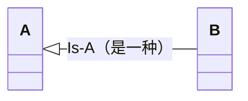
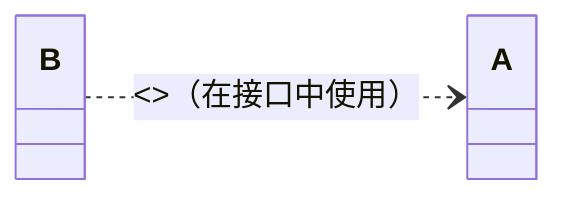
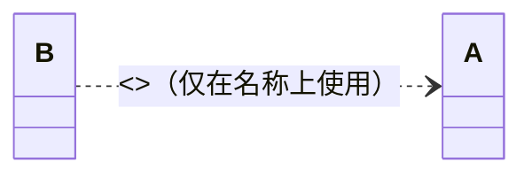
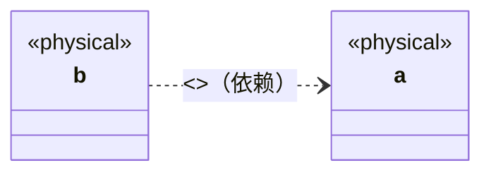

# 大规模C++软件开发 卷1：过程与架构

---
title: 大规模C++软件开发 卷1：过程与架构学习笔记
date: 2026-06-07
tags: [C++, 大规模软件开发, 软件工程]
description: 《大规模C++软件开发 卷1：过程与架构》学习笔记，涵盖开发动机、应用与库软件之辨、编译与连接机制、组件化打包规则、物理设计与分解及层次化复用架构等核心内容。
pinned: true

---

## 第0章 动机

### 0.1 目标：进度更快、产品更好、预算更低

业界评判软件应用开发成功与否的准则一直以来都是以尽可能低的成本、尽可能短的时间交付质量最好的产品。这个目标中实际隐藏着3个维度的要求。

1. **==进度(更快)==**:软件交付的眼前利害。
2. **==产品(更好)==**:增强的软件功能、质量。
3. **==预算(更低)==**:软件开发的经济性。

### 0.2 应用软件与库软件

两类截然不同的软件:**==应用软件(application software)==**和**==库软件(library software)==**。


应用是满足特定业务需要的程序，或紧密结合的程序套件。由于需求不断变化，应用的源代码生来就是不稳定的，且可能变而不告。以我们的观点来看，明确局部于某个应用的代码必须将其使用限制于该应用内(见2.13节)。

库(library)不是一个程序，而是一个存储库(repository)。在C++中，它是头文件和目标文件组成的集合，其设计目的在于便利共享类和函数。

一般来说，库是稳定的，进而潜在地可复用。软件主体是特定应用所特有的还是对整个领域更通用，将决定其在组织内得到复用的限度和有效性，甚至可能不止于此。应用和库在特定性和稳定性上展现出的这些差异表明，二者应采取不一样的开发策略和措施。特别是，库的开发人员(数量很少)须遵守相对严格的规则来创建可复用软件，而应用开发人员(数量多得多)则在组织规则方面有更大的自由。考虑到应用开发人员数量相对更多，他们(理想情况下)都会依赖库软件，因而，库的接口须经过深思熟虑，否则后续的改动成本可能高到难以扭转。

**==库软件==**：

1. **库软件须与那些将会用到它的人有所关联**。库的开发者只需将目光放到己有的应用中。和应用开发者紧密合作，解决他们工作中的经常性需要，库的开发者就能聚焦于真正重要的事情上：提高应用开发人员的开发效率!
2. **库的开发者有责任审慎地处理特性请求，婉转地拒绝不合适的、可能有损于开发社区整体成功的请求**。
3. **即使是有效的请求，有时其提议的解决方案也并不理想。库的开发人员不能盲目照原样满足请求(见3.12.1节)，他们有责任弄清楚实质需要**，考虑所有可能出现的软件问题，并提供满足需要(即使不是所有客户想要的)的切实解决方案，既要满足这一客户，又不止于满足这一个客户。

应用和库的设计范式迥然不同。应用的设计通常是自顶向下的，而由通用软件构成的库则往往是自底向上开发的。

库代码对清晰、简明且完整的注释的绝对需要也显现出它与应用的巨大差异。由于库的存在不依赖于某一特定的上下文，因此客户更加需要全面、详细的概述注释(见卷2的6.15节)以及精心打磨的用例(见卷2的6.16节)以方便理解和使用。另外，与应用不同的是，对于可复用库软件的性能要求并不限于任一用途，且往往必须超过当前可证明的需要。

### 0.3 协作式软件与可复用软件

可复用软件必须 **==易于组合，无须修改==** (见0.5节)就能轻松地拿来解决新的、从未见过的问题。一套值得信赖的预制组件对开发效率大有裨益。

### 0.4 层次化可复用软件


**==细致分级(finely-graduated)==**：表示从某一可访问抽象层级到下一抽象层级所需添加的功能相对较少。
**==颗粒化(granular)==**：表示任一原子物理单元中实现的逻辑功能的广度都很小。

对一个定义明确、反复出现的问题，用户可以轻松访问这样打包整理好的解决方案，并且这一解决方案物理上独立于其他不需要的软件。但我们还是要小心:如果打包得太多，最终导致用于实现颗粒化功能的子功能被嵌套进去(从而导致其呈现变成不可访问的)，则纵向上不再细致分级，并且离层次化复用也会越来越远。

### 0.5 易延展软件与稳定软件

大体上，好的软件可以宽泛地划分为两大类：

1. 一类是 **==易延展的(malleable)==**。
2. 另一类则是 **==稳定的(stable)==**。

易延展软件是指在需求变更时其行为可以轻松、安全地变化的软件，而稳定软件具有定义明确的行为，特意使其行为不会因客户需求变更而发生不兼容的改变。稳定软件的行为也可以轻松地发生改变。健全的软件工程实践有助于提升软件的易延展能力，如给各种符号常量做好完善的注释(魔数就是反面例子)，这当然也适用于稳定代码。两者的关键区别在于，**==易延展软件的行为为变化而设计，而稳定软件则不然。两种类型的软件在不同场合各有需求==**，但既不易延展也不稳定的软件是不可取的。最重要的是，切勿将易延展性与可复用性混淆，只有稳定软件才能复用。与库软件不相同的是，应用代码的行为一般要能够针对快速变化的用户需求做出响应。于是设计优良的应用是易延展的。仅仅因为某些事情在未来某个时候可能会发生些改变，并不意味着我们在编写代码之前不扩展重要的前期思考。遗

**==开闭(open-closed)原则==**:
> **软件既要对扩展开放(open)，又要对修改封闭(closed)。即不谋求在一个组件中为所有可能的行为做好准备，我们提供扩展行为所必要的钩子(hook)，而并不一定要改动组件的源代码。**

### 0.6 物理设计的关键作用

大规模软件开发的成功需要开发人员对 **==逻辑设计(logical design)==** 和 **==物理设计(physical design)==** 两方而细细斟酌，两者有所区别但息息相关。逻辑设计就如字面意思一样，它涉及软件的功能方面，如功能规约决定了应用、子系统或个体组件的整体逻辑设计。决定将特定类特化还是为所需功能提供抽象接口是一个相当高层级的逻辑设计选择。使用带线程的还是不带线程的、阻塞式还是非阻塞式传输(进程间通信)，这些都属于逻辑设计的范畴

物理设计的定义：

1. **==名词==**，表示源代码在文件中的排布以及文件在库中的排布。
2. **==及物动词==**，表示在文件中分隔源代码以及在库中分隔文件。

物理设计决定了(物理上)编码功能相对于整个企业中的其他功能所属的位置。

现如今，软件开发业界已经达成共识，应尽力避免(物理)模块之间的循环依赖。

将深思熟虑的逻辑设计与细致的物理打包相结合，使得软件开发人员能够在细致分级的集成层级上“混搭”现有的解决方案、子解决方案等(见0.3节)。这两相结合所得的灵活性以及逻辑和物理互操作性，有助于通过层次化复用使规模经济最大化成为可能(见0.4节)。

### 0.7 物理形式统一的软件：组件


软件的物理形式在很大程度上影响我们对软件的管理能力。除健全的物理结构之外，我们的专有软件还需要 **==物理形式统一(physically uniform)==** 的组织，这会极大地增强开发者对专有软件的理解、使用和维护能力。而且，物理上的统一会鼓励创建直接在软件上(作为数据)操作的高效的开发工具(如编码规范检查器、依赖分析器、注释提取器)。

组件是物理设计的原子单元。在C++中，它的形式是一对.h/.cpp文件(见16节)。每个组件均应关联一个独立测试驱动程序(见卷3的7.5节)，其要能够检验此组件中所有实现了的功能。

### 0.8 对层次化复用的量化：一个类比

### 0.9 软件资本

**==软件资本的内在特性==**：

1. **易于理解 (easy to understand)**
   - 最小的表面积
   - 规范简洁的呈现
   - 清晰且完整的参考注释
   - 有关的用况
2. **易于使用 (easy to use)**
   - 有效的使用模型
   - 直观的接口
   - 合适的安全等级
   - 最小的物理依赖
3. **高性能 (high performing)**
   - 执行（即真实和CPU）运行时间
   - 进程（即内核内存）大小
   - 编译时间（或者编译时耦合的程度
   - 连接时间（或者连接时依赖的程度
   - 可执行（即硬盘上）代码的大小
4. **可移植的 (portable)**
   - 在所有支持的平台上均可构建
   - 在所有支持的平台上均可运行
   - 在所有支持的平台上均可产生同样的结果
   - 在所有支持的平台上均可达到“合理的”性能
5. **可靠的 (reliable)**
   - 没有核心转储
   - 没有内存泄漏
   - 没有错误的结果
   - 没有bug
   - 没有，我们没在开玩笑！

### 0.10 增大投入

### 0.11 保持警觉

---

### 0.12 小结

有效的大规模软件开发绝非易事，并不是无意之间就能成功的，组织、计划、经验和技艺缺一不可。要在企业规模上达到我们所追求的长期成功，需要对原本创建库和应用的基础常规实践做一些重大调整。本章介绍了大规模开发解决方案所需考虑的高层级目标、思考过程和设计权衡。经典与现代手段融合成一种内聚的方法论，我们认为这是长期开发高质量应用的最有效方法。

#### 0.1 节小结

软件开发的工作目标涉及 3 个维度，分别是进度、产品和成本。如今，工业软件开发带来了许多难题，包括开发的不可预测性、复用的危险、频繁的构建次数、可执行程序的巨大体积，以及人们对已有产品进行细微改进时所感受的胆战心惊。最根本的是，进度、产品和成本之间的平衡并不令人满意。

为了实现这 3 个维度的增益，需要将设计空间向外推。为此，开发过程的一些输出（如软件产出的一部分）必须以某种形式反馈到此过程中。只有这样，开发过程的效率才能无止境地提高。挑战在于找到一种组织和过程能够使得这样的反馈在实际的软件复用中成为可能。我们给出的解决方案是一个既能解决软件组织问题又能解决软件开发人员组织问题的过程。

一开始先别太过具体，我们先假定这样的过程是存在的，并且已经良好运转一些年份了。几乎每一个我们可能需要的组件或者子系统都已经准备好了并且等着被复用（例如图 0-67）。到这时，这个“假想的”开发过程已经演变到了这样一种状况，实现一个应用只需要找到并组装所需要的部件多一点。我们主张，这一过程不仅是可能的，而且从长远看是最优的。我们有时借用长期贪婪（long-term greedy）这一词来形容我们的方法。当进行大规模的软件开发工作时，经验告诉我们长期贪婪是上上之策。

#### 0.2 节小结

我们观察到应用和库的开发有着本质的不同，两者有着不同的目标和压力。应用开发多数是自顶向下的，而库开发则多数自底向上。应用开发需要解决特定的问题，将工作尽快完成，并且可能在随后需要时更改代码。在库开发中，目标则是尽可能将工作做好，更一般化地解决问题，并且避免随后的改动。开发这两类软件的人们一般在目标、脾气和技能等方面均有差异。

应用开发者尽可能快速有效地完成工作，以此获得酬劳。由此不难理解为什么应用的源代码永远不如库的代码稳定。应用开发的焦点在于快速地解决特定问题，这样的软件常常需要随着时间更迭。随着每次迭代，源代码甚至功能模块都可能发生改变。最好的应用代码需要具备延展性。

而优秀的库开发者的思考模式则截然不同。因为库开发一旦高收入流没那么近，相比于应用开发人员，他们有相当程度的自由，因此，库软件的延续时间往往比更长。按定义来说，库跨越了所有应用，它之于应用的生命周期。在编写库组件时，称职的库开发人员不会选择简单的实现，这会导致难以修改的接口或给客户带来不便。正相反，好的库开发人员会为了易于复用而放弃易于实现的解决方案。

#### 0.3 节小结

大型软件问题通常被切分成子问题，各自独立解决后重新组合在一起以解决原问题。然而，这样一种最小化的分解，常常会导致软件的脆弱性，其特点是过度的不规则性存在于紧接互相依赖的接口边界（“碎盘子”）。修改的余地很小。对整块的应用级功能（“烤面包机-牙刷”）的修改可能会导致我们需要重新检查这些接口的实现，增加成本和威胁到软件的可靠性（见图 0-9）。

协作式的接口往往有较大的表面积-体积比，这使得对单个子系统的理解不必要地困难，更不用说复用了。紧密的语法耦合使得对某个模块的改动必然会在另一模块上有所反映。分发设计决策时跨过模块边界，让模块化不清晰。反之，如果我们强调将系统划分为更自然的界限，我们就会发现更多的规整软件。这些更简单、更易于上手的子系统更易于解释和理解，而且更有可能“按原样”复用，因为更高层级的需求不可避免地会发生。

经典的复用会探讨对特定类型、容器、子系统等的复用，而不考虑用于实现它们的任何部件。碎盘子或烤面包机-牙刷的可复用性着实不高。带挂钩的烤面包机和带孔的牙刷的构造是协作式（同等级组件互知）的简单例子。可复用片段越能被简单地描述出来（如半圆形、矩形、正方形、三角形），它们越有机会被无修改地使用。不过，这种程度的复用仍然不够。

#### 0.4 节小结

为了实现最大化的复用，开发人员在逻辑和物理两方面都必须坚持最大程度的分解。一个烤面包机-牙刷可以被分解为烤面包机、牙刷和给烤面包机连上牙刷的适配器。添加一些胶水后，我们将得到想要的定制零件（见图 0-12）。然而，第一层级的分解实现的只是传统意义下的复用。为了实现最大化复用，我们必须积极地将烤面包机、适配器和牙刷分解到它们各自的组成零件（外壳和底盘、杆和接头，以及刷柄和刷毛）。只有这样才能认识到用一个烤面包机、适配器、刷柄、刷毛和胶水来创建一个烤面包机-牙刷的好处（见图 0-20b）。

#### 0.5 节小结

一款软件要称得上优秀，若不是胜在易延展（行为容易改变），就得稳定（行为不改变）。小物理模块（我们称为组件）的层次化组合是稳定性的关键方面。要一致地实现此类小型模块，就需要积极的分解。举例来说，如果我们创建一个具有 6 个参数的函数，则很有可能遗漏了一个参数。为了之后增加参数，我们还得被迫修改现有函数，从而可能违背开闭原则（见 0.5 节），或者从头创建一个全新的函数（有着大段的不必要重复的代码）。如果我们创建 6 个单参数函数，并对它们进行组合，那么我们随后可以很容易地添加第七个函数，而不影响其他 6 个函数的客户。

我们必须承认，只有稳定的软件才能被复用。稳定性是确保在较高层级上所作的假设不会因原组件并行运行（临时或永久）而不兼容地改变可复用组件的行为的作用。另外，可变软件（最好设计为易延展的）最适合放在最高层，并且不能被共享，否则问题会受到过度约束（例如带旗子的、压扁的、绿色烤面包机-牙刷，见图 0-31）。注意，既不稳定又不易延展的软件通常不是我们期望的。

#### 0.6 节小结

细粒度分解需要的不仅仅是稳定性和可测试性。为了实现层次化复用，我们必须确保如何打包我们的每一个独立的解在分割的物理模块中。回忆一下，Dijkstra 主张粒度的层次化分解，Parnas 主张将单个设计决策封装到设计良好的接口后面，这些接口仅通过简单（如参数）数据类型传递信息，Myers 则主张确保这些接口有良好的注释以帮助理解。只有将功能性内容限制到小型（细致分级、颗粒化且注释完善的）物理模块上，才能让我们仅所需要的的东西付出连接时间和磁盘空间。此外，只有通过这种积极的分解，我们才能在每个抽象层次上都达成复用，即除了那些广泛传播的公共使用。

逻辑设计和物理设计是两个截然不同但是信息相关的设计门类。逻辑设计解决开发软件的功能方面。物理设计解决我们如何将我们的源代码打包到各种文件和库中（示例见图 0-15）。物理设计在考虑任何大型软件时都起着关键作用。特别的，欠缺考虑的物理设计会很快使得软件中的物理模块间产生循环依赖，并且对大规模开发而言，相互循环依赖的模块几乎就是不可维护的了。可能出乎一些读者意料的是，物理设计实际是逻辑设计的前提，并且必须从一开始问题被分解就着手考虑，这会使得独立的解决方案之间可以结合起来解决原来的问题（也可以解决更多其他问题）。在大型开发工作中，再怎么强调健全的物理设计的重要性也不过分。

#### 0.7 节小结

按本书的方法论来说，健全的物理设计的基础是将逻辑内容组织到连贯的物理模块中，称之为组件。这些模块在结构上是一致的，而且相对较小。另外，我们希望这些模块既细致分级又颗粒化。我们用细致分级指不同抽象层级之间的（纵向）“距离”小。颗粒化是指该领域功能的（横展）“面积”较小。这种细粒度的物理分解降低了任何特定模块因需求变化而需要更改的可能性。而且，细粒度的模块化使我们能够重新组合现有的片段，这是一种高效的扩展方法（从头创建整个子功能相比）。此外，当软件是分解妥当的并且被打包在各个组件中时，彻底的测试就简单多了。

按本书的定义，组件是逻辑设计和物理设计中基础的原子单元。在 C++ 中，组件由头（.h）文件和实现（.cpp）文件组成，并且应该始终有一个关联的测试驱动（t.cpp）文件。我们要求组件相对较小，逻辑内容的大小在可处理的范围内，可以由单独的测试驱动程序彻底地测试。组件有着定义明确的接口，接口最好要设计优良（易于理解和使用）。此外，设计优良的组件还应设计成可测试的。

从许多方面看，组件就如同搭建房子的砖块一般，两者大同小异。尽管从微观角度看，每块砖在逻辑上都是独一无二的，但所有砖都有相同的宏观物理形式。在某种程度上，区分一块砖和另一块砖的唯一特征的是它在物理层级中的相对位置。在更高层次的砖可以做更多的事情，并不是因为它们更大或者包含了其他的砖，而是因为它们依赖于其他的砖的承诺。因此，更高物理层级的砖，就如同公司经理一样，比其下的个体贡献者有着更大的作用。

多样性可能是生活的调味剂，但不应该用在软件呈现上。存放逻辑内容的物理形式之规整至关重要。逻辑内容的物理打包的统一性能够极大简化人的认知、促进了有效的开发和支持工具创建、增强了企业中专有子系统的互操作性，并增强了开发者可流转性。

#### 0.8 节小结

有一个恰到好处的类比，我们将软件开发应用比作在固定宽度的页面上排版文字的优化问题。一种简单粗暴的方法当然是递归地解决每个左右文本划分的子问题（类似于软件中纯粹的、自顶向下的设计），这会需要指数级的时间。然而，我们注意到不是十分显然的一点，即要解决的唯一的（有用的）子问题的数目不是指数级的。类似地，我们认为不同的部分子解决方案是相当的少（相对而言）。

我们还观察到对这个优化问题的一些其他改进也与本书的软件开发方法类似。第一个改进阐述的是解决方案稳定性的重要性，解决方案可以被原封不动地使用而无须复制（复制粘贴型的复用）。第二个改进强调查找速度的重要性。正如在成熟的软件环境中，应用开发的很多工作其实都是查找合适的预制解决方案来使用。

为了使这一类比成立，我们观察到，应用分解后的许多不同部件里遇到的软件子问题要么是相似到其解决方案可以“原样”（as-is）复用的程度，实现这一目标至少需要细致粒度分解、统一的物理呈现和规范的接口。此外，为复用准备的软件，除了满足其他更客观的质量指标，还必须“足够吸引人”（如有着惊艳的注释，足够赏心悦目）。要不然开发人员就不会使用。还有一点，为复用而做的设计的目标应该是一个由一套离散的、不同的组件覆盖预期的领域，而不是用组件之间共享的细微区别——尤其是在词汇类型（见卷 2 的 4.4 节）方面——的连续体来覆盖。最大限度地提高复用的可能性将在卷 2 的 5.7 节中论述。

#### 0.9 节小结

从企业的视角来看，我们希望让尽可能多的应用代码收纳到稳定的库中，让它们在其中被分解、精细化、变得更稳健，且独立地供以后的应用复用。尽管并不能保证从一开始就可有复用软件可用，但目标是做到预期地将潜在可复用软件重构并降级（见 3.5.3 节）到物理层次结构中的较低层级，使之可以被更广泛地共享。在软件开发中，这种持续重构方法被许多人认为是现今最好的方法。鉴于我们的目标是复用，我们以义务为中心，并且看着这种强调会将我们引向何方。

通过将通用知识隔离到易于访问的软件存储库中，我们使得现在、将来、乃至过去的项目都可以利用我们的知识库并以远远快于其他的方式速度交付新的功能。这一专有软件存储库变成重要的公司资本，它会随着时间会给出越来越多的回报。一系列的具有良好工程实践的专有软件，能促进一个或多个应用领域或产品线中的开发工作，这就是我们所谓的软件资本。积极创建软件资本的首要驱动力是为了缩短未来应用和产品推向市场的时间（见图 0-54）。提升质量的同时减少开发和维护的成本，都是软件资本附带的好处。

#### 0.10 节小结

发展软件资本的隐含目标是获得一套对所有重要且相关的子解决方案的切实可行、细致分级、颗粒化的划分。我们要一致地分解应用以期精确地得到相同的子解决方案，日积月累之下，软件运行的速度和可靠性会远远超过其他方法。易于理解、易于使用、高性能、易于移植且可靠（见图 0-55）的相关预制组件是软件资本的特点。定期的同行评审和测试能够同时提升质量的 3 个维度。只有一小部分专有软件属于这一企业范围的基础设施，但要是不这一小部分软件，我们就得用庞大得多的、迥然不同的、重复且不兼容的解决方案，这些解决方案性能更差、可靠性较差，而且维护成本过高。

事实上，软件资本能够轻松地同时改善设计空间的 3 个维度——进度、产品、预算。此外，由于从软件资本继承到相当的好处，更快、更好、成本更低，无论 3 个维度的重要性权重如何，从软件资本组装的应用在所有这 3 个维度都将获得非凡的好处。

早先开发的一些应用相对而言可能从软件资本中获得的好处相对较少。反复出现的业务需求会引导这一资本的发展方向。随着时间的推移，越来越多的开发工作会聚焦在应用级功能上。我们注意到，在一个设计优良且成熟的软件开发企业中，对正在实现中的应用而言，几乎所有开发的代码都是应该被用所独有的，只有相对较少的一部分持续再投资放在软件资本这一重要的全公司资产的扩展上。

#### 0.11 节小结

开发人员往往有正当理由质疑非业务需求的开发。为了使复用足够高效，要被复用的软件必须被公司内所有开发人员都公认为“离谱”。最糟糕的事情无非就是碰不上听话、心怀不满的开发人员，但面对这么好的软件资本，他也只能低头承认“这实在太了”，“不值得花时间重写”。毕竟它已经摆在那了，他当然只好接着用；我们知道我们已经让代码质量达到了成功复用所要求的等级。

然而要是没有切实可用的软件资本，为了替代缺失的可复用软件而爆炸性增长的重复代码可能会主导、甚至占据所有的开发工作（示例见图 0-68）。库软件的制造成本感觉起来会相当高，但鉴于开发库软件的成本会被分摊到使用它的诸多应用及其版本（见图 0-69），这是可以理解的。而事实也证明，不采用软件资本的实际成本比这高得多，这甚至还没算软件资本的主要收益，也就是缩短未来应用和产品推向市场的时间（见图 0-54）。

在本章中，我们介绍了一些根本性的业务和经济现实，它们促使我们发展出一套在公司规模上开发高质量软件的方法并使用之，这一方法可以称得上是目前最有效、切实可行、快速经济的方法。本书的其余部分会详细描述如何获得这一成功。这 3 卷书中介绍的所有设计、实现和测试技术都适用于大规模系统。即使在规模不大的系统中，遵循本书提倡的做法也能带来巨大的好处，对软件的可靠性、可维护性和性能大有好处。

总而言之，本书讲述了在生产环境中，如何在应用开发上做到增量式的成功。接下来的几章会谈及一个成熟且已践行过的 C++ 软件开发过程的准则，这一过程之应用不局限于 C++ 的某个特定标准化版本，亦不必囿于 C++ 这门语言。任何编程语言（特别是那些会把独立编译单元组装起来的）均可从这些基本软件工程原理中受益。

---

## 第1章 编译器、连接器和组件

### 1.1 知识就是力量：细节决定成败

#### 1.1.1 "Hello World!"

#### 1.1.2 创建C++程序

#### 1.1.3 头文件的作用

### 1.2 C++程序的编译和连接

构建C++程序的过程可以自然地分为两个主要阶段。第一阶段被称为 **==编译阶段==**，它分为两步，先是**将每个源(.cpp)文件及其包含的所有头(.h)文件预处理成一个中间表示**；然后**将该中间表示翻译为可重定位的机器码，然后将其放置在目标(.o)文件中**。在第二(主要)阶段中，**将合并这些目标文件以形成一个内聚的程序**。

#### 1.2.1 构建流程：编译器和连接器的使用

#### 1.2.2 目标文件（.o）的经典原子性

**==目标文件历来便是原子的==**。换言之，若是要将一个目标文件纳入可执行文件中，则只能一整个加进去。该 .o 目标文件中定义的所有外部可访问符号现在都可用于解析其他 .o 文件中未定义符号。同理，该 .o 文件中任何未解析的符号(无论是否会被使用)最终都必须被解析，否则连接阶段会失败。由于C++初始版本便需要包含一些较高级的(相比于C语言)语言构件(如隐式模板实例化、不内联的内联函数)，所有现代平台现在都支持在单个 .o 目标文件中包含多个段(section)，这样，每个段都可以独立于其余段纳入(或不纳入)，我们稍后会就此问题进行详细讨论。外部符号定义是否驻留在 .o 文件的不同段中以及驻留的程度有多大都取决于平台和构建配置，并且肯定不应在开发过程中影响我们(见2.15节)。为了确保对物理依赖的可移植、细粒度的控制，我们做设计时还是把 .o 文件以及组件(0.7节)当作原子的。

#### 1.2.3 .o文件中的节和弱符号

前文已详细地考虑了几年来实现常用语言构件所需的基本编译器/连接器功能，例如C语言所需的功能。而随着C++语言的引入，编译器已经普遍可以将某些特定类型的函数定义放到多个 .o 文件中，然后依靠连接器仅将众多(完全一样的)副本中的一个纳入最终的可执行文件。要使这种方法起作用，编译器必须能够将每个此类符号定义放置在其自己分离的节(section)中，而段可以独立于.文件中任何其他目标代码地被纳入(或不纳入)。然后，连接器从它遇到的各个 .o 文件中散布的也许很多的(完全一样的)定义中选择其一，而不会报告此类孤立符号的多个定义，而且只有在它们满足某个未定义引用才拖入，这就确保了不依赖连接顺序。

**将每个符号定义放置在其自己分离的物理节可能会导致额外的构建时开销**。在不分离定义的条件下实现相同效果的一种方法，是将内联函数和函数模板产生的定义符号标记为弱的，这意味着该符号可以用于满足未定义符号的引用，但如果将该符号定义纳入已使用了相同未定义符号的另一弱定义的程序中，不会导致出现多重定义符号错误。

除了构建时性能，还有许多原因(如在某些平台上处理异常的方式)可能导致各节之间的相互依赖，从而迫使混合解决方案，既有独个的物理节又将符号标记为弱的。注意，如果典型的连接器试图将同一名称的一个弱符号定义和(正常的)一个强符号定义(顺序任意)纳入程序中，就会导致多重定义符号错误。遵循广为接受的软件设计实践(见本书第2章)有助于我们满足基础性的语言需求，如单一定义规则(ODR)，从而避免此类令人不安的问题。

记住，这所有关于物理节和弱符号定义与强符号定义的讨论都远远超出了C++标准的规定，此处提供是作为理解如何使用低层级工具来实现它的基础。在所有平台上避免将目标代码纳入最终可执行程序中的唯一可靠方法是使其远离连接命令行。本书对软件模块化的细粒度方法(0.4节)反映了这一思想。

#### 1.2.4 静态库

即使是相对较小的程序，在连接时列出每个 .o 文件也是烦琐且不切实际的。各编译系统都有工具可将多个目标(.o)文件组合起来，放到一个被称为库(library)或归档文件(archive，通常也称为静态库)的物理实体中。妥当地将互相关联的目标文件整合成库可以便利构建和分发软件的过程。

#### 1.2.5 "单例"注册表的例子

#### 1.2.6 库间依赖

**更一般地，任何实体之间的相互依赖都要尽量避免，逻辑依赖和物理依赖皆是如此**。如果相互依赖被认为是必要的(无论原因为何)，不管这些相互依赖的实体是函数、类还是(此处讨论的罕见案例中)翻译单元，我们都建议将它们打包到一起，而不是分离打包。

#### 1.2.7 连接顺序和构建时行为

**C++标准不处理如何打包库中.o文件的（平台特定的）细节**，但若是不了解库在实践中的一般行为方式，可能会导致开发和部署过程中出现重大问题。库中的.o文件一旦被纳入程序中，就会像直接在命令行上提供一样被对待。整个.o文件会被纳入程序中，任何不能由先前输入的目标文件解析的未定义符号都需要其他.o文件的纳入，否则连接阶段将失败。

直接连接器提供有重复符号定义的.o文件是致命性的错误，但提供的一个或多个库中确实无意中包含多个定义了相同符号的分离的.o文件。在连接阶段过两遍的平台上，所需符号的第一次（或最后一次）出现通常指示了哪个.o文件被纳入。在Unix平台上常见的方法是，依次扫描每个库，在扫描下一个库之前，把所有解析当前未定义符号的.o文件纳入。不管在哪种情况下，都没有切实可行的办法来控制使用的是多个定义中的哪一个。

**即使两个符号定义相同，这些符号定义所在的相应.o文件也可能不同**。受所选.o影响，其他定义可能会被拖入其中，而这些定义可能与其他定义冲突，导致多重定义符号错误。因由定义并置产生的额外的未定义符号可能无法被解析。即使连接成功，磁盘上生成的可执行文件的大小和构成也可能因连接顺序而异。应确保每个连接器符号只有一个定义，从而避免此类连接顺序特性影响构建过程的稳定（可重复性和可靠性）。

#### 1.2.8 连接顺序和运行时行为

**甚至还有更微妙的方法可以让.o文件的处理顺序影响生成的可执行文件的运行时行为**。特别是，文件作用域静态对象（如1.2.5节的图1-11中用于自动初始化注册表的对象）的构建顺序取决于实现顺序和连接顺序。C++中根本没有可靠的方法来确保一个翻译单元中的文件作用域静态对象的初始化先于或晚于另一个翻译单元中的文件作用域静态对象。C++给跨翻译单元提供的唯一保证是，文件作用域静态对象将在首次使用之前、在进入main之前被初始化。

**==依靠于跨翻译单元运行时静态初始化的相对顺序可能导致意外且通常是灾难性的行为==**。

#### 1.2.9 共享（动态连接）库

我们应当注意，使用“共享对象”（Unix 平台上的术语）或“动态连接库”（Windows 平台上的术语）只会增加观察物理依赖并正确打包逻辑内容的需要的。这些类型的库的行为更像整块式的。与动态库的文件而不是静态库，对它们的处理是原子化的，即要么全并进去，要么一点都不用。与动态库的集和连接依赖总是特定于平台的，在这里不再赘述。但是，静态连接的库将成为进一步分析和讨论的良好思维模型。

### 1.3 声明、定义和连结

构建程序时的许多事情，都涉及编译器（有时是连接器）将具名实体（如模板、类型、函数和变量）的使用与其相应的定义关联起来。在程序中，将具名实体的使用解析到唯一定义是通过声明间接完成的。也就是说，编译器基于显式声明启用名称的使用，而语言规则决定了如何将每个声明与其相应（唯一）定义关联。名称在多大程度上可以指代不同作用域或跨翻译单元的实体受连结（linkage）的约束。

#### 1.3.1 声明与定义

由于一个程序可以由多个翻译单元组成，并且这些翻译单元往往是分离编译的，因此 C++ 语言精心地规定了每个 C++ 实体的连结规则，以便与当前典型构建工具（特别是连接器）的能力。

**定义**：**==声明(declaration)是将名称引入作用域的一种语言构件==**。

**声明将一个名称引入作用域。该名称随后可在声明可见的任何地方使用，以指向相应的实体**。

**定义**：**==定义(deinition)是一种语言构件，它唯一地刻画了程序中的一个实体，并在适当时为其保留存储空间==**。

**定义描述了实体的特征，并在合适时保留存储**。

大多数定义也是其自身的声明，如上述每一项定义一样。遗憾的是，定义的自声明可能会导致一些微妙的问题。

事实上，**C++语言要求程序中使用的每个不同实体刚好只有一个定义**。**==这一规则称为单一定义规则（one-definition rule，ODR）==**，根据所涉实体的类型，它以不同的方式解释和实现（见下文）。为了帮助指定不同作用域和翻译单元中实体的逻辑“相同性”，C++标准定义了连结的概念。

连结（Linkage）
当某一名称的声明可与另一作用域中的声明表示相同的对象、引用、函数、类型、模板、命名空间或值时，我们称该名称的声明具有（逻辑）连结。

- **==外连结型==**：**这一名称的声明表示的实体可以在另一翻译单元、另一作用域或另一翻译单元的另一作用域中被定义**。
- **==内连结型==**：**这一名称的声明表示的实体可以在另一作用域中被定义，但不能在另一翻译单元中被定义**。
- **==无连结型==**：**这一名称的声明表示的实体既不能在另一翻译单元中被定义，也不能在另一作用域中被定义**。

**C++连结规则允许我们确定在不同作用域或翻译单元中声明的两个名称在逻辑上是否表示相同的实体**。例如，在文件作用域（或任何其他命名空间作用域内）声明的类型或非静态函数的名称为外连结型，这意味着该名称将与在不同翻译单元中相同作用域内出现的类似声明中的名称所表示的实体相同。

#### 1.3.2 （逻辑的）连结与（物理的）连接

从历史上看，编译器技术和连接器技术（尤其是连接器技术）对 C 的连结规则和语义产生了强烈的影响，进而影响 C++。尽管如此，（逻辑的）连结和（物理的）连接是两个不同的概念，不应混淆。连接是指将名称的使用与其定义（或含义）绑定的物理行为，而连结则用于确定给定的声明和定义是否指同一逻辑实体。

#### 1.3.3 需要了解连接工具

为了从任何特定的实现选择中抽象出语言规约，连结完全是从逻辑效果而不是任何物理表现的角度来定义的。但是，了解“连接”的底层细节——如编译器、连接器或两者最终是否可用于将已声明名称的特定使用与其相应定义（或含义）相关联，对以下两方面至关重要：一是深入了解 C++标准选择“工具无关的”（逻辑）连结规则的动机；二是作为了解 C++标准的单一定义规则（ODR）是否以及何时可在实践中被良性地违反的基础。

#### 1.3.4 物理"连结"的另一种定义：绑结

值得注意的是，连结一词有时也被用来指直接通常用于在典型平台上连接给定 C++ 构件的物理设备类型，尽管其形式不太正式。当然，C++标准的（逻辑）连结定义必须优先，但我们仍然认为这种替代的物理含义在概念上有用——特别是在口头交流中。今后，我们将始终把“连结”（物理的）称为“绑结”。

事实上，C++的（物理）绑结有 3 种不同的（不相交）类型：**==内绑结型、外绑结型和双绑结型==**。

**定义**：**==如果在典型平台上，对一种 C++ 构件的已声明名称的使用及其对应定义（或含义）总是在编译时有效地绑定，则此 C++ 构件是内绑结型（internal bindage）==**。

内绑结型语言构件要求其定义（或关联的含义）和使用在同一翻译单元内对编译器可见，因不会向 .o 文件中引入用于绑定的制品。在典型平台上，始终在编译时解析声明名称及其相关含义。

**定义**：**==如果在典型平台上，一个 C++ 构件的对应定义不能出现在一个程序的多个翻译单元中（如为了避免连接时出现多重定义符号错误），则此 C++ 构件是外绑结型（external bindage）==**。

外绑结型语言构件不要求使用该构件与定义该构件的翻译单元相同，因此，在典型平台上，编译器将在 .o 文件中引入制品，以便连接器随后使用该文件来完成将名称的使用与其（全局唯一的）定义的绑定。（注意，当任何构件的使用发生在其与定义相同的翻译单元内时，编译器可以在编译时执行完全绑定，包括尚未声明为内联的函数。）在典型平台上，通常在连接时绑定的语言构件例子包括非静态的文件作用域（或命名空间作用域）数据和函数、静态的类成员函数以及类数据，以及静态的类数据成员。

**定义**：**==如果在典型平台上，一个 C++ 构件的对应定义能安全地出现在同一程序的多个翻译单元中，并且这种构件的已声明名称的使用及其相应定义可以在连接时绑定，则此 C++ 构件是双绑结型（dual bindage）==**。

#### 1.3.5 连接器运作的更多细节

#### 1.3.6 对一些需要全程序范围内地址唯一的实体的介绍

#### 1.3.7 客户编译器需要看到定义的源代码的构件

#### 1.3.8 声明并不一定要带上定义才能起作用

**要使用某一实体的名字，其声明必须是可见的**。但有些声明本身是有用的。例如，typedef 声明是一个结构别名，它在编译或连接时都不需要相应的定义便完全可用。声明的使用方式会影响实体的定义是否也需要可见。

#### 1.3.9 客户编译器通常需要看到类定义

然而，单一条类声明提供的信息太少，以至于无法创建该用户定义类型的对象、调用该类型的方法、继承该类型、将该类型的对象嵌套在另一个用户定义类型中，甚至都不知道该类型（对象）的 sizeof。类定义中通常包含其他声明和定义。特别是类成员函数和静态类数据成员本身是外连结型实体的声明——其任何使用都必须在连接时解析。当需要的不仅仅是用户定义类型的名称时，客户的编译器必须已经看到该类型的相应定义。

#### 1.3.10 客户编译器必须看到定义的源代码的其他实体

#### 1.3.11 枚举具有外连结，但又会怎样

#### 1.3.12 内联函数略有特殊

内联函数略有特殊，因为它的定义必须在调用它的任一翻译单元中可用，并且它的定义可以在源代码和目标代码级别的代码中跨翻译单元重复。由于调用方的编译器必须能够访问定义源，所以此类函数可能由编译器或连接器“连接”，具体取决于编译器是否决定“在调用点替换函数体”。如果不替换，编译器将需要在当前翻译单元中存放函数的离线版本，以确保连接器至少可找到一个定义。因此，被声明为 inline 的函数是双绑结型。

#### 1.3.13 函数模板和类模板

模板是 C++ 语言的一大复杂功能，其逻辑特性和物理特性需要大量篇幅讨论。模板与类和函数一样，在文件作用域是外绑结型。即在同一（具名）命名空间内不同的翻译单元中声明的两个类模板或函数模板指向同一实体。但不同于类和函数的是，模板无法被直接使用，而要先实例化成类和函数。

#### 1.3.14 函数模板和显式特化

#### 1.3.15 类模板及其偏特化

#### 1.3.16 extern模板

#### 1.3.17 用工具来理解单一定义规则和绑结

#### 1.3.18 命名空间

#### 1.3.19 对const实体默认连结的阐释

还需注意的是，默认情况下，文件作用域（或命名空间作用域）中的变量是外连结型，而声明为 const 的变量是内连结型（与 C 语言不同）。

---

#### 1.3.20 本节小结

正如前面详细讨论所表明的，抽象地理解如何区分纯声明、充当声明的定义以及不充当声明的定义，不是一件容易的事。图1-27给出了相当全面的声明与定义的示例列表，包括其（逻辑）连结型及其（物理）绑结型。

| 构件 | 声明/定义 | (逻辑) 连结型 | (物理) 绑结型 |
| --- | --- | --- | --- |
| `int i;` | 定义 | 外 | 外 |
| `const int M = 5;` | 定义 | 内 | 内 |
| `extern int j;` | 声明 | 外 | 外 |
| `static int k;` | 定义 | 内 | 内* |
| `void f();` | 声明 | 外 | 外 |
| `static void f();` | 声明 | 内 | 内* |
| `inline void f() { }` | 定义 | 外 | 双 |
| `static inline void f() { }` | 定义 | 内 | 内* |
| `typedef int Int;` | 声明 | 无 | 内 |
| `enum A { };` | 定义 | 外 | 内 |
| `enum { X };` | 定义 | 外 | 内 |
| `enum { } e;` | 定义 | 外 | 外 |
| `class U;` | 声明 | 外 | 内 |
| `class V { };` | 定义 | 外 | 内 |
| `struct W { };` | 定义 | 外 | 内 |
| `class MyClass { ... } x;` | 定义（类整体） | 外 | 内 |
| 成员 `int d_a;` | 定义 | 外 | 内 |
| 成员 `const int d_b;` | 定义 | 外 | 内 |
| 成员 `static int s_c;` | 声明 | 外 | 外 |
| 成员 `static const int s_d;` | 声明 | 外 | 外 |
| 成员 `typedef double Float64;` | 声明 | 无 | 内 |
| 成员 `enum Status { GOOD, BAD };` | 定义 | 外 | 内 |
| 成员 `void f() const;` | 声明 | 外 | 外 |
| 成员 `static void g();` | 声明 | 外 | 外 |
| 成员 `inline void h();` | 声明 | 外 | 双 |
| 成员 `static inline void i();` | 声明 | 外 | 双 |
| 对象 `x` | 定义 | 外 | 外 |
| `int MyClass::s_c;` | 仅定义 | 外 | 外 |
| `const int MyClass::s_d = 0;` | 仅定义 | 外 | 外 |
| `void MyClass::f() const { }` | 仅定义 | 外 | 外 |
| `void MyClass::g() { }` | 仅定义 | 外 | 外 |
| `inline void MyClass::h() { }` | 仅定义 | 外 | 双 |
| `inline void MyClass::i() { }` | 仅定义 | 外 | 双 |
| `namespace { void f() { } }` | 定义 | 内 | 外* |
| `namespace Foo { int i; }` | 定义（命名空间） | 外 | 内 |
| 命名空间成员 `int i;` | 定义 | 外 | 内 |
| `template<class T> class Stack;` | 声明 | 外 | 内 |
| `template<class T> class Stack { };` | 定义 | 外 | 内 |
| `template<class T> T max(T x, T y);` | 声明 | 外 | 内 |
| `template<> int min<int>(int x, int y);` | 声明 | 外 | 外 |
| `template <class T> class vector { ... };` | 定义（类模板） | 外 | 内 |
| 类模板成员 `void push_back(const T&);` | 声明 | 外 | 外 |
| `void vector<int>::push_back() {...}` | 仅定义 | 外 | 外 |
| `template <class T> struct X { ... };` | 定义（结构体模板） | 外 | 内 |
| 结构体模板友元 `void f(const X&);` | 声明 | 外 | 外 |

**注释**：

- **带 \* 的条目**（如 `static int k;`、`namespace { void f() { } }`）：从 C++11 开始，`static` 函数/数据的语义及底层机制趋同于无名命名空间中对应声明。
- **复合构件**（如 `class MyClass`、`template <class T> class vector`）需拆分"整体"与"成员"分别分析声明/定义、连结型、绑结型。

### 1.4 头文件

### 1.5 包含指令和包含保护符

#### 1.5.1 包含指令

#### 1.5.2 内置的包含保护符

#### 1.5.3 外置的包含保护符（已废弃）

### 1.6 从.h/.cpp文件对到组件

正如我们在1.4节中看到的，物理设计的演变(以1.4节的图1-31而告终)导致了将一个或多个密切相关的类(见3.3.1节)及其相关的自由运算符并置在单个.h和相应的.cpp文件中的做法。这些.h/.cpp文件对又称作组件[见0.7节，将会被形式化定义(见2.6节)]，它们构成物理设计的原子单元。

目前，我们假设我们所指的任何.h/.cpp文件对都是一个组件，至少要满足以下特性。

1. **cpp文件的实质性第一行代码将对应的.h文件纳入。**
2. **在.cpp文件中定义的外连结型逻辑构件(除非在效果上呈现为外部不可见的)在对应的.h文件中声明。**
3. **在组件的头文件中声明的外绑结型或双绑结型逻辑构件，如果有定义，则其定义仅在该组件之内。**

#### 1.6.1 组件特性1

> **==.cpp 文件的实质性第一行代码将对应的 .h 文件纳入。==**

特性1有助于确保.h文件中的任何声明至少与.cpp文件中的定义一致，如1.4节所述。

确保每个头文件都可以不依靠之前包含的任何声明或定义而通过编译是非常可取的，特别是在诊断这些问题并不容易的情况下。只要有一个翻译单元保证在任何其他声明或定义之前解析一个头文件，就不会让它们掩盖此类缺陷，从而可以强制头文件在编译方面自给自足。通过简单地要求每个组件都包含自己的头文件作为第一行实质性代码，我们确保其头文件可孤立编译，因此客户以任何顺序将其包含都是安全的。

#### 1.6.2 组件特性2

> **==在.cpp文件中定义的外连结型逻辑构件(除非在效果上呈现为外部不可见的)在对应的.h文件中声明。==**

特性2通过在组件物理接口的源代码中显示任何全局名称，来防止无意中违反单一定义规则(ODR)。

#### 1.6.3 组件特性3

> **==在组件的头文件中声明的外绑结型或双绑结型逻辑构件，如果有定义，则其定义仅在该组件之内。==**

从模块化的角度来看，这一特性也许是3个特性中最显而易见的，但在技术上是最微妙的。简单地说，任何宣传(通过头文件中的声明)是唯一的外绑结型或双绑结型逻辑构件，它的定义不会驻留在此.h/.cpp对之外的任何地方。

在本节中讨论的3个基本特性十分重要，它们将我们称之为组件的原子设计单元区别于随意的.h/.cpp文件对:

1. .cpp文件必须在实质性第一行代码处包含对应的头文件;
2. 任何外连结型定义都必须在其头文件中声明;
3. 在组件的头文件中声明的任何外绑结型或双绑结型实体都不得在这一组件之外定义。组件的第四个基本特性对于可视化和可维护性特别有用，对它的讨论放在1.11节。

### 1.7 符号和术语

#### 1.7.1 概要


*图1-47 我们的基本逻辑/物理设计符号摘要*


*第 129 页*


*第 130 页*

| Lakos 原书 | UML 2.5 等价符号 | Mermaid 语法 | |
| --- | --- | --- | --- |
| 逻辑实体（椭圆） | 类（矩形） | `class X` | |
| 物理实体（矩形） | 带 `«physical»` 的类 | `class x <<physical>>` | |
| Is-A（是一种） | 泛化（Generalization） | \`A < | -- B\` |
| Uses-In-The-Interface（在接口中使用） | 依赖（Dependency）+ `«uses-in-interface»` | `B ..> A` | |
| Uses-In-The-Implementation（在实现中使用） | 组合（Composition）+ `«uses-in-impl»` | `B *-- A` | |
| Uses-In-Name-Only（仅在名称上使用） | 依赖（Dependency）+ `«uses-in-name-only»` | `B ..> A` | |
| Depends-On（依赖） | 依赖（Dependency）+ `«depends-on»` | `b ..> a` | |









#### 1.7.2 Is-A逻辑关系


#### 1.7.3 Uses-In-The-Interface逻辑关系


**定义** **==如果某一类型出现在某函数的签名或返回类型中，则称该函数在接口中使用该类型。==**

每当函数声明在其参数列表中提名一个类型或将其提名为返回值类型的一部分时，就称该函数在其接口中使用该类型。例如，自由函数(非成员函数)。

```cpp
    bool operator== (const Date&, const Date&);
```

显然在其接口中使用类Date。此函数恰好返回bool，因此bool类型也将被视为此函数接口的一部分。但这种基本类型到处都是，不用担心它们会引起物理依赖，因此我们不会进一步考虑这
些类型。

**定义** **==如果某一类型被用于某个类的任一(公共)成员函数的接口中，则称该类在(公共)接口中使用该类型.==**

如果某一类型被用于一个类的某一成员函数(不考虑友元)中，则称该类在其接口中依赖该类型。例如，Calendar 的addHoliday方法。

```cpp
    void Calendar::addHoliday(const Date& holiday);
```

在其接口中使用类Date，因此，Calendar在其接口中使用Date。

#### 1.7.4 Uses-In-The-Implementation逻辑关系


**定义** **==如果某一类型被用在一个函数的实现中，但不出现在它的公共(或受保护)接口中，则可以说该函数在实现中使用该类型.==**

如果函数在其实现中提名一种类型，但不在其参数列表中或作为其返回类型的一部分，则称该函数在其实现中使用该类型。

分层(layering，见3.7.2节)是在较小的、较简单的或较初等的类型的基础之上形成较大的、结构较复杂的或程度较高的类型的过程。分层通常是通过组合来实现的，如在一个较简单类型的实例嵌入另一个类型实例的足迹(Has-A)，或者通过嵌入的指针(Holds-A)管理较简单类型的动态分配的实例。但任何形式的实质性使用，只要会引起编译时依赖或连接时依赖，都将被视为分层。

类对各种类型的特定使用方式不仅会影响到其对这些类型的依赖方式，还会影响该类的客户在多大程度上会被裹挟着依赖这些类型(见3.10.1节)。在这里，我们只列举类在其实现中使用类型的不同方式。

**定义** **==如果某一类型不被用于一个类的公共(或受保护)接口中，而是用于该类的成员函数，或者在该类的一个数据成员的声明中被指向，又或者(少数情况)私有派生出该类(是该类的私有基类型)，则可以说该类型被用于此类的实现中。==**

| | |
| --- | --- |
| **Uses(例如，Date“使用” DateImpUtil)** | 此类有一个成员函数在其实现中提名该类型。 |
| **Has-A(例如Calendar “拥有一个”BitArray)** | 此类中嵌入有此类型的对象(实例)。 |
| **Holds-A(例如BitArray“持有一个”int和一个Allocatorr)** | 此类中嵌入有指向该类型对象(或连续对象序列的开头)的指针(或引用)。该类可能拥有也可能不拥有(即控制生命周期)其持有的对象。 |
| **Was-A(曾是一种)** | 此类私有继承自该类型。实践中，我们很少在设计良好的代码中碰到要使用私有继承的合法需求，更倾向于使用Has-A(“拥有一个”)和Holds-A(“持有一个”)关系。注意，我们从不用Is-A箭头标志来刻画私有继承，而更倾向于使用Uses-In-The-Implementation标志，因为后者更能精确地反映其目的。 |

#### 1.7.5 Uses-In-Name-Only逻辑关系和协议类


有时，类会通过局部声明(协作式地)在其接口中提名某种类型，但不会在其实现中实质性使用该类型，实质性使用就要看到该类型的定义才能编译、连接甚至彻底测试该类。对于具体类这种限制性(仅名称上的)使用是人为的，只能通过故意设计实现，例如不透明指针(见35.4节)，但对于抽象类，这种限制性使用会自然发生，特别是那些充当纯接口的类，如上面例子中的Shape。我们通常将这种纯抽象接口类称为协议。

**定义** **==协议类(protocolclass)是这样一种类，它满足以下要求。==**

1. **==除了非内联虚析构函数(在.cpp文件中定义)，其成员函数中只有纯虚函数。==**
2. **==没有数据成员。==**
3. **==不从非协议类(直接或间接)派生。==**

协议类是在其接口中仅在名称上使用类型的典型例子。定义协议类的组件只需前置声明(或者，如有必要，就#include其声明)每种相关接口类型，但不需要在其.h或.cpp文件中#include它们的定义。注意，我们有时会给协议类的名称(如上文的shape类)加下划线，以将其纯抽象本性(如1.7.7节的图0-51)与其他类别(见卷2的4.2节)区分开来。

#### 1.7.6 In-Structure-Only (ISO) 协作式逻辑关系

除了仅在名称上使用，还有另一类纯协作式的逻辑关系，即不隐含任何物理依赖的关系。它与涉及(纯)接口继承的逻辑关系高度相似但又有所不同(见卷2的4.7节)。

这一分离的纯协作逻辑关系类别-我们在此处称为“仅在结构上"(In-Structure-Only，ISO)——在C98中标准化的最初的模板设施上成为可能，这一类别的关系构成了泛型编程和标准模板库(STL)的基础。

在我们的传统符号中(见图1-47)，没有用于表示仅在结构上(ISO)关系的标准符号。因此，我们在必要时使用特殊标记的箭头，或者在类示意图中完全忽略了这种关系。随着这种关系的出现慢慢不仅限于C标准中确定的少数几种关系，我们发现，越来越需要用一致的符号以图解形式捕捉这些关系。图1-50描述了几个附加符号，这些符号是通过对原符号的各个部分进行层次化复用(0.4节)而有意构建的。


我们将沿用椭圆形气泡标识逻辑实体以与长期既定的含义保持一致，但用虚边线而不用实边线表明这一逻辑实体是对类型的规约(specificatoin)，而不是类型本身:


在C++中，这样的类型规约(对类型的一系列需求)被称为设想。我们还将继续用矩形表示物理实体，用虚边线代替实边线表示这一物理实体(目前)尚未存在:


对这3种仅在结构上(1SO)的逻辑关系，我们用图例展示标记它们的符号，这些符号应该可处理几乎所有相关情况:


#### 1.7.7 受约束模板和接口继承的相似之处

#### 1.7.8 受约束模板和接口继承的不同之处

#### 1.7.9 3种"继承型"关系各有所长

#### 1.7.10 给模板的类型约束编写注释

---

#### 1.7.11 本节小结

如果函数或(类)方法在其签名或返回类型中提名了一种类型，则称它在其接口中使用那个类型。如果用户定义类型的一个(或多个)成员函数在接口中使用(Uses-In-The-Interface)另一个类型，则称此用户定义类型在接口中使用(Uses-In-The-Interface)那个类型。如果类实质性使用一个类型，但在其接口中没有(编程式地)公开该使用，则称此类在其实现中使用(Uses-In-The-Implementation)那个类型。如果类型(正确地)公共继承自其他类型(见卷2的4.6节)，则称此类型是另一种一类型的一种(Is-A)。如果编译、连接或测试一个类，需要一个类的名称，但不需要定义，则称此类(几乎总是协议)仅在名称上使用(Uses-In-Name-Only)那一个类。可以看到，模板的类似(和其他)使用产生了一些额外的、纯协作式的仅在结构上(ISO)的逻辑关系:仅在结构上使用(Uses-In-Structure-Only)、仅在结构上模型化(Models-In-Structure-Only)和仅在结构上精细化(Refines-In-Structure-Only)。我们希望这些涉及设想的关系均隐含着物理依赖，因此，只有一个新符号(表示设想本身的虚边线椭圆)不会随时间过时。

### 1.8 Depends-On关系

构成软件的组件之间交织的物理依赖会深刻地影响开发、测试、部署、维护和(层次化)复用(0.4节)。1.7节主要关注(逻辑实体之间)逻辑关系。本节中会重点介绍依赖本身的(物理实体之间)不同方面和属性。正如我们将在1.9节中看到的那样，逻辑实体[如类和自由(运算符)函数]之间的逻辑关系，隐含着这些逻辑实体所在的物理实体(如组件)之间的可预测物理依赖。

**定义** **==如果在编译或连接组件y时需要组件x，则称组件y依赖(Depends-On)组件x。==**

这种依赖关系与我们过去讨论的其他关系截然不同。Is-A和Uses是逻辑关系，因为它们适用于逻辑实体，而非这些逻辑实体所处的物理组件。Depends-On是物理关系，因为它适用于本身就是物理实体的组件，视其为一整体。


用于表示某一物理单元对另一物理单元的依赖的符号是(粗)箭头。

回顾1.7.1节，与逻辑实体(如类和函数，分别使用大驼峰式和小驼峰式表示)不同，我们始终使用全小写字母命名物理实体(如文件、组件和库)(见2.4.6节)。

按照本书的约定(1.7.1节)，我们用椭圆表示逻辑实体，用矩形表示物理实体。注意，用于指示物理依赖的箭头是在组件(矩形)之间绘制的，而不是在各个类(椭圆)之间绘制。用于表示物理依赖的(粗)箭头不应与用于表示逻辑关系(如公共继承)的箭头混淆。描绘Is-A逻辑关系的继承箭头始终在(椭圆)逻辑实体(如类或结构)之间穿行;Depends-On的箭头则总是连接(矩形)物理实体，如文件、组件和库(以及分别在2.7节和2.8节中描述的包和包组)。

现在来考虑图1-54中所示的简单多边形组件polygon的骨架头文件。我们能够看到Polygon类具有一个PointList类型的数据成员。如果一个类的数据成员中有一个用户定义类型的实例，那么即使只是编译该类的定义，也需要知道这一数据成员的大小(和布局)。

**定义** **==如果y.cpp的编译需要x.h,则称组件y对组件x具有编译时依赖(compile-time dependency)。==**

换言之，如果组件y需要某一符号的定义，而只有组件x的目标文件可以提供该定义，则y就会在连接时依赖x。注意，双绑结型符号，比如那些为内联函数(见1.3.12节)和隐式实例化函数模板(见1.3.14节)生成的符号，(通常)不构成连接时依赖，因为它们(常常)在多个目标文件中重复一-其中任何一个(特别是使用它的文件)都同样能够解析未定义符号。

**定义** **==如果(编译y.cpp而产生的)目标文件y.0中有需要连接x.0才能解析的未定义符号则称组件y对组件x具有连接时依赖(link-time dependency)。==**

**==观察==** **编译时依赖常会导致连接时依赖。**

如果组件x必须包含另一个组件的头文件y.h才能编译，那么可以合理地预期，使用其中的声明可能会在目标代码层级(在x.o中)生成未定义符号，然后需要在连接时(由y.o)解析这些符号。使用以下声明时，通常会产生连接时依赖(1.3节):非内联、非模板化函数:在分离的翻译单元中唯一定义的显式函数模板特化;或具有静态存储持续时间的外部(包括类)数据。就算某些编译时依赖不会在连接时引入实际依赖，我们也不敢依赖这样的细节，因为这样的细节可以变而不告。

**==观察==** **组件之间的依赖具有传递性。**

如果组件x依赖组件y，而y又依赖组件z，那实际上x也依赖z。这种组件间依赖的传递性不提一个组件中的哪个文件依赖另一个组件中的哪个文件。任何这样的文件级依赖都足以产生组件级物理依赖。

### 1.9 隐含依赖

逻辑实体之间的抽象逻辑关系会在其所在组件之间产生一定的物理含义。

> 在设计阶段(而不仅仅是在实现过程中)，使用类来表示设想会直接引出考虑继承和使用关系的需要。它还意味着组件(23.4.3节和24.4节)是设计的单位，而不是单个类。

特别是，跨组件边界的实质性逻辑关系(如Is-A和Uses)必然隐含着物理依赖。

> **==是一种(Is-A)引起直接的编译时依赖==，在本书的方法论中，这依赖要求在定义派生类的.h文件(1.7.2节)中#include定义基类的(不同的).h文件。**
>
> **==在接口中使用(Uses-In-The-Interface)隐含了(可能是间接的)依赖==，这种依赖(可以想象)可能不要求在使用一个类型的组件的.h或.cpp文件中#include所用类型的定义，但根据物理依赖的传递性，它还是隐含了一条真的物理依赖(1.7.3节)。**
>
> **==在实现中使用(Uses-In-The-Implementation)则总是引起直接的编译时(可能还有连接时)依赖==，这种依赖要求在使用一个类型的组件的.h或.Cpp(视情况而定)中#inClude定义所用类型的.h文件(1.7.4节)。**
>
> **==仅在名称上使用(Uses-In-Name-Only)表示逻辑协作==，但与 Uses-In-The-Interface 不同，它并不隐含任何物理依赖(1.7.5节)，其他纯协作式的仅在结构上的(IS0)逻辑关系(1.7.6节)也类似。这些纯协作关系的相似之处(1.7.7节)和不同之处(1.7.8节)在1.7节末尾给出。**

如果在设计时便能考虑到隐含的依赖，开发人员就可以在编写任何代码之前很长时间内随时评估并确保软件架构的物理质量。

### 1.10 层级编号

本节会介绍如何根据组件的物理依赖将其划分为同级类，称为层级。每个层级都与一非负整数索引相关联，称为层级编号(level number)。如果软件子系统中的组件依赖(示例见2.8节中的包)恰好形成了有向无环图(directed acyclic graph，DAG)，我们可以将该子系统中的每个组件的层级定义为该组件和局部叶端组件之间最长物理依赖路径上的组件个数。

**定义** **==无环物理依赖可以有(非负)层级编号的规范赋值。==**

1. **==层级0:非局部组件==**
2. **==层级1:不依赖任何其他局部组件的局部组件(也称为叶端组件)。==**
3. **==层级N:物理上至少依赖一个N-1(N≥2)级局部组件，但不依赖N级或更高层级局部组件的局部组件。==**

在这一定义中，我们假定当前项目目录(或包)之外的组件(如iostream)已经过测试，且已知可以正常工作。这些组件被视为已给定的，并赋层级为0。在物理上不依赖任何其他局部组件的局部组件称为叶端组件，并定义层级为1。否则，每个局部组件都定义为具有比该组件所依赖的组件的最大层级多一个层级的层级编号。

**定义** **==由可赋层级编号的组件呈现的软件子系统被认为是可划分层级的(1evelizable)。==**

根据我们的定义，每个基于组件的、物理依赖形成有向无环图的子系统的每个节点都恰有一个可能的层级编号，参与循环的节点则不然。也就是说，作为循环依赖子系统一部分的节点的层级概念没有类似的自然、明显和直观的含义。

### 组件特性 4

尽管可以分析整个 C++程序或库的源代码以确定组件依赖图，但这样做既困难又相对缓慢--事实上，它实在太慢以至于被认为是不可规模化的。但是，我们可以直接从组件的源文件(.h和.cpp)中提取组件依赖图，只需对其C+预处理器#include指令进行解析即可。这样处理速度相对较快(且可扩展)，通常由多种标准的、公共领域的依赖分析工具完成。

但是，为了使这一依赖分析策略发挥作用，我们需要在1.6节中讨论的符合规范的组件所具有的3个组件特性之外添加.h/.cpp对的第四个特性。
**==不局部“前置”声明由另一组件(唯一地)定义的外绑结型或双绑结型逻辑构件。要获得所需的声明，就要包含该组件的.h文件。==**

前3个特性(1.6.1节至1.6.3节)确保了非内绑结型的每个逻辑实体都在组件的.h文件中声明，并且编译器能够验证该实体的定义是否与其声明一致。这第四个特性确保组件的客户使用己验证过的声明，而不是创建自己的(也许是错误的)声明版本。

每当一个组件使用在另一个组件中定义的外绑结或双绑结型逻辑构件时，组件特性4就会适当地强制明显的编译时依赖。除了前面讨论的工程理由，组件特性4还使开发人员可以一目了然地推断组件的所有直接依赖，只需在两个文件的顶部检查#include 指令即可。满足恰当组件所要求的.h/.cpp对的4个特性中的任何一个在模块化和可维护性方面都有明显的好处，但它们在一起引出一条意义深远的观察。

**==观察==** **只要系统能通过编译，C++的预处理器指令#include就足以推断该系统内组件间的所有实际物理依赖。**

组件特性4要求，要实质性使用组件y中的任何逻辑实体，组件x必须在x.h或x.cpp 中包含y.h。因此，一个组件对另一个组件的直接实质性使用总是隐含了编译时依赖。逆否命题(如果x不包含y.h，则x不会实质性使用y)在给定组件特性4的情况下肯定是正确的，前提是x可以编译。

反过来说，组件x包含y.h的唯一合法理由是组件x实际上直接实质性使用组件y。否则，包含本身将是多余的，并引入不必要的编译时耦合。逆否命题(如果x没有实质性使用组件y，那么x不包含y.h)也应该是正确的，尽管偶尔由于人的疏忽，情况并非如此。

**定义** **==如果y.h的内容在编译时最终被纳入与x.cpp对应的翻译单元(只需要一个这样的受支持的构建目标)，则称组件x包含(Includes)组件y。==**

源代码中嵌入的#include 指令非常准确地指出了恰当组件之间的连接时依赖和编译时依赖。如果知道组件的任何实质性使用都被头文件包含标记出来了，就可确保Includes关系的传递闭包指示组件之间的所有可能的物理依赖。以这种方式抽取的依赖图可能指示不必要的#include指令(应该删除)带来的额外的虚假依赖。但是，鉴于.h/.cpp对的4个基本组件特性，包含关系将永远不会忽略任何实际的组件依赖。

快速准确地从潜在的大量组件中抽取实际物理依赖的能力使我们能够在整个开发过程中验证这些依赖是否与总体架构计划一致。@这类工具多年来在大型系统的开发和维护方面持续被证明是宝贵的。

### 1.11 抽取实际的依赖

---

### 1.12 小结

#### 1.1 节小结

可能有很多人告诉你，选取什么编程语言进行表达并不会影响设计；用什么工具构建、呈现也不会对设计造成影响。本书反对这一观点。语言支持什么、能够表达什么的细节会精妙且潜移默化地塑造开发人员谈论甚至思考设计的方式。如果不清楚我们在编辑器里写的源代码是如何被翻译、汇编成可运行的程序，就会缺乏创建可规模化的大型系统所必需的物理基础。事实上，如果对源代码之下发生的事情的认识不够扎实，即使是小型程序也可能会出现不小的正确性和维护方面的问题。

#### 1.2 节小结

C++程序的构建分编译和连接两个主要阶段。在编译阶段(compile phase)(见1.2.1节的图1-2)，对每个实现(.cpp)文件进行预处理，将#include指令所指示的头(.h)文件均纳入被称为翻译单元的单个中间表示中，不管这些头文件是直接出现在.cpp文件中的，还是递归地出现在相应的.h文件中的；然后将此源代码层级的表示翻译(编译)为二进制(机器可读)表示，并存储在一个目标(.o)文件中。

在连接阶段(linkphase)(见1.2.1节的图1-3)，要纳入程序的每个目标文件会被依次检查。以确定哪些未定义符号是必须通过其他目标文件中提供的定义而外部解析的。每个外部符号引用必须被唯一解析，否则连接将失败。如果成功，则含有众所周知的入口点main的结果程序将存储成可执行文件（例如 a.out）。

工具的常见功能，特别是连接器的功能，是一个人为限制因素，它限制了在C++等语言中可以实现的事情。历史上，目标文件总是必然原子地被纳入程序中。此外，每个这样的.o 文件中的所有未定义符号都必须被解析，无论它们是否被使用。因此，即使是逻辑上相关的函数有时也被放置在分离的翻译单元中，因为并置可能导致依赖其他不需要的.o文件，从而导致程序大得不必要。

要支持更高级的语言特性(如隐式实例化以及内联函数)，所有现代平台现在都支持编译器在多个.o文件中生成完全一样的函数定义，然后依靠连接器将多个(完全相同的)副本中的一个纳入最终可执行文件中。但是，为了使这种方法发挥作用，编译器/连接器技术必须确保每个这样的定义都仿佛在.o文件中自成一段(segment)，这样它就可以独立于该.o文件中的任何其他代码(或不)纳入，即使用该定义不会拖入其他任何代码。尽管如此，由于任何这样的细节在很大程度上依赖于平台(和部署)(见2.15节)，因此我们在设计上仍将.o文件视为始终按原子方式纳入。

静态库让软件构建更容易，并便于分发。我们可能会选择使用归档器(例如Unix平台上的ar)将一组合适的文件放置到一个库(如.a)文件中(见图1-8)，而不是连接一个个.o文件。与直接提供的.o文件不同，通过库提供给连接器的.o文件只有在需要解析之前未定义的符号时才会被纳入。不过，一旦.o被纳入，随后对它的处理就和直接提供的没有区别了。注意，必须小心不要像“单例”注册表示例(见图1-11)那样，允许这种差异改变库软件的预期行为(如通过运行时初始化的文件作用域静态变量)。

各平台上对静态库的处理方式并不完全一致。例如，在Unix平台上，几个库被按顺序扫描；每个库依次被用于解析任何符号引用，然后再转到下一个。在静态库中随意地并置目标文件，会导致库之间的相互依赖，这使得这些文件更难以理解和维护。静态库之间的相互依赖的许多不良后果中的一种是，(在某些平台上)可能需要在连接命令上重复一个或多个库——即使只是对这些库作小的增强，这些库的顺序和出现次数也可能会发生变化。

#### 1.3 节小结

声明(通常)会将名称引入作用域，并且大部分可以在翻译单元中重复。另外，受单一定义规则的约束，一个程序中的任何对象、函数或类型最多只能有一个定义。在C++中，有纯声明(如前置声明)、可以充当声明的定义(自声明)和不能充当声明的定义。区分这些不同种类的构件并不容易，也许最好用示例来介绍(见图1-27)。

纯声明的通常是用作函数参数或返回类型的类型。在几乎所有情况下，使用这样的前置声明的编译器最终都会看到相应的定义(当需要实质性使用时)。在极少数(而且几乎总是人为设计的)情况下，当程序中的任何位置都没有相应的定义时，可以使用类声明(见1.7.5节的“仅在名称上使用”关系)；纯抽象接口——我们称之为协议——是这种关系在实践中的唯一自然方式。通过在头文件中适时使用前置类声明而不是#include指令(1.6节和1.11节)，我们常常可以大量减少不必要的编译时耦合(见卷2的6.6节)。

对于那些可能由连接器解析其使用的具名实体，该声明用于向编译器描述完全使用该实体所需要知道的一切——除了它在最终可执行程序的内存中的地址。如果对这样的实体的任实质性使用是通过其声明来做到的，并且假定在此翻译单元局部看不到相应的定义，则在该翻译单元的结果.文件中会放置一个指向该实体关联的符号的引用。然后由连接器查找此实体的(唯一)定义，并在连接时填写缺失的地址信息。

单一定义规则既适用于单个翻译单元，也适用于整个解决方案。在给定的翻译单元中，“一个(one)表示单个源代码定义实例：

**任何翻译单元都不能包含任何变量、函数、类类型、枚举类型或模板的多个定义。**

当我们谈论一个程序时，什么被认为是多个定义，什么不是，取决于被定义实体的本性，并且与该实体的物理绑结密切相关。例如，外连结(且外绑结)型的文件或命名空间作用域的变量和非内联函数定义必须在一个程序内的所有翻译单元中全局唯一。另一方面，外连结型且内或双绑结型的逻辑实体的定义则允许在分离翻译单元中重复，只要每一个这样的定义使用相同记号序列来呈现，并且本质上意味着相同的事情。

作为层次化可复用软件的设计者，我们理应对自己写下的声明和定义的含义充分了解。根据C++标准，如果一个名称可以表示在另一个作用域内声明的实体，则该名称被称为连结型。如果个名称可以表示在另一个**翻译单元**中定义的实体，则该名称被称为外连结型;相比之下，只能表示同一翻译单元内的实体的名称被称为内连结型，如图1-75所示。

***表/图1-75 3类(逻辑)连结***

| | |
| --- | --- |
| 无连结型 | 该逻辑实体不能从定义它的局部作用域外被引用 |
| 内连结型 | 可以跨作用域引用该逻辑实体，但要在同一个翻译单元中 |
| 外连结型 | 可以跨翻译单元引用该逻辑实体 |

对名称的任何使用，编译器必须能够确定名称所指的实体。为此，编译器在翻译单元中使用名称时必须能够看到该名称的声明。连结允许不同上下文中的单独声明引用同一实体。在翻译单元中，连结使得编译器最终会看到定义的类型可以被前置声明。外连结使得编译器看不到定义的函数或对象可以被声明，完全使用它必须由连接器将其声明与定义绑定

在将类型、数据和函数的使用与其相应定义联系起来的典型平台上的物理机制有时也被称为(物理)连结。但我们将始终将此类典型的物理关联机制称为绑结，如图1-76所示。

***图1-76 3类(物理)绑结***

| | |
| --- | --- |
| 内绑结型 | 该实体的定义可以重复于任一翻译单元中；由编译器解析该实体的使用，连接器不参与解析（如类、结构体、typedef和预处理器宏） |
| 双绑结型 | 该实体的定义可以重复于任一翻译单元中；可以由编译器（若它可以看见定义源并选择这么做）解析该实体的使用，也可以由连接器解析（如内联函数或函数模板的显式特化的隐式实例化） |
| 外绑结型 | 该实体的定义不能出现在一个程序的多个翻译单元中，必须由连接器解析其使用 |

注意，与内绑结型构件的定义不同，客户编译器不需要看到外绑结或双绑结型的构件，就能使用它们。即连接器完全可以解决其使用。因此，特别是非内绑结型实体的局部声明尤其成问题:错误的局部声明不会是编译时错误，最好的情况是连接时错误，也有可能是运行时错误。、

在同一命名空间中使用相同名称的声明(即使是跨翻译单元的)，在逻辑上指向程序中的同一实体。单一定义规则要求每一个这类实体的定义都是唯一的。因此，例如，在文件作用域内的不同翻译单元中创建两个名称相同但定义不同的枚举违反了单一定义规则。但是，枚举（内绑结型）等类型根本无法从其他翻译单元直接访问，因此，在典型平台上，尽管C++标准将这些类型定义为外连结型，但它们实际上是其翻译单元的私有类型。

例如，如果外绑结型函数没有在接口中使用这种类型(从而允许定义脱离其翻译单元).么在大多数平台上，这种单一定义规则的违反很可能无法被检测。但是，同时知道多个翻译单元的编译器完全有权拒绝任何他们可以确定不符合C+标准的此类代码。一般来说，我们最好遵免这种所谓良性的单一定义规则违反，除非有令人信服的工程理由(见卷2的6.8节)。

在典型的平台上，当翻译单元的编译器无法访问定义的源代码时，连接器将被要求解析该函数应使用何种定义:如果是这样，编译器可以选择将名称的使用与其定义本身联系起来，而无论该函数是否被声明为内联的。了解典型平台上底层工具的功能和限制(如在绑结方面)，使我们能够更好地对C++语言的复杂性(如关于连结)进行建模，从而理解和推理。

#### 1.4 节小结

尽管在C语言和C++语言中，头文件并非不可或缺，但它们便利了翻译单元之间共有源代码的共享。C语言作为一种过程式语言，它可以启用抽象数据类型(abstract datatype，ADT)，但缺乏有效支持。因此，C语言中的模块化编程演变成相对较大且有些不规整的物理单元。随着私有数据和内联函数被引入C++，抽象数据类型的高效对象可以作为自动变量(直接在程序栈上)创建。这些较小的(原子)设计单元的实现在.h文件和.cpp文件之间分布得更均匀，变得独立有用，导致软件的不成文组织，常被称为.h/.cpp对。

注意，struct或namespace均可用于限定自由(非成员)函数或全局变量的作用域。如果将namespace用于此目的，则限定定义必须小心地实现在namespace之外(使用struct就会迫使我们必须这么做)。这样，函数签名的声明和定义之间或全局变量的名称之间的不一致性将自动在编译时被库开发人员检测(而不是在连接时被其客户检测到)。出于此，再加上其他工程原因(见图2-23)，对仅限于单个物理模块(组件)的作用域我们更偏好使用struct，而对跨物理模块的作用域则使用namespace。

本书将头文件作为模块化机制，用于共享内绑结或双绑结型的定义，例如类、内联函数和模板的定义，以及结构别名(如typedef和预处理器宏)。我们还使用头文件来分配具有静态存储持续时间的函数(或变量)等共享的外绑结型构件的一致声明。

#### 1.5 节小结

头文件需要包含保护符，以确保单个编译单元多次#include一个头文件后，此头文件中的任何定义都只被编译器解析一次。内置的包含保护符可实现这一目标，但代价是在某些行业标准平台上的编译过程中(许多年来仍然)会花费过多的时间。

> 头文件中的外置(冗余)包含保护符现在已被弃用，曾经用于让编译器(特别是较早的编译器)连打开头文件都别超过一次，从而改善了构建时性能。但是，最近，它们在更现代平台上的残余优势(如果算的话)是，冗余的保护符真的丑陋到提醒我们应该仅仅在要确保头文件在编译方面是自给自足的时，才在头文件中包含.h文件，再没有其他原因。

#### 1.6 节小结

本书中的软件开发方法基于原子构建基石，我们称之为组件，由.h/.cpp对组成，每个组件都具有某些基本物理特性(1.6节和1.11节),如图1-77所示。

组件特性1使编译器能够(在编译时)帮助确保物理接口和实现之间的一致性。使组件包含其自身的头文件有效且永久地消除了与包含顺序相关的缺陷。组件特性2确保所有导出的符号都在源代码层级有被表示，并且可以通过包含头文件来访问(避免创建任何局部extern声明)。如果没有组件特性3，则.h和具有相同根名称的.cpp文件之间的关联所隐含的任何模块化都将是空洞的。组件特性4(在1.11节单独讨论)不仅确保客户在编译时(而不是在连接时，也不是在更糟糕的运行时)检测到库代码中对函数名、签名和返回类型的更改，也使我们能够以比其他方法更快的速度(如通过解析C++源代码)通过简单(如Perl)脚本抽取物理依赖顺序，该脚本只需检查结合起来的.h文件和.cpp文件中的#include指令。

#### 1.7 节小结

在本书中，我们使用尽可能少的符号(见1.7.1节的图1-47)。逻辑实体(如类和函数)分别由胶囊状的气泡和椭圆状的气泡表示;物理实体(如文件)由矩形表示。

#### 1.8 节小结

除了上述逻辑关系，本节还定义了依赖(Depends-On)这一物理关系，这种关系必然存在，我们仅描述在物理实体之间的依赖。

#### 1.9 节小结

跨物理边界的实质性逻辑关系(如公共继承、在接口中使用或在实现中使用)隐含物理依赖。在设计时便考虑隐含依赖的物理结果使我们可以预先避免错误。如果不预先检测到这些错误，可能会在以后迫使我们大量改写代码。在整个开发过程中，我们会利用组件特性4以自动验证组件之间的依赖假设。

#### 1.10 节小结

层级编号主要是为了帮助我们及早检测到循环并消除之。组件的层级划分涉及给子系统中的组件赋确定性的层级编号，这基于组件在局部(无环)物理层次中所处的位置。不物理依赖其他局部组件1.10节小结的组件被称为叶端组件，自然处于层级1。其他任何局部组件c的层级编号比它所依赖的局部组件的最大层级编号多一级。按照这一定义，当且仅当软件子系统中没有循环物理依赖时，给其中的组件赋层级编号才是可能的。避免此类物理设计循环会显著提升我们理解、测试和维护软件的能力。

#### 1.11 节小结

在本章中，我们描述了如何面对高度复杂编译型语言的底层机制，如C++。这种思维模式让我们对下面两件事准备得更加充分，一是对C++标准的解释，二是对关键设计决策的推理，且不遗漏会对这些决策产生巨大影响的实现细节。此处所述的4个组件基本特性(1.6节和1.11节)刻画我们的逻辑设计和物理设计的基础原子单元的特征。组件特性4，即永远不局部重新声明外绑结型或双绑结型构件，取而代之的是，总是包含定义它的组件的(唯一的)头文件，这会带来实践上的好处，即单从#include指令中就可以抽取出(物理)组件依赖的包络，而无须解析C源代码本身。遵循这些特性的.h/.cpp文件对能确保是在逻辑上和物理上均连贯的设计原子单元，并可以被打包成适合独立发布的更大的连贯实体。第2章会详细介绍组件(以及不遵循这些特性的软件)的打包和部署方式。

---

## 第2章 打包和设计规则

不同的人对软件工程有着不同的看法。一些聪明能干、充满激情的开发人员认为创造软件是艺术的一种形式，强加任何约束都会扼杀人的创造力，即使它对整体是有益的。这种态度催生了无端的不规整，而这会损害软件开发过程的总体效率。我们认为，一个组织要达到最高水平的软件生产率，就必须遵守某些基础规则(甚至一些武断的约定)。本章中的内容正是基于这一看法。

C++在逻辑和物理上均提供了极大的自由度。如果不加以限制，随着系统规模的增加，人们会越来越难以理解任意且多样的物理结构。而编译器和连接器既不知道也不关心我们的源代码做的是什么，只要源代码符合它们的组织规则。这些工具其实看到的都是我们代码的物理结构。自然，我们可以用一种无关乎源代码中所含领域功能的方式来组织源代码。我们希望在这里提供一些通用结构来构建我们可能会开发出的许许多多软件。这一组织结构被有意设计成统一的物理形式，且无关乎代码所执行的任务。简而言之，本章定义了“游戏规则”。

我们将会给出一小组架构设计规则及其理由，这些规则塑造出这样一个已历经验证的物理框架，可以把基于组件的软件(连同不基于组件的遗留软件、开源软件和第三方软件)组织起来，在企业规模上有效地进行设计、开发、测试和部署。但与典型命名约定或单纯的编码标准不同的是，这些架构规则不受限于语言特性，切中肯綮，特别强调开发的可伸缩性和有效复用。当然，我们在这里建议的这种软件组织不是唯一可行的，但我们己成功将之付诸实践许多年，并且经受住了时间的考验。


### 2.1 观全貌

大型系统中的最高层级集成单元可以不正式地算作一个“库”，其接口通常由单个目录(例如/usr/include)中的头文件集合和依赖目标平台的单个库(如libc.a或libc.so)组成。尽管这一特定架构型实体的内部结构(逻辑内容是如何被分割在.o文件之间的)完全是组织型的(不是其规约或合约的一部分，见卷2的5.2节)，且可能因供应商平台而异，但我们还是可能用“C库”(The C Library)唯一地指代这整个实体。

与遗留库、开源库和第三方库的集成是重要的，

### 2.2 物理聚合

在第1章中，我们讨论了物理设计的原子单元(我们称之为组件)，以及由其(无环的)物理依赖创建的物理层次。可扩展性要求层次，而由物理依赖强加的层次虽然至关重要，但只是大规模物理设计的一个架构方面。另外，我们还必须考虑如何将相关组件打包到更大的内聚物理单元中。我们将基于组件的设计的这一其他层次维度称为物理聚合(physical aggregation)。

#### 2.2.1 物理聚合的一般定义

**定义** **==聚合(aggregate)是内聚的物理设计单元，由逻辑内容构成。==**

聚合的目的是将逻辑内容(以C++源代码的形式)整合为一个可在架构上作为原子单元处理的内聚物理实体。物理聚合谱(physical-aggregation specrum)的一端是组件。每个单独的组件聚合逻辑内容。

#### 2.2.2 物理聚合谱的小端

**定义** **==组件是物理聚合最里面的层级。==**

在设计中，每个组件都包含有限数量的代码--通常只有几百行到一千行源代码(不包括注释和其相关测试驱动程序)。因此，单个组件的粒度太细(0.4 节)，无法完全表示大多数不平凡的架构子系统和模式(pattem)。例如，给定一个协议(1.7.5节)，如一个(抽象)内存分配器(见卷2的4.10节)，我们可能希望提供几个不同的组件来定义各种具体实现，每个组件都是为满足不同的特定行为和性能需求而定制的。当这些组件被视作一个整体时，自然地代表着个更大的内聚架构实体，如图2-5所示。为了在逻辑上相关的组件中捕捉这些组件和其他内聚关系(假设它们没有迴然不同的物理依赖)，我们可能会将它们并置在更大的物理单元中(见2.8节、2.9节和3.3节)。这样能方便库软件的搜寻和管理。

#### 2.2.3 物理聚合谱的大端

**定义** **==发布单元(unitofrelease，UOR)是物理聚合最外面的层级。==**

物理聚合谱的另一端是发布单元，它代表了一个物理上(通常也代表了一个逻辑上)内聚的软件集合(也就是源代码的集合)，它被设计成一个整体以部署和使用。每个发布单元通常由多个较小的物理聚合组成，比任何单一组件中的代码要多得多。但就算如此，随着时间的推移，读者也可以预料到库软件会不断膨胀到单一发布单元无法容纳的程度。因此，读者如果从企业级的规划视角来看，就必须准备好在库软件的源代码库的最高层级容纳可能出现的许多发布单元。

#### 2.2.4 聚合的概念原子性

> **==指导原则==** **==设计上，每个物理聚合都应视作原子的。==**

尽管发布单元可能会聚合物理上独立的实体，但它在设计上总是应该被视作原子的。依赖发布单元(所有物理聚合都类似，如组件)的程序纳入其中内容的粒度依赖组织上的、平台特定的、部署细节，而这些细节在设计时是不可靠的。因此，我们必须得假定，只要有一处用到这一发布单元，它和它所依赖的一切都会被纳入最终的可执行程序中。这一个原因就足以说明把软件
聚合成不同发布单元的手法是至关重要。

#### 2.2.5 聚合依赖的广义定义

**定义** **==如果对聚合y的编译、连接或彻底测试需要聚合x中的任何一个文件，则称聚合y依赖(Depends-On)聚合x。==**

我们有意放宽以上对聚合的物理依赖的定义，以扩大它的适用范围，使之可以应用于那些不太遵循本书方法论的聚合。对于完全由第1章中的4个组件特性定义的组件构成的聚合，y对x的直接依赖的定义可简化为y中是否有任何文件包含来自x的头文件。

**==观察==** **聚合之间的依赖关系具有传递性。**

物理聚合由于设计目的而必须被视为原子，那么如果聚合z(直接地或以其他方式)依赖y，而y又依赖x，那么至少从架构角度而言，必须假定z依赖x。

#### 2.2.6 架构显著性

**定义** **==如果一逻辑或物理实体的名称(或符号)有意被设为对(定义该实体的)发布单元外部是可见的，则称该实体是架构显著的(architecturally significant)。==**

架构显著的实体是指外部客户直接看到(并可能使用)的发布单元的部分。这些实体共同有效地构成了发布单元的公共接口(public interface)，任何变更都可能对其客户的稳定性产生不利影响。架构显著性(architectural significance)的定义强调的是有意为之，而不仅是实际的物理表现，因为架构必然要反映的正是这种意图。

欠佳的实现可能会无意中暴露出从不打算用在发布单元之外的符号(在.o层级)。这种无意的可见性如果出现在完全由组件构成的发布单元内，则可能是由对组件特性2(1.6.2节)的意外违反而导致的，并不是故意(且被误导着)试图留个秘密的“后门”访问点。修复此类缺陷不会构成架构上的改动，尤其是在这种情况下，因为对这种符号的使用又会违反组件特性4(1.11节).

#### 2.2.7 一般发布单元的架构显著性

按照本书基于组件的方法论，除实现main()函数的文件之外的所有软件都是以组件形式实现的。遗憾的是，那些我们想要或需要(或被迫要)使用的发布单元并不一定都(按照我们的设计方式)基于组件。我们先从一般发布单元中那些不管是不是完全由组件构成都具有架构显著性的部分开始讲起，之后再针对那些完全由组件构成的发布单元进行讨论。

#### 2.2.8 发布单元中具有架构显著性的部分

简而言之，任何可外部访问的.h文件、这些.h文件中声明的非私有逻辑构件以及发布单元自身均具有架构显著性。在定义逻辑实体的发布单元之外使用它们，需要它们(有包限定)的名称(见2.4.6节)。此外，实质性使用.h文件中声明实体的客户必须(或至少应该)通过名称直接(见2.6节)包含这些头文件(1.11节)。如果要引用某一发布单元对应的.o文件构成的特定库(也许出于连接目的)，亦必须用名称标识该库。

#### 2.2.9 发布单元的什么部分不是架构显著的

.h文件自然是架构显著的，而.cpp文件及其相应的.o文件却不然。如果我们要改动头文件的名称或重新分发其中声明的逻辑构件，就会对客户的稳定性产生不利影响;而.cpp或.0文件则不然。假设某一发布单元已由其名称整体标识，则该发布单元的.o文件(对应其.cpp文件)构成的静态库的内部组织如何绝对不会影响到客户源代码。此外，对这种被隔离细节(见3.11.1节)的改动甚至不需要重新编译客户代码。

#### 2.2.10 组件"自然地"具有架构显著性

对于那些由组件构成的发布单元，如果其组件确实按照第1章的定义由.h/.cpp对构成，那么其.h和.cpp文件都会以组件名作为前缀(见2.4.6节)，这使得组件也是架构显著的。为了让层次化复用最大化(0.4节)，发布单元中的所有组件及这些组件中定义的所有非私有构件一般都是架构显著的。但偶尔也会有合理的工程原因抑制组件的架构显著性。在2.7节中，我们会介绍如何通过命名上的约定来有效地限制非私有逻辑实体在定义它的组件之外的可见性以及组件作为一个整体的可见性。

#### 2.2.11 组件必须是一对.h/.cpp文件吗

归根结底，刻画一个组件的架构特征的是它的.h文件。在第1章中，我们将组件定义为满足4个基本特性的.h/.cpp对。这种说法在绝大部分场合都能够当作C++中组件的定义。但为了完整起见，我们指出，虽然这一定义在实践中很有用，但它充分而不严格必要。存在满足这4个基本特性的单个.h文件和一个(至少)或多个(见下文).cpp文件才是C++中对组件的真正基本需求。

#### 2.2.12 何时不宜写成一对.h/.cpp文件

在一些极其少见的情况下，可能确实有充分的理由用多个.cpp文件来表示单个组件。与头文件不同，组件中的.cpp文件和静态连接库(.a)中的.o文件并不被视作架构显著(后者尤其如此)。举个例子，myuti1组件定义有3个逻辑相关但物理独立的函数，可以将其实现为单个头文件myutil.h和多个实现文件，如myutil.1.cpp、myutil.2.cpp 和myutil.3.cpp,它们的名称都是唯一的，但都以组件名为前缀。因此，在某些部署策略(见2.15节)下，只调用3个函数之一的程序可能只会纳入与所需函数对应的那个.。文件。一般的开发不会在意这种细微之处，关心这一点的通常是嵌入式系统子领域。

#### 2.2.13 对.cpp文件的划分仅是组织上的改变

必须认识到，上述积极的物理划分是允许的，因为它是组织上的(organizational)，而非架构上的(architectural)。这就是我们对组件的看法和使用，其逻辑设计及其物理依赖不受这种架构不显著的(insignificant)优化的影响。引入(或移除)此类优化不会影响面向客户的接口(包括任何重新编译的需要)或逻辑行为，只会影响程序大小。相比之下，为单个组件引入多个.h文件将代表明显影响使用的架构更改;因此，无论如何一个组件必须只有一个头文件，其根名称唯-地标识了该组件(见2.2.23节)。

#### 2.2.14 实体清单和可容许依赖的谱系

**定义** **==清单(manifest)是对其所属的物理聚合的意想之中的物理实体集合的规约，通常用外部元数据(见2.16节)表示。==**

**定义** **==可容许依赖(allowed dependency)是被允许存在于其所属的物理层次中的物理依赖:通常用外部元数据(见2.16节)表示>。==**

**==观察==** **任何物理聚合的定义均须包含它所聚合的实体的规约和它被容许直接依赖的外部实体的规约。**

为了切实有用，每个聚合(从组件到发布单元)至少必须容许我们在某种程度上以合约方式指定它所聚合的实体，以及容许(明确容许)这些实体可直接依赖的其他实体。本书的设计方法论大多基于软件内离散的逻辑和物理上内聚的实体之间的物理依赖(见2.3节)。给定一个依赖图，在不知道这个有向图的节点或(容许)边的特定(对外可见)实体的情况下，根本没有好的方法来解释它。

对于任何给定组件，如图2-6a所示，聚合实体的清单由在其头文件中声明的可访问逻辑实体隐含。容许的直接依赖由嵌入该组件.h和.cpp文件中的组合#include指令(1.11节)隐含。对于物理聚合的第二级和后续层级，成员聚合的清单和可容许依赖列表是架构规约的重要组成部分，必须以某种方式明确说明(图2-6b)。


#### 2.2.15 对可容许依赖的包络的表达需求

显式表示组件聚合的可容许依赖的包络乍看似乎十分多余。如1.11节所述，有许多依赖分析工具可用于从聚合组件中提取实际依赖，并自动生成物理聚合中这些依赖的包络，但这样做会忽略以下要点:说明可容许依赖的目的是预先考虑，而不是被动。描述一组提议的聚合，然后提供这些聚合之间可容许依赖的包络，使我们能够在编写任何代码之前表达我们的物理设计(意图)。随着新功能的增加，可以检测到意外的物理依赖并将其标记为实现错误。如果不预先指定可容许依赖，就没有要实现的物理设计，更不用说验证了。因此，在每个物理聚合层级上都必须明确指定并验证可容许依赖。

#### 2.2.16 物理层次需平衡得当

**==观察==** **为了尽可能方便人的认知，物理聚合中同级实体的物理复杂度应相当(如具有相同的物理聚合层级)。**

在组件和发布单元之间，我们可以想象(理论上)任意数量的中间层级物理聚合，有些层级可能有架构显著性，而另一些则没有。物理聚合的层次有优有劣。特别是，不平衡的层次(如图2-8示意的层次)是欠佳的。

#### 2.2.17 不仅要层次化，而且要讲究平衡

大型系统的有效定期分解不仅需要层次，还需要平衡。我们选择相应地为我们的软件开发建模。虽然严格来说不必要，但我们希望每个聚合都包含物理复杂性相似的实体。特别是，我们故意避免将组件放在发布单元中较大的聚合体旁边。我们发现，在每个聚合深度具有可比复杂性的实体可以提高理解能力并方便复用。

在物理聚合的每个不断增长的层级上，我们都努力将大量但不是压倒性的信息和工程整合到一个统一的抽象层次上，以便能有效地理解和使用这些信息和工程。通常，我们希望相关的示意图细节与图2-9中各个图的复杂性相对应，可以合理地放在一张216mmX279mm的纸上。这一平衡与本书的章节划分非常相似，通过实现平衡我们提供了相当统一的分块内容，这使得分析和讨论更加方便。

#### 2.2.18 物理聚合超过3级即算过多

**==观察==** **通常来说，物理聚合若是平衡妥当，超过3个层级几乎总是不必要的，并且可能引起麻烦。**

一方面，组件很小(是故意细粒度的)，小到不合适单独发布或部署。另一方面，平衡物理聚合的层级超过3个(如图2-10中的示意图所示)便裨益甚少，而且涉及的代码量过于庞大，可能不切实际。可以妥当地放入单个物理库中的内容量是有极限的，开发和构建工具也会有其容纳、处理的上限。还有一些设计和部署方面的问题会阻碍物理聚合如此庞杂的架构实体。

#### 2.2.19 即使是大型系统，3级也已足够

根据我们的经验，平衡妥当的3级架构显著物理聚合足以表达相当大规模的库。当发布单元中存在3个架构显著的层级时，我们总是称其中第二层级的实体为包(见2.8节)，称这一发布单元为包组(见2.9节)。

例如，即使像图2-11对组件、包和包组作保守的大小估计，每个发布单元平均可支持20万行非注释源代码，这还不包括其相应的组件级测试驱动程序(见卷3的7.5节)。据此估算，就算1000万行源代码规模的企业范围的库软件也只需要50个这种大小的发布单元，更大的代码库只需要按比例增加发布单元的数量即可。


#### 2.2.20 发布单元总共有2级或3级的物理聚合

按照本书中的方法论，库软件中平衡妥当的、架构显著的物理聚合的层级数将总是至少为2(组件和它们构成的发布单元)，但绝不超过3。

在极少数情况下，可能有合理的理由(例如容纳大型整块式且由外部设计的接口)，纯粹出于组织目的，引入额外的、交织的物理聚合。任何像这样对架构显著的聚合的实现进行的基于组织的划分(就像对组件的划分一样)，自然不应再具有架构显著性(见2.11节)。

#### 2.2.21 平衡得当的3级聚合就已足够

上文中建议的对物理聚合的“人为”限制绝不会束缚个体开发人员的创造力:相反，这种结构规整的物理聚合模型有助于将创造力集中在最有效的地方，也就是功能上，而不是集中到打包上，从而使软件开发团队更加成功。事实证明，一个规整、平衡和相当浅的架构结构也有利于在我们的专有库软件中识别每个架构显著的逻辑和物理实体(见2.4节)。

#### 2.2.22 发布单元应该是最为架构显著的

我们有意避免创建比单个(物理)发布单元更大的具有架构显著性的东西。如图2-12a所示，将如此庞大的逻辑单元按原子方式处理会扩大可容许依赖包络，而不会给内聚的物理实体中的逻辑功能带来任何具体的封装(见2.3节)。取而代之的是，我们会将这种粗糙的架构方针更明确地建模为发布单元之间的单独可容许物理依赖(图2-12b)。在单个(架构显著的)物理聚合中，能够封装出的逻辑子系统越多，我们越能从这些实体之间的逻辑关系中推断出有用的物理依赖(1.9节)

#### 2.2.23 架构显著的名称必须唯一

> **==设计规则==** **==在整个企业中，每个架构显著的实体的名称都必须是唯一的。==**

C++语言要求，如果某一逻辑实体的名称在定义它的翻译单元之外是可见的，这一名称就必须在程序中是唯一的(1.3.1节)。我们的要求比这更强。我们要求我们的库中所有外部可访问逻辑实体的名称能够唯一地标识其实体，因为有了复用之后，这些逻辑实体可能有一天会纠缠在一个程序中(见3.9.4节)。出于同样的原因，所有发布单元(包组和包)的名称和组件的名称(都对外部客户可见)也必须是全局唯一的。

即使没有我们的衔接命名策略(见2.4节)，确保组件文件名本身在整个企业中全局唯一(无论目录结构如何)仍有令人信服的优势(见2.4.6节和2.15.2节)。

> 唯一文件名带来的好处是独一无二的。在系统中任何位置(无论是在日志消息、断言、电子邮件还是文本编辑器的选项卡里)看到一个文件名(如xyza_Context.h)时，我们都能唯一地知道它所指的组件。唯一的文件名还使源代码中的包含指令的呈现正交于与头文件在文件系统中的物理位置。文件名不唯一并不会破坏任何事情，但由于文件名不再是唯一的标识符，要将许多任务集合在一起会变得更加困难。在一个有着成千上万组件的大规模组织中(肯定会有许多组件的基名是“context”)，让文件名作为标识符保持唯一会是个非常宝贵的特性，现在如此，将来也是如此!

#### 2.2.24 不要出现循环物理依赖

> **==设计要务==** **==物理聚合之间可容许的(已明确表示的)依赖必须是无环的。==**

无论物理聚合的层级如何，任何物理实体之间的循环物理依赖都不可扩展，并且总是不受欢迎。这种相互之间循环依赖的架构不仅难以构建，而且相较于无环架构更难以理解、测试及维护。事实上，为了帮助改善人类认知，我们几乎总是对源代码进行结构化，以避免对逻辑实体的引用，即使在同一个组件中也是如此。每当设计的物理规约容许是架构显著的物理聚合之间循环依赖时，我们都断言设计存在不可接受的缺陷。即使出于某些不寻常的(组织)原因，我们选择将一个对外可见聚合划分为架构不显著的子聚合(见2.11节)，我们仍然坚持这些子聚合之间可容许依赖也是无环的(另见2.15.10节的图2-89)。

---

#### 2.2.25 本节小结

总之，物理聚合是逻辑内容的物理内聚单元，是任何开发过程中都必要的抽象。物理聚合的组织细节可能会因平台，编译器/连接器技术和部署策略的不同而有所差异;因此，每个物理聚合至少在架构上被视为原子。我们的逻辑设计也必须始终受为聚合指定的架构可容许的(而不是实际)物理依赖的约束。在每个连续的聚合层级上平衡复杂性有助于人们的认知和潜在的复用。使用3个平衡层级的架构显著的物理聚合已被证明足以(实际上是最佳的)描述甚至是最大的系统。但是，我们确实希望避免跨发布单元的架构显著的逻辑实体(企业范围命名空间除外)。

### 2.3 逻辑连贯和物理连贯

在开发大规模软件时，逻辑设计和物理设计必须在每个打包层级以几种相当具体的方式协调一致。打包良好的软件的最基本特性可能是在物理模块或聚合的集合接口内公布所有直接在该模块内实现的逻辑构件[如组件、包、发布单元(2.2节)]。若是用有向图描绘软件结构，以节点表示内聚的**逻辑**内容，有向边表示对其他物理模块的(无环)依赖，则有向图足以描述具备上述特性的软件，而不具备该特性的软件一般难以用这种有向图描述。本书将此类不受欢迎的软件称为**逻辑和物理上不连贯的软件**。

例如，组件特性3(1.6.3节)指出，如果一个外绑结型逻辑构件声明在一个组件的头文件中，则该组件是唯一允许定义该构件的组件。回顾1.9节，如果知道具有组件特性3的分离组件中含有的类之间的逻辑关系，我们就可以可靠地推断这些组件之间的物理依赖。不能完全封装其逻辑构件定义的任意.h/.cpp对会使设计(和组织)依赖的推理变得不必要地复杂(如图1-46中类Date的输出运算符定义错误)。因此，我们要求，组件公布的任何逻辑构件都必须完全在该组件中定义，而不是在其他组件中定义。

> **==指导原则==** **==架构内聚的逻辑实体应紧密封装在物理实体中。==**

我们从单个组件中获得的逻辑/物理连贯性的相同优势也适用于较高层级聚合的库软件。例如，假设我们有两个相当大的逻辑子系统，我们称之为buyside(买方)和sellside(卖方)。每个子系统由多个类组成。在本次讨论中，让我们假设每个类都是在其各自分离的组件中定义的，并且非捆绑组件的依赖图是无环的。图2-13显示了当从逻辑角度构想的子系统成为现实时经常发生的情况。尽管这些系统的逻辑和物理方面是一致的，但聚合设计的循环物理性质并不能扩展，因此是不可接受的(2.2.24节)。

避免跨聚合边界的循环物理依赖不仅有利于构建工具，还有利于开发人员的认知和推理。如果所需要的只是两个库，其中聚合之间的组件依赖的包络是无环的，那么对这些组件机械地重新划分就足够了，如图2-14所示。但是，除了要在物理上无环，还要让软件打包方便人的认知，设计的逻辑和物理方面就必须保持**连贯**。

将软件的逻辑特性和物理特性结合在一起是使大规模系统的有效开发成为可能的原因。实现逻辑子系统的有效模块化并非总是容易的，可能需要对子系统的逻辑设计进行重大调整(见第3章)。如图2-15所示，重新设计甚至可能产生某种不同的逻辑模型。在开发周期的早期阶段实现逻辑/物理连贯物理依赖无环的设计需要深思熟虑，但要比在编码完成后调整设计容易得多。然而，一旦向客户发布，重新构建子系统这一已经十分艰巨的任务将变得更加棘手，而且往往是难以克服的。

在整个代码库中实现逻辑和物理连贯性以及物理依赖无环是绝对必要的。但是，除了确保这些重要特性，我们还需要一种策略，不仅保证每个架构显著的逻辑实体和物理实体的名称在整个企业中都是唯一的，而且还可以从其使用点进行识别(并定位其定义)，而不必使用工具(如IDE)。2.4节将讨论我们如何在实践中实现这些附加目标。

### 2.4 逻辑名称衔接和物理名称衔接

能够直接从使用点识别每个逻辑构件定义的物理位置，这是设计的一个重要方面，它将我们的方法与软件行业中使用的其他方法区分开来。然而，这一设计方面的实际优势很多，本节将对此进行探讨。

#### 2.4.1 过去对命名空间污染的应对措施

全局命名空间污染是一个由来已久的问题，具体而言，是指局部构件篡夺了短的公共名称。众所周知，在文件作用域内(甚至在.cpp文件中)将一个类命名为Link或将一个函数命名为max是自找麻烦。如果不受管理，名称冲突的概率会随着程序大小的增加而增加。开发人员通常会根据有希望唯一的前缀(如1s_Link、myMax、sizet)命名逻辑构件的特殊约定来解决此问题。当逻辑构件的使用仅限于单个.cpp文件时，我们始终可以使单个函数保持静态，并在无名命名空间中嵌套局部类。然而，名称冲突的问题也扩展到头文件。

#### 2.4.2 名称务必唯一，衔接的命名有益于人

回顾2.2.6节，如果有意使逻辑实体或物理实体的名称(或符号)从定义它的发布单元外部可见，则该实体是**架构显著的**。要明确地引用每个架构显著的实体，我们要求每个此类实体的名称是全局唯一的。我们如何实现这一唯一性在某种程度上是一个实现细节(至少从编译器的角度来看)。然而，正如我们将在本节中阐明的，对人而言，衔接的命名已经被证实提供了有力的认知强化。

#### 2.4.3 既不衔接又无助于记忆的命名荒谬至极

除了全局企业范围命名空间(见下文)，在本书的方法论中用到的每个命名空间都将对应于一个连贯的、**架构显著的**、逻辑和物理上内聚的聚合。

#### 2.4.4 需要相互衔接的名称

对于每个架构显著的逻辑实体，至少有3个相关的架构名称:

1. 逻辑实体本身的名称(或符号)
2. 声明该逻辑实体的组件(或头文件)的名称;
3. 实现该逻辑实体的发布单元的名称。

确保这些名称有意地衔接将对开发和维护产生重大影响。因此，我们如何以及在何种物理层级实现名称衔接是我们方法论中的一个独特且非常重要的设计考虑因素。

#### 2.4.5 过去/现在对包的定义

**定义** **==在大于组件的实体中，包(package)是具有架构显著性的最小物理聚合。==**

**推论** **==包的名称必须在整个企业中唯一。==**

包(见2.8节)是一个架构显著的(全局可见的)逻辑和物理设计单元，它用于聚合组件，但必须遵守明确规定的可容许依赖准则(2.2.14节)。包也是使相关组件物理和名称上衔接的一种手段，稍后我们即将看到这一点。通过这些方式，包使设计人员能够在源代码中捕获和反映单凭组件不容易表达的重要架构信息。

历史上，包被定义为一个组织成(逻辑和)物理内聚的单元的组件集合(见2.8.1节)。尽管按本书方法写出的包均是用组件来实现的，但其他包含多个头文件、理由充分且架构显著的物理实体，虽不聚合组件，当然也是可能的。

使用上述定义，包可以作为一个统一的术语来描述任何比组件更大但不一定是基于组件的、架构显著的代码主体。但是，我们总是将不完全符合我们设计规则(特别是与2.4节剩余部分中描述的衔接命名约定相关的规则)的组件组成的包定性为**不规整的**(见2.12节)。

#### 2.4.6 使用点就应足够锁定位置

> **==指导原则==** **==在包级命名空间作用域中声明的任何逻辑实体，对它们的使用应足以指示定义该实体的组件、包和发布单元。==**

当开发者看到代码中使用的逻辑构件时，他们会希望能够看一眼就知道它隶属于哪个组件、包和发布单元。如果没有明确的策略，类的名称、声明该类的头文件以及实现该类的发布单元的名称之间可能会互不相关，如图2-17所示。看到BondPrice的客户仅从使用中无法揣测出定义BondPrice的头文件是哪个，也不知道哪个库实现了它;因此，在后续的所有客户代码维护过程中，都需要全局搜索工具。

同样，为实现此逻辑子系统而打包在一起的其他组件可能具有彼此无关的名称，从而掩盖了此子系统的衔接物理模块。尽管源代码中的明确的“视觉”关联并非严格必要，但经验表明，它有助于人的认知。这种名称上的衔接反过来又强化了对逻辑/物理的连贯(2.3节)的更关键的需求。因此，相关的架构显著实体之间的逻辑名称和物理名称衔接是我们打包方法论的明确设计目标。

> **==设计规则==** **==组件文件(.h/.cpp)的根名称必须与组件本身的根名称相同(仅在后缀上有所不同)。==**

作为.h/.cpp对实现的组件本性上便已经自然地表现出某种程度的物理名称衔接。注意，在我的第一本书出版时(1996年)，情况并非如此。由于早期对文件名长度的不合理限制，要区分静态库(.a)文件中包含的.文件，.0文件名往往不得不缩短;因此，需要维持外部交叉引用，以便重新确立各组件的内聚本性。

**==推论==** **任何库组件的文件名在整个企业中都必须唯一**

回顾2.2.23节，每个全局可见的物理实体都必须具有唯一的名称。由于库组件头文件至少有可能(见3.9.7节)在其各自发布单元之外是清晰可见的，并且其相应的.cpp文件派生自相同的根名称，但它们之间又有区别，因此它们也必须是全局唯一的。注意，与库组件不同，应用包中的组件名称(见2.13节)不必与其他应用包中的组件名称不同，只要它们的逻辑名称和物理名称与库中的名称不冲突，就像本书的方法论中所说的那样。同一程序中永远不会有两个这样的应用包。

> **==设计规则==** **==任何组件都必须处于一个包内。==**

组件用于达成非常专注的目的，并为层次化复用而特别定制(0.4节)，它们往往过于细粒度，很难单独发布(2.2.20节)。因此按本书的方法论，每个组件都必须嵌套在一个更高层级的架构显著的聚合中，这一聚合(根据定义)是一个包。虽然仅在0.7节中概述的物理形式统一的好处(增强了可理解性和自动化工具的便利化)是有说服力的，但如果不严格遵守这一规则，将远远达不到它所寻求的潜在好处。这里的目的不仅是提供软件的统一和平衡的物理表示，而且是为了构建一个层次化存储库，其中包含的元素从逻辑和物理角度来看都是内聚的和协同的(见2.8.3节)。此外，我们还希望确保我们编写的每个库组件在我们公司范围内的存储库的物理层次中都有一个自然而明显的位置(见3.1.4节和3.12节)。

> **==设计规则==** **==每个组件的(全小写)名称必须以其所属包的(全小写)名称开头，后跟下划线(_)。==**

确保架构显著的名称之间明显可见的衔接性的第一步是确保组件名称反映其所在的包的名称，如图2-18所示。只要看一下bts_cost组件的名称，我们就知道存在两个名为bts_cost.h和bts_cost.cpp的组件文件，它们位于bts包中。

本书倾向于不在物理实体(如文件、包和库)的名称中加入任何大写字母(1.7.1节)，这是由于一些常用的文件系统(特别是Microsof的NTFS)不区分大小写。理论上，只要所有文件名小
写后还仍然唯一就不会产生冲突。但实际上，在物理打包中拥有不必要的额外自由度会使开发/部署工具复杂化，还有碍于人的理解，这使得给C++源代码的文件名混用大小写的做法欠佳。

另外，也许最重要的是，我们发现，具有始终以大小写混用的形式呈现的类的名称(1.7.1节)——与全小写呈现的物理名称不同一在符号表示上是方便的，并且在视觉上加强了个不同设计维度之间的区别，如在组件/类图(图2-18)中所示。不应低估源代码和外部注释(如本书)中这种视觉区分所带来的效用。

虽然namespace构件对逻辑名称可以奏效且效果显著，但对应的物理名称(也就是组件的文件名)却不好用命名空间解决。也就是说，即使使用命名空间，使用简单名称(如date.h)的头文件仍然在问题。我们可以像许多人一样强制客户在源代码中嵌入指向相应头文件的部分(相对)路径(#include<bts/date.h>);但是，确保文件名在企业范围内的唯一性(如#include<bts_date.h>)在部署方面提供了卓越的灵活性。换句话说，通过使所有组件文件名本身在设计上都是唯一的(无论相对目录路径如何)，我们在部署过程中对重新打包提供了更好的稳健性和灵活性(见2.15.2节)。

从软件厂商的角度来看，我们的打包方法论的早期明确需求是能够从庞大的存储库中选择一个组件或任意一组特定组件，并将它们与这些组件所依赖的组件(直接或间接)一起提取(副本),并将这些组件作为具有单个(“平的”)包含目录和单个的库提供给客户归档。如果我们允许开发目录结构掺杂源文件，我们就会被迫在客户的系统上复制一个可能非常大且稀疏填充的目录结构。同样，非唯一的.cpp文件名将使多个包中的.o文件重新归档到单个库中变得困难起来。

这种不必要的稀疏目录结构将因第三级物理聚合而加剧。例如，在开发过程中位于包级#include目录中的同一个头可以与在同一个发布单元中组合在一起的其他包的头共存(在单个组级#include目录中)，对外部客户使用来说，这种方法更方便(也更有效)。在部署方面拥有这种卓越的灵活性胜过基于美学或“常见实践”的任何论据，库软件尤其如此。

确保全局唯一的文件名还有其他附带好处。使文件名包含其唯一的包前缀也简化了对包含保护符名称的预测。如1.5.2节的图1-40所示，保护符名称只是前缀INCLUDED 后跟大写的根文件名(如文件 bts_bondprice.h的保护符名称就是 INCLUDED_BTS_BONDPRICE)。编译器通常使用实现文件名作为在程序中生成唯一符号的基础(如用于虚表或无名命名空间中的构件)。对文件名中的唯一包前缀进行硬编码还意味着其全局唯一标识将保留在创建它的目录结构之外(如在~/tmp中、作为电子邮件附件或在打印机托盘中)。正如我们所做的(见2.5节)，在每个组件文件的第一行上始终重复文件名作为注释，这进一步增强了其身份。仅仅通过查看文件的名称来了解文件的上下文是一个很快就会想到并依赖的有用的特性。

> **==设计规则==** **==在组件中声明的每个逻辑实体都必须嵌套在与此实体所在包同名的命名空间中。==**

现行各大C++编译器早已支持namespace构件，随后人们开始倾向于简洁纯粹的逻辑名称。我们大约从2005年开始将逻辑实体都嵌套在命名空间中，这一命名空间的名称与定义该构件的组件所在的包的名称相同，如图2-20所示。逻辑型包级命名空间的使用和原来逻辑型包前缀的用法是同构的，因此改用逻辑型包级命名空间后，和组件文件名沿用的物理型包前缀的用法是一致
的，逻辑名称和物理名称还是衔接的。

#### 2.4.7 专有软件须有企业级命名空间

读者大概从图2-20己预料到，我们还会建议添上一个非常重要的企业级命名空间，以便我价够消除与可能遵循我们(或类似)命名方法论的其他软件的冲突(尽管这在实践中罕见)。

**==设计规则==** **==每个包级命名空间都必须被嵌套于唯一的企业级命名空间内。==**

通过将我们所有的专有代码(main应用函数除外，见2.13节)屏蔽在一个企业范围的名称(们的公司全名)后面(如图2-20所示)，我们几乎消除了任何意外外部冲突的可能性。而且，由于我的所有组件都位于同一个企业级命名空间内，因此无须使用using声明或指令。在极不可能发生的s外部软件冲突的情况下(即使有using指令)，消除冲突仅仅需要在前面加上公司范围的符号或第三方产品的符号，如果第三方代码没有其自己的命名空间，就在前面加上::。

相反，拥有由最高层级命名空间代表的每个单独包将导致(至少在概念上)大量的短全局符号，从而增加与采用类似策略的供应商发生冲突的可能性(见卷3的8.3节中的生日问题)。不管怎样，为我们自己的代码使用一个(某种程度上是唯一的)企业范围的“保护伞”命名空间有助于降低风险，因此是可取的。

实现逻辑和物理名称衔接的下一步是正式确定在组件中定义的逻辑实体的命名方式，以便仅使用它们就可以标识定义它们的组件。为了简化描述，我们提供了组件基名的以下定义。

**注意** **==组件的基名(base name)是指这一组件头文件的根名称，不算包前缀和紧跟其后的下划线。==**

在图2-20中所示的组件的**基名**是cost。但是，该名称没能衔接上该组件定义的类BondPrice的名称。

#### 2.4.8 逻辑构件署名应锚定于其组件

**注意** **==切面函数(aspect function)是签名的语义普遍统一的(如begin或swap)具名(成员或自由)函数；当它是自由函数时，其行为类似于运算符[如对参数依赖查找argument-dependent lookup, ADL） 而 1 ]。==**

> **==设计规则==** **==在包级命名空间作用域中声明的每个逻辑构件的名称[自由运算符和切面函数(如operator==和swap)除外]必须以实现它的组件的基名作为前级;宏名称(ALL UPPERCASE)词法上不被限定在包级命名空间内，它们必须将组件的大写名称(包括包前缀)整个作为其前缀。==**

**==推论==** **在架构显著的组件头文件中声明的任何逻辑实体的完全限定名称(如果这一实体是函数或运算符，即是指其签名)必须在整个企业中是唯一的。**

但要注意，在本书的方法论中，除非有4个具体的补偿理由之一，否则我们倾向于每个组件都有单一的一个(主体)类(见3.3.1节)。只要在单个组件中的包级命名空间作用域定义了多个类，每个这样的类名都将纳入该组件的基名(尽管是大驼峰)作为前缀。

#### 2.4.9 在包级命名空间的作用域中只有类、结构体和自由运算符

> **==设计规则==** **==在组件的.h文件内的包级命名空间作用域中声明的只允许有类、结构体和自由运算符函数(以及类似于运算符的切面函数，如swap)。==**

为了尽可能地减少混乱，要始终避免在组件头文件的命名空间作用域声明单个函数以及枚举、变量、常量等，而是倾向于始终将这些逻辑构件嵌套在适当的class或struct的作用域内。这样做时，我们将这些不太实质性的构件固定在一个更大的、架构显著的逻辑实体中，该逻辑实体与命名空间不同(1.3.18节)，必须完全包含在一个组件中(0.7节)。我们理解，这条规则与前一条规则类似，在存在有效的补偿业务原因[如外部指定的(“面向客户的”)接口]时，可能不适用。


> **==设计规则==** **==对于自由(非成员)运算符或(在包级命名空间作用域内的)切面函数，组件头文件只有在其一个或多个参数将同一组件中定义的类型纳入时才被允许含有其声明。==**

如果一个自由运算符指向在两个分离的组件(其中一个依赖另一个)中实现的两种类型，则运算符自然应定义在较高层级的组件中。但要是组件相互独立(如图2-27a所示)，则有两种选择

1. (次优)任意选择一个组件使之层级较高，并将自由运算符放置在其中(如图2-27b所示)(从而给其中一个组件引入了额外的物理依赖)。
2. (首选)在一个分离的组件中创建类实用结构体(如图2-27c所示)，并在此结构体中嵌套定义一个或多个非运算符函数(见3.2.7节)。注意，将相互依赖的自由运算符升级(见3.5.2节)到一个分离的组件**绝对**是不合适的。

除了最基本、最明显且最直观的那些操作(见卷2的6.11节)，使用运算符几乎总是一个坏主意，通常应避免;对于本来独立的用户定义类型之间的运算符，几乎不存在任何有效、实际的需求。

#### 2.4.10 包的前缀命名不仅仅是编程风格

毫无疑问的是，包的命名方式绝不仅仅是一种编程风格；包的名称具有深刻的架构显著性。

**==推论==** **==包之间的容许(明确说明的)依赖必须是无环的。==**

像任何其他聚合一样，若是容许包之间的循环依赖，软件的复杂程度就会剧增。到最后，**所有**涉及循环的包都将不得不作为一个单元处理。

#### 2.4.11 包前缀即其所在包组名

#### 2.4.12 using指令和声明往往是坏主意

> **==设计规则==** **==不允许using指令或using声明出现在组件的函数作用域之外。==**

无论如何，我们都必须禁止using指令或声明出现在头文件函数作用域之外的地方。

---

#### 2.4.13 本节小结

总之，我们在命名包、组件、类和自由(运算符)函数时，为保持名称上的衔接而采用严格的方法，不仅可以避免冲突，还在源代码中给出宝贵的视觉线索，可用于找出所有架构显著的实体的物理位置。经验表明，这种视觉关联方便了人的认知。反过来，名称上的衔接又增强了逻辑/物理连贯性(2.3节)更关键的需求。于是，相关架构显著的实体之间逻辑名称和物理名称的衔接便化为我们基于组件的打包方法论的一个组成部分。

### 2.5 组件源代码的组织

在本节中，我们将介绍组件中源代码的一般高级布局。回想一下，从0.7节开始，我们的目标是在相对较小的、原子的、统一的物理模块中表示我们所有的专有软件。我们可以十分自信地说，第1章(1.6节和1.11节)中提到的组件是最合适的可伸缩系统原子构建基石。而且，逻辑和物理设计的合适单元也应是组件，而不应是类。

从远处看，系统中的每个组件都是相同的，而不管其逻辑内容如何。图2-35基本相同地重复了0.7节的图0-33中的结构设计，但现在每个名称都包含了相应的包前缀(2.4.6节)，此处用包名xyza进行说明。@在不妨碍传统的类级设计的情况下，组件提供了“不动产”，在其中封装密切相关的逻辑实体，同时承认对通常影响类级设计决策的基本物理问题的考虑(见卷2的第5章)。

当我们贴近看时，我们会发现每个组件的组织也是标准的，并且在很大程度上独立于各组件的逻辑内容。图2-36说明了我们编写的每个组件的基本逻辑内容所附带的规范“样板”。头文件(图2-36a)以保留供开发环境使用的单行开头，以便根据识别需要标记组件。然后是所需的可预测的包含保护符，接着是详细的组件级注释和使用示例(分别在卷2的6.15节和6.16节中讨论)。

接下来，我们在头文件中只放入编译这一头文件所需要的#include指令。其余需要的#include 指令被妥善地放到.cpp文件中。头文件的包含顺序取决于物理层次。首先包含同一包中组件的头文件，然后是同一包组其他包中的组件，接着是不同包组中的组件，最后是标准头文件。在这4小段里面，包含指令按字母顺序排列。

这时候，我们打开企业级命名空间。我们需要将当前包之外的类的任何局部(“前置”)声明塞入企业级命名空间中，每行放置一个。然后打开包级命名空间，并将当前包中定义的类型的所有局部声明放置在该位置，同样，每行一个。


我们现在开始声明我们打算在此头文件中提供的每个逻辑内容。我们通常将此内容格式化为一个或多个类的序列(或者，对于实用程序，格式为单个结构体)，每个类后面都紧跟着任何关联的自由运算符的声明。@我们通常完全避免声明自由非运算符函数;但是，我们有时不得不对标准(“切面”)函数(如swap)进行例外处理，这些函数(按约定)具有普遍一致的语法和语义，因此就像运算符一样。如果我们确实声明了这样一个自由切面函数，那么我们会在此关联类的任何自由运算符之后立即声明它。卷2的6.14节中有关于如何组织各类中的逻辑内容的详细讨论。

为了便于阅读，并区分合约和实现的概念，我们始终将必须在翻译单元之间共享的任何定义的源代码放在类的词法作用域之外，并且放在组件的整个公共接口之下。组件的公共接口完成后，我们会用如下所示的醒目的横条来分隔逻辑接口和实现。

```cpp
// =============================================================================

//                      INLINE FUNCTION DEFINITIONS

// =============================================================================
```

所有内联成员函数和成员函数模板的定义的相对顺序都与其声明的顺序相同;但是，自由函数是单独组织的。回顾1.3.1节，在命名空间作用域定义的自由函数也可以作为其自己的声明如果无限定函数定义的签名与以前的声明不匹配，则该定义本身将引入新的声明。在声明自由幄数的命名空间之外定义此先前声明的自由函数，便可以抑制这种次优行为。在命名空间中定义的自由运算符(与任何其他自由函数一样)也是自声明的(在该命名空间中)。因此，我们选择首先结束包级命名空间，然后对每个自由运算符的定义进行包限定，最后是任何必要的(类似运算符)自由(切面)函数的定义，如图2-36a底部所示。

对于类型萃取(见卷2的4.5节)，可能有必要特化其他包中定义的模板。虽然萃取本身是一种词汇类型(见卷2的4.4节)，但这种特化通常是优化，除非明确注释为基本行为(见卷2的5.2节),否则被视为(应该是)实现细节，并且可变而不告。因此，我们选择在头文件的实现部分实现此类特化。由于这些特化必须实现在与定义相同的命名空间内，因此必须结束当前包级命名空间;由此，我们发现将这些特化放在位于包级命名空间末尾之外的所有内联函数定义和函数模板定义之后是很方便的。在最后，我们结束企业级命名空间并终止(内置)包含保护符，明确表示头文件的末尾。

至于实现文件(图2-36b)，我们再次发现第一行保留用于管理，然后是以适合我们目的的任何格式对实现特性的可选描述。下一部分必然是#include指令，其开头是包含我们自己的组件接口的指令，后面是包含逐步降低层级的组件(相同的包、较低层级的包、其他包组以及系统级头文件，每个组件按字母顺序排列)中的组件。

接下来，将企业级命名空间和包级命名空间(因为它们之间没有任何内容)一起打开，并将所有剩余的逻辑内容放置在那里，任何剩余的extern自由(运算符或切面)函数定义除外，与.h文件一样，这些函数定义应在结束包级命名空间后实现。.cpp文件的函数定义如果在.h文件中有声明，则这些定义出现的相对顺序与其在.h文件中的声明顺序相同。任何我们希望其连结局部于本翻译单元的逻辑内容[无论是通过将其声明为静态、在无名命名空间中还是按照约定(见2.7.3节)]，都将被首先实现。在最后，结束企业级命名空间并附上注释，以明确表示.cpp文件的逻辑末尾。


> **==指导原则==** **==除企业级命名空间和直接嵌套的包级命名空间外，避免对C++中 namespace 构件的架构显著的使用.==**

鉴于这种对C++命名空间的使用是统一且有限制的，我们有效地省略了两个额外的缩进层级，否则这些缩进层级可能与嵌套在其中的代码相关联，我们分别在相应的右括号后用以下简单的方式来注释: `// close package namespace (结束包级命名空间)` 和  `//close enterprise namespace(结束企业级命名空间)`。
(在注释中普遍使用通用的“包级”和“企业级”主要是为了避免我们无意的复制和粘贴失误)。

在本节中，我们提供了组件中最高层级内容布局的详细草图。虽然这种格式肯定不是唯一可能的组织，但事实证明，它对我们编写的所有软件基本上已足够。在2.6节中，我们将介绍一系列基本组件设计规则，这些规则管理它们的物理特性和逻辑内容。遵循此布局和随后讨论的设计规则，使我们能够充分发挥基于组件的方法论的优势。

### 2.6 组件设计规则

我们围绕基于组件的健全软件设计的所有基础规则(如组件内容本身的组织)完全独立于学科领域(正在实现的逻辑功能的主题)。我们所要求的一些做法可以相当程度地被定性为任意的，如遵循特定的布局和样式规则(旨在最大限度地减少呈现过程中的意外不一致;见卷2第6章);而其他做法则不能定性。本节叙述了一套简明、连贯且重要的、可客观核实的逻辑设计和物理设计规则。我们践行了多年，这些规则显著改善了软件的可理解性、可测试性和可维护性。

> **==设计规则==** **==一个组件必须仅包含一个.h文件和(至少)一个具有相同根名称的相应.cpp文件，这些文件共同满足组件的4个基本特性(1.6节和1.11节)。==**

正如0.7节中所讨论的，确保物理规整性对于利用我们基于组件的开发策略的许多好处十分关键。在第1章(1.6节和1.11节)中，我们讨论了将组件与单纯(名称上衔接的).h/.cpp对区分开来的4个基本特性。这4个特性构成了这种物理规整性和关键模块的基础，我们在这里将其作为设计规则重复。

> **==设计规则==** **==组件特性1:组件的.cpp文件第一行实质性代码用于包含其对应的.h文件。==**

这条规则的目的在于让每个组件头文件在编译上自给自足。让.cpp文件包含其组件相应的.h文件，不仅在翻译过程中暴露了头文件本身中的任何语法错误，还发现了.h文件和.cpp文件之间的不一致性，特别是当我们避免直接在包级命名空间中实现定义时(2.5节)。

此外，当第二个(分离的)翻译单元[如组件级测试驱动程序(见卷3的7.5节)]在测试期间也包含头文件时，我们还有机会(在连接时)捕捉因不恰当的强(1.2.3节)外连结型符号定义(这是一个缺陷，如果仅将头文件包含在单个测试驱动程序文件中将无法检测到该缺陷)而产生的错误。

通过进一步要求此包含指令是第一行实质性(不是注释的)代码(组件特性1，1.6.1节)，我们可以确保头文件都能独立编译，就可以一劳永逸地解决与包含顺序相关的问题。

回顾1.5.1节，所有这些#include指令最好都用尖括号(<>)而不是双引号(""),以便提高部署过程的灵活性(见2.15.1节)

> **==设计原则==** **==组件特性2:在组件的.cpp文件中定义的每个在效果上是外连结型的逻辑构件都被声明在该组件的.h文件中==**

我们认为，组件编写者的任务要确保组件的目标(.o)文件不导出真正外连结型的符号定义，除非该组件的头文件中存在相应的声明(组件特性2，1.6.2节)。如果从组件的.cpp文件中导出未发布的符号，我们会面临两种风险，一是定义与程序中的其他符号冲突，二是诱导客户通过局部声明访问定义，从而引入了不必要的难以跟踪(“后门”)依赖。对于逻辑上“局部”于组件的类，例如本来可以放在无名命名空间中却必须在:h文件中局部声明的类，我们可以通过[纯粹按照约定(见2.7.3节)]选取一个保证不会与组件外部的名称冲突的类名来模拟内绑结，与嵌套类样。因此，在这样的类中(类定义本身)的外绑结或双绑结的方法声明不受此规则约束。

> **==设计规则==** **==组件特性3:在组件的.h文件中声明的每个在效果上是外绑结型的逻辑构件(如果有定义)都在该组件之内定义。==**

在对一个定义作主要声明和注释的组件之外的另一个组件中提供其定义(示例见1.6.3节的图1-45)会以不符合模块化所需的清晰逻辑分解的方式(组件特性3，1.6.3节)引起耦合。“在效果上”是指此规则也适用于有意在组件头文件中声明但不定义(如使用extern模板声明，1.3.16节)的双绑结型构件(1.3.4节)，然后仅在单个.cpp文件中显式定义，从而实现唯一的连接时依赖(1.8节)。但是，注意，单纯为了抑制不想要的行为--(a)复制构造或复制赋值，或者(b)不希望的转换--而声明为private的成员函数(参见图2-37)可能不会被实现:将这些函数声明为私有，这使得任何调用它们的外部企图都是徒劳的。

> **==设计规则==** **==组件特性4:组件的功能只能通过#include其头文件访问，而不能通过局部`extern`声明访问.==**

对一个组件逻辑接口的更改应触发任何使用该组件的组件的重新编译。如1.4节所述，采用局部extern声明而不用适当的#include指令(见1.4节的图1-35)会使此安全措施短路，并将编译时错误转换为成本更高的连接时或运行时错误。此外，正如读者在1.11节中所见，一以贯之地遵循此规则(1.11节)还会带来受欢迎的副作用:查阅.h/.cpp文件对中的#include指令便可有效地推断组件的物理依赖的完整集合。

> **==设计原则==** **==在定义main的文件之外编写的任何逻辑构件均必须放在某一组件内。==**

坚持将所有源代码打包到物理形式统一的模块中，确保了每个组件的物理形式与其逻辑内容无关。尽管如此，我们还是会经常遇到建议基于个人开发人员的感觉进行“优化”是“令人信带的”原因。要求每个组件都有一个.cpp文件最初可能会给开发人员带来不必要的负担。例如，对于图2-38中所示的星期枚举，省略.cpp文件似乎“没有大问题”。毕竟，它里面能放什么呢?

单靠规整性就足以正当化组件的严格物理形式。无论提议的偏离可能多么无害，考虑每种物理不规整性的效果所花费的时间和精力(通常会重复出现在每一个新的观察者身上)都应该表明，对于大规模系统，偏离固定和规整组件结构绝不是好主意。

> **==设计规则==** **==每个组件的.h文件都必须包含唯一且可预测的包含保护符:`INCLUDED_PACKAGE_COMPONENTBASE (如o INCLUDED BDLT_DATETIME).`==**

为避免因单个翻译单元的包含图重汇聚而导致的重复定义，唯一的内置包含保护符是必须的。要求这些保护符具有机械可预测性(仅从组件名称就可推测)，使我们能够使用自动化工具验证它们:

```cpp
// bdlt_datetime.h                                                     -*-C++-*-
#ifndef INCLUDED_BDLT DATETIME
#define INCLUDED_BDLT_DATETIME
// ...
#endif
```

这种可预测性还允许使用(现已弃用的)外置(“冗余”)包含保护符(1.5.3节)。

> **==设计规则==** **==由组件导出的非内绑结型(如内联函数)的逻辑构件必须先(在头文件中)声明，然后分离地定义(在同一组件中)，且所有自由(如运算符)函数定义要声明在它们的命名空间之外。==**

特别是，此设计规则要求不在类作用域中定义内联函数(双绑结型)，以确保存在与实现分离的接口(见卷2的5.2节)。出于1.3.1节中阐述的原因，自由运算符以及任何其他自由(切面)函数都将在声明它们的包级命名空间之外定义。通过简单地遵循我们规定的组件布局(见2.5节的图2-36)，我们可以在很大程度上确保满足这一重要规则。

> **==设计规则==** **==不允许文件或命名空间作用域静态对象的运行时初始化.==**

文件作用域或命名空间作用域中静态变量的运行时初始化，特别是在不包含main的文件中，已经是，并且遗憾地仍然是软件缺陷的长期根源，如单例注册表(1.2.5节)所示。然而，还有其他一些令人信服的理由，要求我们避免这种错误的初始化(见卷2的6.2节)。

**==推论==** **每个组件的.h文件都必须可孤立编译。**

只要遵守1.6.1节中的组件特性1，这一需求便可确保满足，但我们还是明确说明，用以强调。

> **==指导原则==** **==.h文件应只包含确保头文件可孤立编译所必需的#include指令[或在适当情况下包含局部(前置)类声明]。==**

同时，我们希望避免头文件中出现任何不必要的#include指令(甚至是局部声明)。事实证明，只有少数情况需要在头文件中#include另一个头文件。图2-41总结了正确将头文件包含在头文件中的5个(迄今为止)最常见的原因。

图2-41一个头文件包含另一个头文件的常见合理情况 (表)

| #include指令出现在头文件中的正当理由 |
| --- |
| (a)Is-A(或者任何形式的继承) |
| (b)Has-A(一个被嵌入的对象但并不是Holds-A或Uses-In-The-Interface) |
| (c)Inline(任何在内联定义中实质性使用的对象) |
| (d)Enum(即枚举值) |
| (e)typedef(显式的模板特化，如std::string) |

当一内联函数实质性使用某一类型时，编译器必须已经看到这一类型的定义才能编译之。被(隐式实例化的)函数模板实质性使用的类型也是如此。虽然有些编译器直到调用(实例化)函数才检测定义是否缺失，但包含头文件可以确保所有编译器都能把这一头文件孤立地编译出来，并且客户代码在调用函数时总能编译。因此，有必要在定义内联函数(或函数模板)的头文件中#include任何在该函数定义主体中实质性使用的类的定义所在的头文件(图2-41c)。

除了图2-41中列出的5种特定情况，在一个头文件中再#include另外一个头文件几乎都算错误。还有其他一些罕见的情况，如协变返回类型，在这些情况下，可能需要在头文件中包含头文件。幸运的是，编译器将始终警告读者这种情况，当然前提是读者严格遵守组件特性!(1.6.1节)。

**定义** **==传递式包含意味着客户依赖使用一个头文件来包含另一个头文件，以便直接使用通过嵌套的包含间接提供的功能，==**

> **==设计规则==** **一个组件对另一个组件的任何直接实质性使用都要求相应的#include指令直接出现在客户组件中(在.h文件或.cpp文件中，但不能同时出现)，除非间接包含隐含在内部和实质性编译时依赖中，即公共继承(没有其他内容)。**

**==推论==** **传递式包含是不被允许的，除非是要访问已被直接包含定义的类型的公共基类**

因此，除了公共继承，只要一个组件实质上直接使用另一个组件中提供的功能，它也应该始终直接包含该组件的.h文件。

> **==设计要务==** **组件之间的循环物理依赖是不被允许的。**

根据定义，组件是物理聚合的最小单元，所有物理聚合的可容许依赖必须是无环的(2.2.24节)。如果对两个组件之一进行编译、连接，甚至是测试都必然需要另一个组件的存在，则这两个组件是循环依赖着的。

> **==设计要务==** **对逻辑构件的私有细节的访问不得跨越定义其的物理聚合的边界，如"长程”(组设计要务件间)友元是不被允许的。**

模块化编程(0.4 节)最基本且最广为人知的原则大概是将每个低层级设计决策隐藏在-人清晰的、明确定义的接口后面。并非巧合的是，人们发现，可能一起发生变化的代码应该在系纯内物理位置非常接近的地方(见3.3.6节)。组件是逻辑设计和物理设计的基本单元(0.7节)，用于封装和隐藏这些低层级细节。逻辑模块和物理模块的一致使得新版本的组件能够独立于任何其他组件来替换以前版本的组件(见卷2的5.5节)。注意，通过使用受保护访问权来暴露实现细节也同样存在问题(见3.11.5.3节)。

给非局部逻辑实体授予私有访问权常会导致难以预料的严重不灵活性和不必要的费用。“特权”软件的物理距离越远，负担就越重。仅可维护性这一项就足以将迭代器与其容器的并置正当化，但要考虑的是，只要较高层级组件中的对象具有私有的可修改访问权，我们就会失去层次化测试较低层级组件的能力(见2.14.3节的图2-79)。

将友元访问权给分离的组件中的类，还会使拥有相同名称的恶意实现很容易被无意中授予(或窃取)特权访问权。通过坚持私有访问权不超出组件边界，我们可以将组件已发布合约的一个有效实现(见卷2的5.5节)替换成另一个有效实现，而不管其他组件的私有细节。毫不奇怪，这一确保细粒度的物理可替换性的概念是我们开发方法中最基本的概念之一。

> **指导原则** **==除非有工程理由不这样做，否则每个组件只有一个(公共)类。==**

组件的大小、复杂度及其总体质量影响了开发者有效理解、维护和测试组件的能力(见卷3的7.3节)。此外，保留细粒度的物理结构(0.7节)有助于最大限度地减少物理依赖，从而促进独立的复用。因此，我们努力限制(最好是一个)任何特定组件中的类数，除非有令人信服的工程理由。如果将类放在分离的组件中会导致长程友元(跨组件的友元)，或是循环物理依赖(在实践中很少出现)。因此，我们必须避免任何可能包含如此紧密耦合类的大型或更糟糕的无界限集群的设计(见3.1.9节)。

在本节中，我们介绍了几个重要的、可客观验证的设计规则，这些规则使软件更易于理解、可测试和可维护。每个组件至少有一个.cpp文件(可能还有更多)，但.h文件总是只有一个，所有文件都具有相同的根名称。这些文件一起满足第1章(1.6节和1.11节)中描述的组件的4个特性:(1)在.cpp文件中先要包含.h文件，指令中要使用尖括号(<>)而不是双引号(”");(2)所有外连结型定义都被声明在.h文件中;(3)从不在声明外绑结型构件的组件之外定义它们:(4)仅通过#include指令访问其他组件的功能，且还是使用尖括号(<>)。

我们在定义main的文件之外写入的每个逻辑构件(甚至是专为单个应用编写的代码)都属于适当的组件，包括枚举和协议，这些组件通常不需要任何外绑结型定义。我们要求.h文件可孤立编译，但尽量减少组件头文件中的#include指令(和局部类声明)的数量，又不能依赖不安全的传递式包含(公共继承以外的任何内容)。

组件之间的循环物理依赖既无必要也不合适，不管在编译时还是连接时都是如此。长程友元也被禁止，换言之，它提供跨越任何物理(如组件)边界的私有访问权，因为这种访问权会使一个符合要求的组件的实现与另一个组件的独立替代能力受到损害。如果没有令人信服的工程原因(迄今为止最常见的是友元)，我们竭力避免在一个组件中有多于一个的(公共)类。

### 2.7 组件私有类和附属组件

基于组件的方法论带来的显著优势之一是层次化复用(0.4节)。为了最大限度地发挥这一优势，我们希望尽量不让某些已稳定的实现细节私有，它们在其他场景中也许还能发挥余热。但是在某些情况下，不可避免地会出现层次化复用的错误。本节讨论此类不大常见的情况。

#### 2.7.1 组件私有类

本书0.7节中将组件视为基本的、原子的设计单元。一般而言，开发者希望编写的每个组件都提供一个或多个(有充分理由)(见3.3.1节)命名恰当的类或单个实用结构体(见3.2.8节)其中每一项都旨在保持稳定，并可从定义它的组件外部直接使用。但是，在某些情况下，我们要定义组件中使用的类，这些类可能不稳定，并且(至少现在)不适合直接公共使用。因此，我们希望将这样的类指定为对其定义的组件的私有类，故而不能从外部直接使用。下面讨论一个相关的主题，即附属组件(见2.7.5节)。

**定义** **==组件私有(component-private)类或结构体是在包级命名空间作用域定义且不能由位于定义该类的组件外的逻辑实体直接使用的类或结构体。==**

#### 2.7.2 有几种实现方案可待选择

#### 2.7.3 下划线的约定用法

#### 2.7.4 使用组件私有类的经典案例

#### 2.7.5 附属组件

我们还注意到，在极少数情况下，尤其是需要实现某些外部指定接口(如C++标准库)时，试图将所有专供一个面向外部的组件使用的源代码都放置在同一组件中可能是欠佳的，然而，我们也不想鼓励不受限制地直接访问“不那么公共”的组件，即使只是在单个包中。因此，我们提出了附属组件的概念。

**定义** **==附属组件(subordinate component)是指这样一种组件，只有明确指定为被该组件附属的(位于同一包中)组件能直接#include或使用该组件，其他组件都不可以这么做;一个组件最多可以附属于一个非附属组件，==**

由于可以自由地规定如何将一个组件指定为附属于另一个组件，因此(本着在C++中复用关键字的精神)，我们选择使用已承担了很多任务的下划线(_)字符来实现这一目的。

> **==设计规则==** **在基名中带有下划线的组件c，其下划线专为表示该组件附属于(同一包中)另一个名称从开始到一个下划线为止(但不包括下划线)与c相同的组件k。**

基名中含有下划线(如xyza_base_name)的组件被视为附属于同一包中另一名称与前者基名在某个下划线之前完全匹配的组件(如xyza_base)，这也纯粹是约定的，并且(如图2-56a所示)附属组件可以且只可以被它所附属的组件直接包含(和使用)。

注意，设计规则中的措辞有意允许组件基名含有多个下划线(如xyza_base_name_imputi12)，从而让附属组件可以搭成层次(树而不是有向无环图)，但明确允许其“祖父级”组件(图2-56a中的xyza_base)直接包含/使用“孙级"组件(如 xyza_base_name_guts)。还要注意，这一约定有意不允许多于一个的“公共"组件直接依赖包内“私有”的任何组件(见3.9.7节)。最后要注意，附属组件中的组件私有类(如组件xyza_base_name 中的xyza::Base_Name_ImpUti1)在该组件之外不能直接访问(甚至从xyza_base也无法访问);但是，具有(非组件私有)名称的类xyza::BaseNameImpUtil可以被直接访问，但仅限于xyza_base。

如前所述，当组件的规约不在我们的控制范围内，并且所需的实现和/或测试设备稳定可复用既不切实际也不可能时，最常用的是指定附属组件的“额外下划线”约定。当测试大量编译时参数化的复杂容器(如std::unordered_map)时，可能会产生这样的大型密切依赖。因此我们有时会将“核心”(guts)和“迭代器”作为独立的附属组件，以便于独立测试。在实现平台相关(如网络或线程相关)软件时，也需要附属组件。因此，我们可能会考虑在相关平台之后命名附属组件(也许是层次化组织的):

```cpp
bdlmt threadpool

bdlmt_threadpool_win32
bdlmt threadpool_win64

bdlmt_threadpool_unix32
bdlmt_threadpool_unix32_sun
bdlmt_threadpool_unix32_hp
bdlmt_threadpool_unix32_ibm
bdlmt_threadpool_unix32_linux

bdlmt_threadpool_unix64
bdlmt_threadpool_unix64_sun
bdlmt_threadpool_unix64_hp
bdlmt_threadpool_unix64_ibm
bdlmt_threadpool_unix64_linux
```

我们用这种方法作为我们对于C++11风格的原子的初始实现。另见3.3.8节。

---

#### 2.7.6 本节小结

有时，辅助类的接口不稳定，随时可能变而不告。为了提高可读性、灵活性和统一性，同时避免上述嵌套类的缺点，我们继续保留在包级命名空间作用域声明的逻辑名称中使用下划线来表示组件私有的构件，相反，最好直接在包级命名空间作用域中声明每个“辅助”类，从而仅仅使用最平凡的嵌套类和嵌套结构体。同样，我们保留在组件的基名中使用下划线，以表明它不仅局部于其所在的包，而且私有于唯一的一棵组件树，此树的根是一个可公开访问的组件;并且除了附属组件所附属的组件，其他任何组件(在包中)都不能包含/使用它。

### 2.8 包

一个大型程序可能牵涉许多开发人员，有着多层的管理体系，甚至开发团队都可能分布在世界各地。这一系统的物理结构不仅反映了应用的逻辑结构，还反映了实现该应用的开发团队的组织结构。单个组件搭建的可划分层级的层次难以撑起大型系统所需的物理组织。为了容纳更复杂的功能，我们需要利用较高抽象层级的物理设计单元。本节便从比组件更大的最小物理抽象单元开始。在本书的方法论中将其称为包(package)。

#### 2.8.1 用包来分解子系统

当从最高层级开始设计系统时，总是能找到大的片段可以作为独立单元进行讨论。考虑图2-57中为大型语言(如C++)的解释器所做的设计。其中任意一个子系统要妥当地塞进单个组件中都可能过于庞大复杂。这些较大单元(图2-57中均以“双重边框”标注)都必须作为可划分层级组件构成的集合体来实现。


图2-57中这些较大单元之间的依赖表示了构成子系统的组件之间的依赖的聚合。例如，运行时数据库是个独立的子系统;除了标准库或其他通用可复用库中的组件，它不依赖其他组件。解析器、求值器和格式化器子系统中均有组件依赖运行时数据库中的组件，但这三者中的组件均不依赖平行的其余两子系统中的组件。最高层级解释器中的组件则依图2-57 高层级解释器的架构赖这3个平行子系统中的组件(甚至可能直接依赖运行时数据库中的组件)。

在将项目的开发工作分配给多个个人、开发团队或工作地点时，要仔细地将系统划分为大型单元，并考虑这些单元之间的聚合依赖，这非常重要。虽然我们不将图2-57所示的子系统开发视为一个大型项目，但要将它分给多个开发人员很容易。这种组件之间的自然划分可以较为直接地让几个开发人员同时工作。在设计运行时数据库后，将有机会同时进行3项开发工作，分别开始解析、求值和格式化功能。一旦这些部分开始到位，第四个开发人员(或团队)对最高层级解释器的实现和测试就会进入全面的阶段。

回想一下，包是架构显著的(全局可见的)物理设计单元，用于聚合比单个组件更大的逻辑内容(见2.2.17节的图2-9b)。包也是使相关组件在名称上衔接的一种方法(2.4.5节)。通过这些方式，包使设计人员能够直接在源代码中捕获和反映重要的架构信息，而这些信息单单用组件是不容易表达的。现在重新引入术语包，除非明确指定为不规整的(irregular，见2.12节)，否则般该术语表示逻辑和物理上内聚的组件的集合。

**定义** **==包是架构显著的组件集合，这些组件被组织为物理内聚单元，并共享一个共同的包级命定义名空间。==**

典型的包由一些组件构成，这些组件被组织为单个发布单元的一部分，该发布单元的逻辑构
件在公共(唯一)包级命名空间(通常在企业级命名空间内)中定义，一起用于目标聚焦的语义用途。一组松散耦合的低层级可复用组件也可能构成包，如C+标准库。包也有可能包含一个目的特殊的只供单个客户使用的子系统。无论哪种方式，设计优良的包都能封装一组衔接的组伴。满足某些目标聚焦的章程。

系统部件可能作为一个单元复用的程度也在子系统的分解中起作用。在图2-57的示例中，运行时数据库可能被广泛使用，而3个并行子系统只使用一次。即使运行时数据库与子系统的其他部分相比非常小，将这一低层级功能放在其自己的分离的包中也很有意义，以避免将其可复用的功能与其他任何不太常用的功能捆绑在一起(示例见3.5.6节的图3-60)。

包也反映了开发如何组织起来的。通常，包由单个开发人员或团队编写或所有。包内更改的影响可以得到其所有者的充分理解，并得到一致和有效的处理。而跨越包的边界的更改往往会影响其他开发团队，并可能造成极大的破坏。因此，我们竭力将子系统中可能有变动的紧密耦合或协作式的部分置于单个包内(见3.3.2节至3.3.6节)，最好是放在单个组件中(2.7.1节)，否则，在附属组件的层次中也行(2.7.5节)。

我们特意让所有包的开发视图的物理结构别无二致，不管其是否是包组的成员(见2.9节)，在过去，我们将每个包都表示为文件系统中与此包同名的目录。图2-58a说明了(假设)求值器孤立包evaluator的内容的最高层级布局。每个包含组件的源文件与相关组件级测试驱动程序(见卷3的7.5节)并排驻留，如图2-58b所示。

此外，与组件和测试驱动程序源代码处于同一层级的还有4个标准子目录:doc、include、1ib和package。doc和package子目录分别包含包级注释(见卷2的6.15节)和描述下文所述的对其他发布单元可容许依赖的元数据(见2.16节)。include和1ib子目录的使用(在开发和部署过程中)将在2.15.3节中进一步讨论。

包中组件之间的依赖所隐含的层次的概念不像包一样层次严明(如在组内的包)，而是更柔和且更易延展。在某些情况下，我们可能会选择在包中添加额外的内部(非架构显著的)聚合组件结构(见2.11节);不过，试图用子目录把包的物理结构中的组件依赖尽数反映出来只能算是个坏主意。

但从符号上讲，我们表示了如图2-59a所示的包双重边框反映了第二架构显著的物理聚合层级。我们按原子的方式表示包间依赖，如图2-59b所示。即如果包中的任何组件依赖某物，则整个包也依赖它。反过来，如果某物依赖包中的特定组件，我们就假定此物依赖包中的一切。虽然静态库的粒度特性使得包之间的实际物理依赖远远不是原子的(1.2.2节)，但这种技术可能不是我们部署的技术(见2.15.9节)。使用元数据(见2.16节)，我们甚至可以将对包的可容许直接依赖限制为包中的一个或任意组件子集，但我们仍然必须假定该实体依赖整个包。因此，我们将包间依赖设计为原子的。


因此，通常会从已完成包之间的依赖图中省略包间组件依赖的细节(示例见图2-57);但是，在设计阶段，强调包内组件级依赖[有时甚至是类级逻辑关系,如Is-A和Uses-In-the-Interface(1.7.2节)]通常会很有帮助。交互式工具支持提取包内组件级依赖的各种视图，这在允许开发人员“可视化”和消除不必要、过度或其他不适当的组件依赖方面已被证明非常有效。

> **==设计规则==** **必须明确说明每个包的预期可容许(直接)依赖。**

与单个组件相比，每个包的依赖[无论是组内包对包组中的其他包的依赖(见2.9节)，还是孤立包对其他发布单元的依赖]都是设计上存在的，而不是偶然地存在的。无论是否孤立，包的可容许直接依赖都被视为架构规约，并在前面说明。即包架构师(在包子目录中的文件中)明确说明可容许包间依赖的其他实体的包络。

#### 2.8.2 包间循环是不好的

> **==设计要务==** **包之间的循环物理依赖[由其(明确说明的)可容许依赖定义]是不被容许的。**

如果两个或多个包明确说明的可容许的直接依赖形成循环，则它们是循环依赖的，即使实际依赖不是这样。例如，图2-62中3个包中的组件之间的可容许依赖不构成组件级循环，但会导致包级循环，组件cw(在包c中)依赖组件bx，组件bx又依赖ay，而ay依赖c_z(在包c中)。即使去除了av对c_z的依赖，明确授权这样一个潜在循环本身也是违规行为，因为它会导致ay对c_z的依赖。


#### 2.8.3 布置、作用域和规模是首要考量

未能及早考虑组件的所属位置是许多问题的根源。在本书中，我们明确禁止将单个组件与包起放置在库软件中;这样做会削弱我们平衡的规整组织(2.2.16节)。然而，将包单作为容器来保存不相关的组件可能会更糟。这种人为或巧合的衔接(见3.2节)不可避免地产生没有明确目的或共同逻辑属性的包，从而导致由巧合而不是故意设计形成的物理依赖，如图2-63所示。

确定添加新功能的适当位置无疑是一项挑战(见3.1.4节)。必须满足逻辑和物理因素，才能认为布置是成功的。即使有着最好的意图，我们也经常看到初出茅庐的架构师挣扎着确定某一特定组件所属的新包的作用域。

理想情况下，将软件划分为分离的包对客户来说应该是自然直观，特别是对于可广泛复用的软件。隔离在不同包中具有细微不同逻辑属性或物理属性的类似组件可能会阻碍复用。在最坏的情况下，包名可能看起来几乎像解锁组件名称已经完全描述的功能所需的密码。即使使用了明确定义的准则，也要将密切相关的组件[例如实现表示值的类型的组件(见卷2的4.1节)]与实现非初等(见3.2.7节)但在该类型上具有广泛有用的“实用”功能的组件分离在不同的包中可能会使查找该功能变得不必要的困难。

仔细打包有助于查找和理解所提供的功能，而不是妨碍它。理想情况下，包名本身将是通常用于引用其所包含的组件的聚合集合的名称。适当设计的包通常包括作为一个整体提供特定服务(如日志记录设备)的子系统;提供类似的特定功能(如内存分配器)的各种组件;或者一个更大、更松散的功能集合，用于解决某些一般抽象层级(例如C++标准库)。

#### 2.8.4 包前缀的唯一性对沟通大有裨益

对几乎每个架构显著的逻辑实体的唯一物理“地址”进行编码远远超出了编程风格的范围。这种名称上的衔接迫使我们对逻辑名称所表示的物理属性保持敬畏——这是单凭命名约定本身永远无法做到的。将任意的包前缀分配给本来无环的组件子集(2.4.10节)通常不可能不在包之间引入循环，所以在开发过程的每个阶段，我们都必须将较大的打包问题与基于组件的逻辑设计和物理设计的低层级细节一起考虑。

对显式包名的一致使用还有一个好处，随着时间推移，人们会越来越多地领会这些包名。最初，从逻辑角度来看，特定包名可能显得晦涩、武断且无用。但是，每个前缀都有一个含义维度，这不是单凭组件名称就能传达的。考虑图2-66中所示的3个包，这3个包隶属于一个实际的集成电路CAD系统的相当低层级的包组dm2。乍看上去，dm2t、dmn2p和dm2e这些包名完全没有意义。

这是什么戴思?要点是，当看到新的被包限定的类名防看我们前先者虑的不是类的名称部分，而是包的名称部分——是我们己经看到过许多次的部分。看到 dm2t::Polygon，我们就会想到高性能的独立数据结构；看到dm2p::Polygon,我们会想到“dm2e::E1ement的潜在属性”；看到am2e::Polygon，我们会想到适合纳入集成电路单元的“从dm2e::Elenent 派生的具体类型”。另一点是当看到dm2p::GrimblePritz时，我们知道它既不是高性能的独立数据结构也不是一种可以添加到单元中的dm2e::Element，而是(某种)原语，它将dmn2t中定义的一种类型适配好，以用作dm2e::Element的属性

---

#### 2.8.5 本节小结

总之，确定新功能适合放在哪个物理位置确实不易，逻辑和物理因素都须考虑。每个包的分容必须在逻辑上具有内聚性，并且还必须共享容许的物理依赖项的相同(紧密)包络。考虑到带们青睐平衡的物理层次(2.2.17节)，我们必须仔细评估创建的每个包的作用域。就像创建不地组件的包是不明智的一样，创建的包过于具体以至于只能接受几个组件也是不明智的。退后一步并进行长期规划，更有可能在位置、特征、依赖和作用域方面做出正确的组件打包选择。

### 2.9 包组

有效聚合组件的能力对于开发过程十分重要。包是架构显著的实体，但单靠包还不足以进行真正的大型开发工作。如果包是唯一的物理聚合方式，发布单元中的每个组件就都将驻留在同一命名-包组，便可以将更多物理上相近的逻辑内容捆绑在一起，同时保空间中。引入聚合的第三层级--留重要的逻辑边界。此外，2.4.11节中介绍的组内包名称的管理可以轻松地去中心化。

#### 2.9.1 物理聚合的第三层级

**定义** **==包组是一个架构显著的包集合，组织为物理内聚单元。==**

**推论** ***==任何包组的名称在整个企业中必须唯一。==**

包组与其他发布单元(如孤立包和第三方库)相契合以支持整个企业任意大型的应用、系统和产品。包组由一组包构成，每个包都由其他发布单元上相同(共有)的物理依赖控制。由于包组非常大且为人熟知，因此它们的名称有意非常短(3个字符，2.4.11节)。从包中构建包组的原因与从组件中构建包的原因基本相同:深思熟虑的聚合有助于人类理解并提高效率。在包组之外驻留许多单独包是规划不佳的症状，并且往往会使企业规模的理解和维护变得复杂。

包组与孤立包一样，是一个发布单元，在部署时，它原则上采用库(.a、.3o、.1ib或.d11文件)和头文件目录的形式。在开发过程中，如图2-67所示，包组的物理结构与包的物理结构致(见图2-58)。也就是说，我们在文件系统中将每个包组表示为一个与其包组名同名的目录此目录与包一样，含有4个标准子目录(图2-67a):doc、include、1ib和group。此最高层级包组目录还含有对应于组中每个单独包的子目录，如图2-67b所示。按照设计，每个组内包的物理布局与每个孤立包的物理布局相同(图2-58)。


注意，创建一个以有效英语单词(如group)为名的(组内)包，虽然可能很聪明，但几乎总是错误的。人不是机器，他们将进行一场几乎不可能的战斗，以阻止以原子方式解析记号。一般而言，我们主张应该有意识地选择组内包的名称，以避免让它们拼写成单词，特别是令人厌恶的单词。

图2-68a作为第二个示例，阐明了bsl(BDE标准库)包组的最高层级布局。doc子目录含有适用于整个包组的概述文档资料(见卷2的6.15节)。group子目录含有bs1.dep文件，该文件指定此包组(作为一个整体)对其他发布单元的可容许依赖包络。关于如何在包组的开发和部署过程中使用include和lib子目录的讨论再次推迟到2.15.3节。

就像bal一样，bsl包组也含有对应于组中每个包的分离目录，每个包的前缀名都是其所在包组的名称。图2-68b说明了与包组中的包对应的多个不同的包目录;名称中带有+符号的包是不规整的(见2.12节)，因为由于外部定义的接口限制，它们不会像规整包所需(2.6节)的那样驻留在自己的分离的包级命名空间中。注意，对于设计完全由我们控制的包组(如bal)，不需要此类不规整包(因此也不需要这样的包名)。

bsl包组中有一个与内存分配器相关的包bslma。图2-68c反映了图2-58a中首次引入的孤立包的标准的包结构。doc和package子目录在组内包中的作用与在孤立包中的作用相同，只不过组内包package子目录中定义的依赖仅限于同一组中的其他包(的名称)。关于如何在构建和部署过程中使用include和lib子目录的讨论再次推迟到2.15.3节。图2-68d中显示了组件的部分源文件及其测试驱动程序(每个文件都以包名作为前缀)。


从符号上讲，我们使用三重方框表示物理聚合的第三架构显著的层级，即包组(如图2-69a所示)。当组件依赖跨越包组边界时，它们会引入外部依赖，如图2-69b所示。


**定义** **==要包组g中的任何一个包依赖另一个发布单元u，则称g依赖u。==**

我们表示包组之间直接依赖的方法类似于表示包之间依赖的方法。与包一样，包组之间实际物理依赖的传递性并不确定;但从架构的角度上看，我们将包组的依赖视为“要么全有，要么全无”。换言之，如果客户依赖包组的任何一部分，则该客户将继承整个包组的依赖包络。因此，在实践中，包组级的示意图通常忽略包组之间依赖的细节，并且不提及组件。

**设计规则** **==必须明确说明每个包组的预期可容许(直接)依赖。==**

就像孤立包一样，包组有一条必不可少的特征是该包组作为一个整体被容许可以依赖的那些发布单元。单独发布的孤立包的功能和依赖是分开设计的，而一个包组里每个包的依赖受该组的总体物理规约的约束，并且必须符合该组的总体物理规约。因此，包组间依赖具有深远的架构显著性，更甚于包间依赖，需要提前做好规约。因此，每个包组在开始时都必须准确地确定容许其成员包直接依赖哪些其他发布单元(包组、孤立包以及遗留库、开源库和第三方库)。

例如，考虑如何在构建典型交易系统时使用的包组之间形成依赖。我们假定需要以下公司范围(软件基础设施)包组:

| | | |
| --- | --- | --- |
| odl | Our Development Library | 我们的开发库 |
| otl | Our Transport Library | 我们的传输库 |
| oal | Our Application Library | 我们的应用库 |
| ogl | Our Graphical-user-interface Library | 我们的图形用户界面库 |
| obl | Our Business Library | 我们的业务库 |

交易系统也拥有其自己的部门范围内特定领域的可复用软件库:
`tde - Trading-systems Development Environment 交易系统开发环境`

交易应用本身有自己的包组:
`tal- Trading Application-specific functionality for system one 系统 1 的易应用特定的功能`

注意，有意作出的架构决策，禁止直接使用包组otl中实现的功能在包组tal中实现。根据此规约，容许tde包组直接依赖它间接依赖的每个包组(如od1)，而不容许ta1中定义的组件直接包含ot1中定义的组件的头文件。包组直接使用附属包组是否合适是一个架构决策，我们并不主张禁止直接使用附属发布单元作为我们设计理念的一部分。重要的是，容许在一个发布单元上直接使用另一个发布单元的决策可能是有意识的决策，并不总是需要默认为(巧合的)传递性物理依赖的包络。

> **==设计要务==** **发布单元之间(明确说明)的可容许依赖必须是无环的!**

回想作为物理聚合(2.2.1节)的两个或多个发布单元(如包和包组)，如果它们的明确说明的可容许直接依赖形成一个循环，则它们是循环依赖的(2.2.14节)，即使实际组件依赖不是循环的。机械地讲，这一概念与图2-62所示的包级循环依赖的概念几乎相同。鉴于包组往往比包大一个数量级，并且总是独立的发布单元，包组级循环依赖的后果是很严重的。特别是，我们失去了按层级顺序发布库的能力(1.10节)。如果哪一条设计要务在任何情况下都不能动摇并且要毫无疑问地严格遵守，我们提名这一要务(2.2.24节):尽一切可能避免发布单元之间出现循环!


读者可以发现，交易系统的核心团队刚刚在tde中创建了一个包，该包提供了解决对许多odl客户而言非常重要的一些紧急业务问题所需的功能。无论让od1依赖tde(图2-71d)看上去多么诱人，都必须抑制住这一冲动。设计优良的软件层次化存储库，只要有一个这样的打击，就会转换成一个循环依赖的“大泥球”(0.2节)。实际上，如果不立即纠正，损害就会迅速扩大到无法弥补的程度。

#### 2.9.2 在部署时对包组的组织

但是，从组织的角度来看，可以将包组集群作为单个单元来进行部署。再次考虑图2-70中依赖图的层级1和层级2所示的5个公司范围的包组。从理论上讲，最低层级的od1组应该能够立即发布，此后其他4个组(obl、otl、oal和ogl)可以以任意顺序同时发布或单独发布。但是，对于非常大的系统，这种增量部署方法将会非常低效，因为原则上，每次发布任何一个组时，依赖它的所有更高层级软件都必须重新构建(并重新部署到每台生产机器上)。

假设同一个核心团队负责维护这些包组，特别是在每个组都处于积极开发阶段时，将所有这些物理组都视为一个组织型(organizational)部署单元，可以显著减少构建时间并提升部署效率，组织型部署单元变而不告(见2.15.10节)。为了方便开发人员，这些核心包组甚至可以组织为单个源代码存储库的组成部分。但是，任何此类组织都必须不含有架构显著的制品，从而允许对源代码进行重新划分，并使得部署策略可以不断演化，而绝对不更改库或其客户的源代码。

#### 2.9.3 在实践中如何使用包组

在讨论了什么是包组之后，现在让我们探讨在实践中常规使用包组的不同方式。

**==观察==** **包组能够支持开发逻辑和物理上内聚的库。**

在大规模开发中，可以通过两种不同的方法有效地使用包组来实现逻辑和物理上内聚的子系统。

第一种使用方法(通常是可复用的库或基础设施库)是获取广泛的易用功能，这些功能在处理不同包中的不同逻辑主题的同时，共享共同的预期受众以及共同的物理依赖。可复用组中的包通常由横向(horizontal)包组成，其中所有组件都是供组外的客户直接使用的。基础设施组中的典型包通常代表可复用的树状(tree-like)子系统，如记录器，其中只有部分组件供外部客户直接使用，但并不完全附属于该组中的其他包。

第二种使用方法(应用库)是将一个逻辑设计和目的被充分理解的、内聚的复杂子系统划分为接口包和实现包。在这些类型的包组中，可能只有少部分的包会被外部客户直接使用。因此客户将使用适当的包装器和/或接口包来识别这样的组的使用情况。

**==观察==** **包组容许无环应用库随时间演变**

大型开发组织中的包组的一个微妙但强大的优势来自这样一个观察:大多数单个项目都不是特别大，但随着时间的推移，会产生大量代码，理想情况下，这些代码将在组织良好的基础设施中并排共存。预期未来十年的项目代码在物理层次中的位置甚至是不可能的。但预期显著物理依赖的一些粗略层级是我们可以做的。然后，我们可以使用包组划分出些分离的“不动产”--每个资产几乎完全由管理成员包的依赖包络刻画。生成的库中的每个包都是逻辑上内聚的并且每个包与组中的每个其他包共享相同的物理依赖包络。在缺乏全面的知识的情况下，这一结果是我们可以合理地希望得到的最好的结果，而且在实践中，它一点也不差。

注意，作为持续维护过程的重要部分，我们主张使用所谓的持续重构(continuo1 refectoring),通过这种重构，应用库中的通用组件被提取、细化、推广，并在部门的发布单元依赖图中下榜记们将成为基础设施团队进一步重构并置于公司范围的存储库的更低层级的更明显的候选对象从而实现更广泛的复用。

**==指导原则==** **如果可能，每个包都应该是相应包组的一部分。**

虽然设计独立(孤立)包最初需要的前期工作可能较少，但随着时间的推移，它总是会增加物理复杂性、人的理解、维护和可用性方面的成本。在可能的情况下，我们建议按照包组进行设计，并尽一切努力将每个新组件放入适当包组内的适当的包中，除非有令人信服的理由不这样做(见下文)。

**==指导原则==** **可容许的包组间依赖应该是最小的且很少增加。**

设计优良的包组将由共享紧密的共有物理依赖包络的包组成，同时在逻辑上内聚。理想情况下，每个包都属于具有这些属性的包组，但并非每个与包组中其他包逻辑上内聚的包都属于该包组。那些没有的软件几乎总是依赖某种实质性的物理依赖--例如遗留软件、开源软件或第三方软件(见2.12节)。

#### 2.9.4 去中心化的（自治的）包的创建

**==观察==** **包组支持去中心化的包创建**

包组是架构显著的，因此其名称必须在全企业内唯一。唯一的命名通常是通过积极维护一个集中的企业范围包组名注册表来实现的。由于包组名会自动预留其包含的所有包名的命名空间(2.4.11节)，因此一旦分配了包组名，包组所有者就可以自由地创建所需的任意数量的包，而不必咨询中央注册表，从而将包的创建去中心化。

---

#### 2.9.5 本节小结

总之，包组是具有架构显著性的第三层级(最高层级)的物理聚合。虽然包始终用于聚合逻辑和物理相关的组件，但包组提供了一种工具，用于聚合可能在逻辑上不内聚但仍必须共享相同的可容许物理依赖包络的包。

理想的情况是，设计优良的库包组的章程作用域将足够广泛，足以吸引在逻辑上有所不同的套件，同时还要

1. 满足共同的目的或服务于特定类别的客户;
2. 具有足够大的作用域，以免随着时间的推移而增长到过大；
3. 共享一个非常狭窄的可容许物理依赖包络。

由多个(如应用)团队长期拥有和填充的包组，其逻辑内聚可能不如由单个(如基础设施)团队集中拥有并管理的包组紧密，但是，通过提供一个有组织的框架，确保并置的组件必须依赖类似，并且确保发布单元之间的循环物理依赖不会随时间缓慢变化，仍然会带来深远的好处。

库发布单元以包组的形式发布为宜，而孤立包是偶尔出现的例外，主要用于适应对典型的开源库或第三方库的重量级依赖。这样，我们就可以将个体包的创建去中心化，允许包组所有者根据需要独立创建这些包。

### 2.10 包和包组的命名

给广泛可见的实体制定合理的命名策略对于大规模软件开发至关重要。本节描述了命名架构显著的逻辑实体和物理实体的总体方法。特别是，对于包组及其内外的包，本节均给出了经过业界验证的简明命名规则。

#### 2.10.1 平铺直叙的包名不一定好

当创建包组时，许多人可能最初会假设应该允许包的名称具有任意长度，足以让不熟悉的用户立即理解和了解，对它们所包含的包的名称也是如此。因此，位于与我们最基本的包组中的时间相关类型相关联的包中的Calendar类可能具有一个极具描述性的限定逻辑名称:
`our_development_library::time::Calendar(非常糟糕的主意)`

遗憾的是，使用这种公认的“文式”命名空间名的痛苦程度将会让位于using指令(2.4.12节)。当这些指令作为块从一个源文件拖到另一个源文件时，它们像癌症一样聚集和生长，从而消除了此类名称曾经可能具有的任何描述性优势。

我们可以使用极端的缩写，并且仍然保持语法分隔的命名空间:
`odl::t::Calendar (坏主意)`

但这样做的目的是什么?幸运的是，包组名构成了企业范围内唯一的包名的自然前缀。只需将固定长度的组名称与一个或两个(最多3个)字符的包后缀合并，就可以找到唯一的包名odlt(发音为“oh-delt”):
`odlt::Calendar (好主意)`

相反，选择紧凑而独特的包名(如std)，虽然起初看上去有些晦涩，但它们很快就成为我们的词汇的一部分，并通过复用得到加强。

鉴于我们迫切需要精简包名称，系统地实现唯一性再次成为最重要的问题。记住，按本书的方法论，在文件作用域或命名空间作用域只允许声明类、结构体和自由运算符(以及类似运算符的切面函数)(2.4.9节)。然后，通过使组件名称与该组件中在包级命名空间作用域定义的每个class或struct的小写的前导字符相匹配，可以实现名称上的逻辑/物理衔接。遵循这些指导原则，所有逻辑构件的唯一命名问题简化为避免全局物理命名空间中组件名称之间的冲突，我们通过确保包名本身在整个企业中是唯一的来实现这一点。

对于仅是单个包的发布单元，包名将自动同时作为逻辑命名空间和它所包含的每个组件的物理前缀。对于聚合多个包的发布单元，我们采用了包组的概念，根据定义，该组均架构显著(2.2.6节)，因此必须具有全局唯一的名称。此名称的长度一致，将构成组中每个包名的前缀。注意我们还必须确保组内包和孤立(“独立”)包的各自授权命名空间不会重叠。

#### 2.10.2 包组的名称

> **==设计规则==** **每个包组的(全小写)字母数字名称必须恰好为3个字符，并且构成有效的标识符:**
> **`<包组名>:=[a-z][a-z0-9][a-z0-9]`**

简短而晦涩的名称确实有其缺点。尽管如此，为描述性目的而提供的任何空间投入组件的“给定”(given)名都远远好于投入用于标识其外围包及其在物理层次中的(唯一)位置的父级“标签”(tag)。由于包组与其他主要库[如C+标准库(命名空间std)]一样相对较少且广为人知，因此我们选择(尽管可能是残酷的)将包组名称的长度限制为3个字符，从而产生26x36x36=33696个不同的包组名称。

要理解，比此处所倡导的3个字符的特定长度更重要的是包组名称非常短，且长度精确地相同(以避免额外的分隔符)。集中管理的企业范围内的己分配发布单元名称注册表(见2.10.3节)消除了对这些名称会发生冲突的任何担心，而且此处的简洁会提高生产率。如果有一天需要的话，我们也有内在的逃避规定。

#### 2.10.3 包的名称

> **==设计规则==** **包组中每个包的(全小写)名称必须以组的名称开头，后跟1个、2个或3个小写字母数字字符，用于唯一区分其组中的包。**
> **`<组内包的名称>=<包组名>[a-2][a-20-9]([a-20-9]([a-20-9])?)?`**

通过检查名称就能很容易看出bdlt、bdlma和bdlb这些包都属于同一包组bdl。

```cpp
bdlt_datetimebdlb_bitutil           //与时间有关的类型
bdlma_bufferedsequentialallocator   //目的特殊的内存分配器
bdlb_bitutil                        // 通用的低层级功能
```

由于逻辑名称和物理名称衔接(2.4节)，只要给定bdlt::PackedCalendar类对象的声明，就可以快速确定该类属于bdl包组的bdlt包中的bdlt_pacedcalendar 组件。而且，由于包组的位置(相对而言)很少而且(理想情况下)众所周知，因此对人类和工具来说，找到这些文件和其中包含的逻辑实体是自动的、有章可循的。

为了将独立包的命名空间与那些可能属于某一包组的包的命名空间分开，我们排除了独立包的4~6个字符名称，并且还提供了单个字符的转义序列。但是，注意，我们为应用包保留了单字符转义序列m_(见2.13节)，为兼容C语言的过程接口专门保留了z_(见3.11.7.8节)。在极少数情况下，例如C++标准库(std)本身，我们可能会选择一个包组大小的独立包(具有单个命名空间)，在这种情况下，其名称(以及相应的命名空间)正好有3个字符(见2.10.3节和2.11节)。

> **==设计规则==** **每个独立包的(全小写)名称必须以小写字母字符开头。或者由6个以上(或正好3个，这是罕见的)字母数字字符组成;或者后跟一个下划线、一个字母，然后是零个或多个字母数字字符(注意，前缀“z”是专门处理的，见图2-75)。**
> **`<非组内包的名称>::=<包组名>([a-z0-9])4([a-z0-9])*`**
> **`| <包组名>`                罕见**
> **`|[a-y]_[a-z]([a-z0-9])*`   z_是特殊的**

图2-75说明了几个包的名称，一看便知这些名称直接表示独立包。特别是，任何超过6个字符的包名都不属于任何组。带有一个单字符前缀，后跟一个下划线(z_除外，见3.11.7节)也表示包不分组。在确实特殊的情况下，如C++标准库，我们会很愿意只拥有一个非常大的单个包，而且包名非常短(正好是3个字符)，如std(见2.11节)。在这种情况下，人们通常不能仅从(3个字符)名称中判断它是指一个组还是一个超大的独立包。但是，在后者的情况下，人们始终会在实践中识别(在代码中)普遍存在的包前缀(如std)。


**==指导原则==** **企业内每个(可共享)发布单元的名称应在使用前向中央机构注册(并保留)。**

就像在多线程编程中一样(见卷2的6.1节)，我们希望避免可能危及架构完整性的竞争环境。如果一个发布单元名称可以被外部客户引用(m_...除外)，则在企业中的团队广泛使用它之前，保留该名称是明智之举，这样其他有相似想法的人就不会无意中选择类似的名称。最终，我们基于包的组织有着中心化的本质，它会强制这一点。“上医治未病”这句话在这里是适用的。

**==观察==** **在包组中选择包名是自动去中心化的。**

我们的组内包命名法的一个重要附带好处是，一旦保留了包组名，就不需要退回去并在组件或包的层级重新注册(2.9.4节)。所有这些都是有效的。尽管包组中的每个包都必须具有全局唯一的名称，但在这一有限的作用域内，通常只需添加一到两个额外的字符即可。

---

#### 2.10.4 本节小结

总之，在大规模开发软件时，有效的命名策略非常重要。为避免诱导客户使用using指令和声明，客户用于指代其自身包之外的实体的名称必须保持极短。鉴于我们已采用了最多3个层级的架构显著的物理聚合(2.2.19节)，我们能够利用精炼的命名法来轻松访问其他包中的软件，对于其他包组中的软件也是如此。偶然的情况是，拥有如此短的包名很容易导致意外的重复和冲突。拥有一个深思熟虑的、全面的分层命名约定以及企业范围内的发布单元名称注册系统，可以轻松解决此问题。此外，已注册的包组名称允许将组中新的个体包命名的过程去中心化。这种命名策略所提供的自主权在一定程度上使我们的开发过程能够进行扩展以适应极大型的软件开发组织。

### 2.11 子包

我们认为，3级架构显著的物理聚合就足以满足任何情况的需要。我们还了解偶尔有需要在单个命名空间内表示一个异常大的组件集合，即当外部定义的规约这么要求时。这种外部规约(如C++标准库)中大量独立可复用的组件旨在供客户直接使用，但其设计方式也许不能在发布单元中以最佳方式结合架构显著的子聚合依赖。

如果预先考虑不充分或是分解不够适当，在发布单元中有着分离的包(因此也包括命名空间)甚至会被证实是有问题的。例如，不正确的划分迫使客户必须记住哪个加密包变量与特定组件名称(如xyza_bitarray与xyzt_date)任意关联，这很容易影响可用性。因此，包名本身必须正确描述包的特征。理想情况下，包名将是用于表示其所代表的设施或子系统的常用口头名称，如bslma(发音为“be-sel-ma”)是指位于bsl包组中的内存分配器设施包的常用名称。

考虑一个大型且分解较差的发布单元，拥有单一的命名空间也使其实现者在“移动”[大幅改变相对物理(实现)依赖]该发布单元中的组件方面具有更大的灵活性，而不会强迫外部客户更新其代码。尽管如此，我们怎么强调也不为过，这种实际灵活性给实现者带来的任何好处都会被因为前期设计和规划不足而导致的可理解性、可靠性和维护方面的成本增加而抵消。根据我们的经验，在大型发布单元中拥有具有架构显著性、逻辑上内聚的内部物理结构的实际价值是明确的。

在某些罕见的情况下，库的开发者(0.2节)可能会选择在内部消化掉实现的复杂性，放弃包组分形命名空间的名称衔接性(2.4.11节)所带来的开发和维护上的便利，并创建一个协调良好物理健全、包组大小的包，该包仅具有一个命名空间，如std。尽管远非理想，但至少现在这个发布单元的休闲客户只需记住一个包名，xyz(如xyz_bitarray和xyz_date)。

这一简短部分的其余部分(对大多数人来说都应该是完全假设的)讨论了如何在不向客户披露(或更改)内部聚合层次的情况下，保留内部聚合层次。图2-76显示了包含9个组件的两种类似的教学模型。图2-76a显示了包含3个包的包组grp，每个包有3个组件。在这纯粹的教学中。例如，我们假定组件名称在整个包中是唯一的(或可以轻松地使其成为唯一的)。因此，可以取消要求客户将组件名称与其组内相应的包相匹配的要求。


从某种意义上讲，需要为组中所有包设置一个命名空间，并且所有成员文件前缀都与该命名空间匹配(图3-76b)。但是，最终的转换只不过是将一个恰当的包组grp(图2-76a)转换为一个过大的(尽管是规整的)包pkg(见2.12节)，同时保留3个物理层级的聚合(图2-76b)。根据我们对包的定义(2.4.5节)，pkg将成为第一个架构显著的聚合层级。因此，子包(根据同一定义)不是架构显著的，从定义它的包之外看，它是完全无关的。

从架构的角度来看，“子包”是不可见的:它们可以被任意更改或清除，而不影响源代码。在大型包中使用子包所带来的优势是完全组织性的(为了包作者/维护人员的利益)。它们仅仅能够帮助表示逻辑和物理相关组件集群之间的聚合依赖，这些组件不能享受组内包提供的名称上的衔接。通过明确哪些组件属于哪个子包(根据每个子包的.mem文件)，以及容许子包依赖哪些其他子包(根据每个子包的.dep文件)，或许能够更好地强制一个可以按我们习惯的增量和层次化方式进行维护、测试并移植的内部组织。

现在考虑由供应商提供或开源实现C+标准库。其接口已被指定(并且恰好不符合我们的规范的包组模型)。由于在整个过程中讨论过的原因，这一可广泛复用的库中的功能由单个简洁命名空间std保护。尽管命名空间是同质的，但在实现时，逻辑和物理上连贯的集群仍有很大的潜力。

例如，在C++标准库的基于组件的呈现中，STL容器和std::string几乎肯定会共享对库本身内其他组件集群(如低层级元函数、萃取、异常等)的共同依赖包络。流还将作为具有类似依赖的组件的衔接集合来实现。我们在维护C++标准库的各种实现方面的经验证实，缺乏适当的内部物理结构会使设计变得模糊，并可能导致不必要的循环物理依赖(最坏的情况会涉及公共接口)。精心选择的子包可以提供保持这种库的有效可维护性所需的物理结构。

总之，此处所示的子包可能对极其庞大独立包的维护者有价值。由于子包不是架构显著的，因此从包的外部不能将它们作为实体指向;因而讨论部署时，它们并不相关(见2.15.9节)。但是，子包是物理聚合(2.2.1节)，因此子包之间的循环依赖(由它们包含的各个组件之间的依赖定义)是不被容许的。鉴于如此庞大的包的效用罕见，我们认为子包不需要再花笔墨赘述了。

### 2.12 遗留软件、开源软件和第三方软件

按照本书的方法论，新开发的专有库软件都将采用组件(2.5节至2.7节)的形式，这些组件已被妥当地聚合成包(2.8节)，最常见的是包组(2.9节)，所有这些都遵循一致的命名策略(2.10节)。但如2.1节的图2-3所示，并非所有的库软件都有必要采用基于组件的方法。其中一些可能早在我们一致使用组件之前，还有一些库可能采用其他不同的方法论。默认情况下，不基于组件的软件的原子集成单元是可作为独立的发布单元部署的库和相应的头文件。此类软件的来源最授近包的定义，但通常不符合本书中的衔接的源代码打包命名法(2.4节和2.10节)。

**定义** **==如果包不完全由恰当组件组成，则称该包是不规整的(irregular)。这里的恰当指的是组件符合本书中的设计规则，特别是那些与衔接命名相关的规则。==**

回顾2.2.7节，发布单元都是架构显著的，因此需要一个唯一的名称。遗留库、开源库和第三方库亦不例外。要在我们的基础设施中纳入和引用这些库，必须为每个库分配一个全局唯一的名称。由于这些名称通常不会反映在源代码中，因此这些名称基本上是任意的。

遗留库可以被视为单个不规整包，抑或是由单个不规整包构成的包组。后一种方法允许逐部将遗留库重构为一组可划分层级的(1.10节)规整包(见3.4节和3.5节)。组中不规整包的名称在语法上通常不同于规整包的名称。例如，包组xyz可能既包含规整的包xyza和xyzb，也包含不规整的包xyz+oldstuff。在bsl包组的特定情况下，名称中带有+的成员包意味着在该包中定义的逻辑内容驻留在bsl命名空间中，以便镜像预定义的C++标准库规约。但是，对于开源库和第三方库，我们通常会避免任何修改，因为这会导致代码分叉;因此，我们通常会将每个此类库视为一个单独的不规整孤立包。

开发人员需要在每个发布单元(如孤立包或包组)的.dep文件中按名称说明对不规整发布单元的依赖。由构建系统和维护不规整软件的人员来安装它，以便构建系统可以找到并使用它来实现所有相关平台上所有受支持目标。描述支持构建目标的信息(如DEBUG_STATIC、OPTIMIZED_SHARED等)和相关平台信息(如SUN_STUDIO12、HP UX、IBM AIX等)超出了C++语言的范围，并且必须驻留在与软件关联的元数据中，如位于功能文件(.cap)中(见2.16节)。

例如，假设我们现在有解析XML的需求，遂决定将Xerces开源库纳入我们的开发环境中。我们很可能会采用xerces作为此不规整发布单元的名称。接下来，我们将给xerces关联(用元数据)它将支持的各种平台和目标。然后，必须构建和部署xerces(如有必要，可通过手动方式)，使其外部接口(一组头文件和一个库)与我们的专有规整软件的接口镜像。我们可能希望将Xerces功能与一个符合要求的接口结合起来，这样需要XM解析功能的代码就不会被这些不规整名称所污染。

大多数生产就绪的开源库都附带了自己的构建/安装脚本，这些脚本将源代码发布到指定位置。此类软件在发布时通常包含由相对路径组成的小层次。与我们自己的规整的专有软件不同，我们没法指望不规整软件所在文件的名称具有全局唯一性。因此，我们一般不能在部署期间将该软件平展或与其他不规整软件并置(见2.15.7节)。此类软件也可能取决于#include指令(1.5.1节)的特定于平台的属性，该指令使用双引号("")而不是尖括号(<>)。我们需要确保该软件在我们所有支持的平台上运行(或在.cap文件中描述其所支持的平台)。因此，每个不符合要求的库都需要至少进行一些初始工作，才能将其融入我们基于组件的框架。

简而言之，对不规整软件的集成，我们不再强调设计而侧重于部署。每个遗留库、开源库或第三方库都将获得一个全局唯一的名称，用于将其称为其他发布单元的黑盒。一旦这类不规整软件被妥当配置好元数据，就可以将其视为规整的，虽然它大概不会严格遵循本书中的命名约定。2.15节中将详细讨论部署。使所有这类软件无缝工作的是描述其属性的元数据，然后使用基于组件的工具来适当执行此元数据(见2.16节)。

### 2.13 应用

在本节中，我们介绍了用于开发应用的一致框架。为了最大限度地发挥作用，库的开发须遵循一种严格的方法，这种方法可以实现高水平的稳定性、互操作性，理想情况下，还可以实现层次化复用(0.4节);但是，应用开发并不需要。如0.2节所述，应用开发的目标主要是在需求不断变化的动态环境下尽快提供高质量的解决方案。由于应用自然位于软件的整体物理层次中的最高层级，因此在很大程度上消除了对稳定性(特别是可复用性)的需求。因此，可靠地开发应用并不违背敏捷性的目标。

应用开发人员自然以应用为中心。鉴于每个应用都位于物理层次的顶部，应用开发人员可以用他们认为合适的任何方式对其进行组织和构建--完全独立于其他应用。但是，在大型开发组织中，通常会同时开发许多应用。这些应用将依次具有多个版本。在大规模管理应用软件开发时，设计一个可用于将所有应用集成到单个方法中的框架具有令人信服的优势。

在最高层级，我们将软件组织为两个开发分支:应用和库，如图2-77所示，符合要求的应和库发布单元将放置在各自的分支中。在这一组织结构之外开发的应用仍可通过其自己的传统构建工具使用新的规整库软件。在我们的方法之外开发的库软件将在发布单元层级集成到本组织中，如2.10节所述。


符合要求的应用应该是相对较小的发布单元，其物理结构与独立包相同(2.8节)。但是，与库包不同，应用包不得被任何其他发布单元依赖，但容许包含位于全局命名空间之外并包含main例程的单个文件(除测试驱动程序外)。考虑图2-78中的m_mai1server应用包。此应用包含符合相同孤立包结构的文件集合(见2.8.1节的图2-58),但此外还有两个可分辨文件，即m_mai1server_server.m.cpp和m_mailserver_administrator.m.cpp，它们代表了此应用支持的两个程序。


源文件如果在.cpp后缀之前有额外的.m(用于“主程序”)或.t(用于“测试驱动程序”),则表示它们包含main例程定义。此包中的所有其他源文件都位于标准组件中。

严格来说，对应用的唯一需求是应用中的名称不会与应用内的任何库冲突。如果确实发生冲突，应用开发人员通常很容易解决。对小规模开发来说，这种被动解决办法是足够的。但是，在更大的范围内，由于可能会自动构建和部署数百甚至数千个应用，因而它并不是最佳的。偶然的情况是，随着新库组件的添加，会引入意外冲突的风险。除非库命名空间和应用命名空间在设计上保持同步不相交，否则随着代码库的成熟，冲突将继续成为一个问题。

> **==设计规则==** **应用(也可以说是应用级的“包”)可以容许的名称必须有别于所有其他类型的包的名称。**

读者可能已经注意到，每个应用包的名称都有一个额外的m_前缀。这一选择是我们命名规则(2.10节)的纯粹的任意实现细节，它确保应用名称永远不会与库名称冲突。此外，由于所有应用代码(.m.cpp文件中的代码除外)必须放在与包名匹配的命名空间中，应用包符号自然不可能与库符号冲突。

> **==设计规则==** **应用包中的所有代码必须局部于(私有于)该包，换句话说，不容许包外的任何代码依赖应用级包中定义的软件**

位于应用最高层级的代码可以高度协作，并且必须保持其易延展性(0.5节)。鉴于快速生产应用代码的压力比生产可复用的库代码的压力要大得多，因此我们决不允许其他开发人员这样做是至关重要的。通过单方面将对软件稳定性的期望仅用于其他应用，从而阻止这种易延展性。应用代码可以在驻留在同一应用包中的密切相关的main程序(.m.cpp文件)之间共享;但是，如果要在应用包之间共享代码，则必须将其重新考虑并降级(见3.5.3节)到库软件中，没有例外。

将所有最高层级应用逻辑都驻留在单个包中具有一些重要优势。应用代码的维护是易延展的，但高度协作，可能需要同时对多个组件进行更改。由于所有这些协作代码都位于一个包中，因此连锁更改和发布这些代码要容易得多。此外，由于所有这些代码都位于一个命名空间中，因此我们可以不必用冗长且丑陋的应用命名空间(如m_mailserver)来限定我们的名称。由于应用开发人员编写和使用的大部分内容都在他们自己的包中，因此丢弃应用前缀(无须使用using指令或声明)可以增强可写性(以及可读性)。

将我们的所有应用组织为孤立的包会移除构建过程中的许多创造力，从而使创造力集中在其他更能盈利的地方。在一个拥有数百个正在进行的项目的大型组织中，将开发人员的创造力重新集中到他们创建的解决方案上，而不是集中到打包、构建和部署方式上，这是以更低的拥有成本实现更高吞吐量的重要一环。鉴于这种非常简单规整的应用结构，以前一直是一个痛苦、乏味且容易出错的过程的大部负担，现在可以自动处理。2.16节用元数据讨论了构建和部署规整的应用的合适外部环境。

### 2.14 层次化可测试性的需求

在公理(axiom)之上构建“抽象定义的结构”并不少见，公理即“被认为是己确定的，已被接受的、或不证自明的”声明或主张。在本书的方法论中，有这样一条公理，不同物理实伤之间的循环物理依赖总是不可取的。然而，与数学中的一些公理不同，作为工程师，我们有多融理由认为容许这样的设计循环是一个坏主意。我们认为，循环设计比无环设计更难理解。此外，循环物理依赖(见3.4节)可能阻断只对子系统的一小部分的(如层次化)复用(0.4节)，但是在本节中，我们将从完全不同的角度探讨在每个物理聚合层级竭力避免循环物理依赖的必要性即确保切实，彻底(层次化)的可测试性。

#### 2.14.1 将本书的方法论适用于细粒度的单元测试中

确保大规模系统的可靠性只能通过前期设计实现。本书中基于组件的方法提供了实现这一重票目标所需的杠杆作用。但是，鉴于大型系统的固有复杂性，我们需要利用的几个方面:细粒度的模块化、层次、反馈和复用。坚持采用小型、分解妥当的、逻辑和物理上连贯的设计单元，即组件(07节、1.6节、1.11节和2.6节)，是重要的第一步。然后，我们需要利用基于组件的设计的双重物理层次(聚合和依赖)，先彻底分解它们，再对验证工作进行优化排序。接下来，我们将与每个组件关联一个独特的独立测试驱动程序(见卷3的7.5节)，我们将使用该程序建立必要的冗余和集中的即时反馈，以逐个组件地验证功能的各个方面。最后，我们将复用统一的物理形式、方法和接口，以使我们的测试方法标准化，从而降低了与软件验证相关的大部分附带复杂性。

#### 2.14.2 本节安排（还有卷2及特别是卷3的引子）

在本节中，我们将讨论可扩展组件级测试所必需的可客观验证的规则。稍后，在第3章中，我们将讨论完善和改进物理分解的技术，如避免循环、过度或其他不适当的依赖。事实证明，通过对常见类类别的认识来指导组件设计(见卷2的4.2节)不仅方便认知，还进一步提高了组件级测试的有效性。在卷3第7章中，我们将回顾组件级测试的需求及其背后的原则。在卷3的后续章节将详细说明选择适当输入数据的方法(第8章)、提供测试数据的实现技术(第9章)以及组件级测试驱动程序的总体组织(第10章)，然后根据特定类别进行定制。在这3卷的末尾，我们将掌握必要的知识，以确保我们的测试工作彻底又高效。但就目前而言，我们先从基础开始。

#### 2.14.3 测试要能层次化地推进

> **==设计要务==** **层次化可测试性的需求;每个物理实体要成为可彻底测试的，都必须仅基于其他本身已经过彻底测试的实体。**

与任何其他工程学科一样，可测试性(或更一般地说，从程序中获得反馈的能力)是本书提倡的方法论的基石。如果不能衡量它，就很难说明这套方法行之有效，也不知如何改进。试图在一个极其复杂的系统上获得这种反馈是非常困难的。持之以恒地将系统分解为子系统(如包组和包)，并最终分解到细粒度原子模块物理单元(例如组件)，我们便能够实现有效的彻底测试。但是，单凭这种可分解性属性是不够的!在物理聚合的每个层级上，必须至少有一个测试顺序，以便在该层级上的每个物理实体(无论是组件、包还是包组)都可以被验证，而不依赖实体已经依赖的内容之外的任何内容，也不依赖不可独立验证的(或以其他方式已知正确的)任何内容。


跨越组件边界的可修改的私有访问权明显违反了本书中关于层次化可测试性的需求，而不可修改的后门访问权则违反了另一项重要原则:物理可替换性(physical substitutability)(见卷2的5.6节)。也就是，如果我们对某个类的封装私有实现细节进行更改，除非我们对其所有友元进行了必要的相应更改，否则我们无法将该更改重新检入系统，即使面向外部的公共接口和合约没有改变。注意，类似的一种无界限的封装漏洞是由受保护访问权导致的。只要坚持不让友元跨越物理设计的原子单元(2.6节)，并强烈阻止几乎所有对受保护访问权的使用(见3.11.5.3节)，我们就能消除绝大多数跨组件边界的相互密切依赖的实现，从而有助于确保可替换性和层次化可测试性，

> **==设计规则==** **与每个组件相关联(并且具有相同的根名称)的测试驱动程序必须是唯一的、物理上独立的，后缀必须一致(如.t.cpp)。**


尽管人性使然，但仅提供一个驱动程序文件u_v_w.t.cpp会使得我们无法独立于w验证组件u和v。有人可能会认为，没有w，既不能使用u也不能使用v，那么为什么要分离测试它们呢?对于完全分解的基于组件的设计，简短的答案是“因为我们可以做到”。安全分解的基于组件的设计不仅可以更高效和有效地均匀地分配测试工作，而且我们永远不知道我们或其他人何时会合理地扩展我们的细粒度的架构，以我们无法预料到的方式利用一个稳定的组件——一个被认为只是子组件(如u或v)的组件。

为了进行组件级测试，我们要求在每个组件旁边都有一个唯一的独立驱动程序文件。给定~个相当复杂的组件，我们可能会尝试将测试工作分散到多个测试驱动程序文件中，如图2-8ld所示。同样，除了希望建立一个规整结构，我们还要求将组件的大小和复杂度控制在可管理的范围内。

用行数或类似的标准来衡量大小和复杂度相当武断。然而，从工程角度看，我们有效测试的能力必然限制我们创建的东西;因此，我们在方法中采用的组件复杂度的上限就是可以从单个测试驱动程序进行彻底测试的复杂度(见卷3的7.5节)。这种特定的限制方法的选择没有武断的硬性数字限制，会产生健康的张力，并足以控制组件的复杂度。

> **==设计规则==** **组件测试驱动程序与它测试的组件(物理上)位于同一目录中。**

测试驱动程序是组件开发和维护的不可或缺的部分。我们认为，对组件的可测试性和固有可靠性负有最终责任的人，应该是它的作者，而不是另外的测试者。虽然测试驱动程序没有任何特殊的“私有”编程访问权，但测试驱动程序的开发人员将(并且通常必须)对所测试组件的实现有深入的白金知识(见卷3的8.1节)。此外，组件作者有时会对测试驱动程序提出比对一般客户群体约束更强的合约，这只是为了方便测试。组件与其测试驱动程序之间典型的紧密的协作，加上共同的所有权，极力主张将测试驱动程序与其相关组件放在同一(如包)目录中的物理模块性，如图2-80c所示。

> **==设计规则==** **测试驱动程序的分层直接(物理)依赖不得超过受测试组件的依赖**

可以将测试驱动程序视为具有相同物理特性的特定组件的扩展。鉴于物理依赖的传递性，测试驱动程序自然会继承其关联组件的所有依赖。考虑图2-82a中所示的两个同级组件u和v。这些组件都不依赖任何其他(局部)组件。因而(1.10节)，它们的局部层级都为1。

现在考虑一下，容许v的测试驱动程序也依赖u造成的影响，如图2-82b所示。组件v本身并不依赖组件u，但为了满足层次化可测试性的需求，测试v之前不得不先测试u。我们现在的情况是，测试驱动程序决定了这些组件之间容许的关系(坏主意)，而不是反映由其测试的组件定义的物理关系。就可测试性而言，组件v现在隐式地(而且过于含蓄地)位于层级2。

#### 2.14.4 测试时的局部组件依赖的相对导入


#### 2.14.5 可容许的跨包的测试驱动程序依赖

当依赖其他包中的组件时，对“无额外依赖”的严格解释可以稍微放松。记住，包间的依赖被描述为对组中的其他包(2.9节)的依赖，或者对于独立包则是对其他发布单元(2.8节)的依赖，而不是依赖这些其他包中的特定组件。如果明确容许一个包q直接依赖另一个p(无论出于什么原因),则包p中的所有组件都将可用。因此，我们可以使用p中的每个组件来测试q中的任何组件，即使。中的任何特定组件实际上都不依赖测试中的组件q。

更一般地说，当组件位于聚合中时，必须明确说明该聚合可容许依赖的包络。该聚合中的所有组件和测试驱动程序共享相同的可容许依赖包络。因此，如果容许该聚合中的任何组件依赖外部架构显著的软件(组件、包、包组或不规整的发布单元)，则该聚合中的每个组件和每个测试驱动程序都有权执行相同的操作。

#### 2.14.6 尽量减少测试驱动程序对外部环境的依赖

> **==设计规则==** **测试驱动程序对外部数据或其他设备的依赖不能超过受测试组件对它们的依赖，这些数据或设备不是我们支持的(可移植的)构建环境的明确组件。**

开发基于组件的软件的目标之一在于，消除可能会阻止开发人员在各种不利环境下继续使用和积极维护组件测试驱动程序的问题和困难。即使在正常情况下，在运行时依赖外部资源的测试驱动程序(超出受测试组件本身的资源)通常比没有外部依赖的、完全自包含的测试驱动程序更难理解和维护。

现在考虑维护组件集合的复杂性，其中测试驱动程序可能需要对外部资源(如环境变量、数据文件、远程进程或永久存储)进行临时访问。开发人员不仅必须保持测试驱动程序与这些资源的交互，还必须保持资源本身的交互。这项任务通常不是微不足道的，并且很容易将阻碍我们的测试工作。此外，无法将一个或多个运行时测试资源移植到新平台可能会削弱我们在该平台上执行有效测试的能力。

根据我们的经验，手动维护和管理外部资源带来的负担会妨碍对组件级测试驱动程序的有数、一致的使用。开发人员被平凡的活动(如设置数据库权限或调度远程进程)所淹没。随着时间的推移，这些管理责任被忽视，设计不当(不规整)的测试方案不可避免地被废弃。

因此，我们认为不应依赖外部数据源(如平面文件或数据库)或组件本身已经依赖的外部资源之外的任何其他外部资源--无论它们模拟“真实世界”的程度如何，除非我们能够保证我们的测试驱动程序可以在所有受支持的平台上可靠地访问它们。

#### 2.14.7 坚持统一（独立）的测试驱动程序调用接口

**==指导原则==** **每个测试驱动程序的调用接口应有一个定义明确的子集，这是整个企业的标准。**

我们测试工作的一个重要日标是无缝集成在开发过程中使用的组件级测试驱动程序，从而形成一个自动化回归测试套件。我们将测试驱动程序组织为分离的、可独立运行的测试用例(见卷3的10.2节)，以方便人的认知，并通过并行缩短测试时间。

此类标准调用接口提供的统一性使驱动程序能够运行，而无须了解测试驱动程序或受测试筑件的内部结构。虽然给定的测试程序出于开发目的可能具有特定的自定义设置(见卷3的10.1节)但这些参数的处理和解释不在标准调用接口范围内，因此在夜间(持续)回归测试期间，不能依赖这些参数来验证组件。换言之，测试驱动程序作者有责任在驱动程序本身中对最终验证其关票组件所需的适当默认输入和参数进行编码。

**==指导原则==** **在整个企业中，每个测试驱动程序的“用户体验”(理想情况下)应该是标准的。**

总体而言，“用户体验”意味着开发人员将认为测试驱动程序的组织和操作或多或少都是统一的，并且独立于它们正在测试的特定组件级功能或开发它们的包。我们几十年来一直在使用的特定组织和面向开发人员的操作，以及继续倡导的组件级测试驱动程序，详见卷3第10章。通过坚持一致的布局和面向开发人员的接口，当开发人员从一个项目迁移到下一个项目，从一个开发组迁移到另一个开发组时，我们极大地促进了理解。

---

#### 2.14.8 本节小结

总之，层次化测试需求的全部内容是确保我们编写的每个组件所依赖的所有组件都经过彻底的独立测试，然后再开始测试组件。有效测试和获得反馈的能力是工程的法宝，软件工程也不例外。为此，我们要求每个组件级测试驱动程序都完全专注于与其唯一关联的单个组件。鉴于每个组件级测试驱动程序都对其关联的组件有着完全的了解，因此每个此类测试驱动程序都在其外围的包目录中与该组件(具有相同的根名称)物理上共存。

测试驱动程序的依赖(例如外部数据库)若是逾越了受测试组件的依赖，就会破坏可移植性因此应予以避免。对于包中的其他组件，内部依赖(如在受测试组件的接口中定义的依赖)并不令人担忧，而那些仅存在于实现中的依赖则应得到更仔细的考虑。另外，测试驱动程序对给定包中其他组件的依赖超过对受测试组件的依赖是完全不容许的;如果我们决定此类测试驱动程序依赖是有保证的，我们会通过适当注释的#include指令，在组件本身的.cpp文件中始终明确说明这种依赖。但是，容许的组件测试驱动程序对非局部实体的依赖程度较低，就像对组件本身的依赖一样。

开发人员须确保企业级构建系统能够测试每个组件。只有在我们坚持使用每个组件级测试验动程序的调用接口的统一子集来彻底测试其相应组件时，这才成为可能。另外，我们希望建立个标准组织，并对组件级测试驱动程序保持一致的外观和感觉，以便软件开发人员可以轻松地从一个开发项目或团队迁移到下一个开发项目或团队。

### 2.15 从开发到部署

在努力组织源代码以尽量减少自身的开发负担的同时，我们还必须确保团队能够以对所有潜在客户最便利的方式部署源代码。源代码在开发过程中的组织方式以及最终如何在我们所有支持的平台上部署到生产环境中，这些问题本质上是分开的。为了最大限度地提高部署软件的灵活性，这两个不同的问题决不能有不必要的耦合。在本节中，我们将讨论如何刻意将架构与任何后续部署的仅限实现的细节分开，以及这些部署细节如何以及为什么会显示出来。

我们必须预测，我们自己的专有库软件最终可能会比我们的应用客户可能使用的许多其他第三方库大得多。因此，我们将先发制人地将库软件分为适当大小的架构设计单元(2.2.20节)，而更高层级的库和应用客户都可以分别选择依赖这些单元。因此，我们要确保这些发布单元在结构上仅受其所包含的逻辑实体之间的关系(1.9节)所隐含的固有物理依赖的约束，而不受基于其预期部署方式的权宜之计的约束。

#### 2.15.1 不应在软件的灵活部署方面让步

**==设计规则==** **在#include组件头文件时，不允许使用相对路径名或绝对路径名(换言之，不带目录名)**

部署的完全灵活性要求的是可以从文件系统中的任何位置安装和使用我们的每个库发布单元。与许多流行库使用的自顶向下的目录组织形成鲜明对比，我们特意避免将根深蒂固的结构插入通用、可复用的库源代码中。此外，鉴于库发布单元是多个应用和其他库可能依赖的实体，我们希望可以按需部署发布单元，在任意包含目录里能够打乱头文件，在任意静态库里能够打乱目标文件。只要在源代码中对开发目录结构有硬编码依赖，部署时就得用相同的结构，这会不必要地降低软件的灵活性，特别是，不再能够为部署目的而任意重新打包组件。

#### 2.15.2 .h和.o文件名的唯一性非常关键

为了避免使用硬编码的目录路径，确保企业范围内文件名的唯一性十分重要。若是头文件名不一定唯一，软件可能需要对#include指令(1.5.1节)进行目录路径名限定，或使用(已过时)依赖实现的双引号("")语法。幸运的是，由于我们对组件的定义(2.6节)及其相关命名法(2.4节)，每个组件的.h和相应的.。文件自然会在整个企业中都是唯一的(2.8节至2.10节)。

#### 2.15.3 在开发过程中软件组织会有所变化

具体的开发过程可能各有差异，如何在开发过程中访问软件以供自己使用可能会有所变化。作为一个典型的例子(现在主要是教学意义)，假设我们正在增强自己拥有的包组xyz的包xyza中的组件xyz_foo。同一组中其他更高层级包中的组件可能已经在使用此组件，因此，在验证组件(以及包中的其他组件)之前，我们不希望通过中间更改影响这些组件。因此，在开发过程中，组内的高层级包不直接访问组件源，而是继续查找当前导出的.h和.。文件版本，这些版本分别位于各个包的include和lib目录中。当所有使用都完成时，包的新快照将被推送到这些目录。

同样，有时我们可能需要对组内的各个包进行重大改动，完成后，可能对组内的外部客户几乎没有或根本没有实际影响，但在升级过程中会对他们造成干扰。一旦我们在组中再次拥有一组一致的包，成员包include目录中的每个头文件都将复制到组的单个include目录中，每个.文件都被移动到1ib目录下的单个组级静态库中。如果不能保证(至少在整个组作用域内)唯一的组件文件名，则在开发过程中不可能进行此类重新打包。显然，这种特定方法是简单的，绝不是构建基于组件的软件开发过程的唯一(甚至是最佳)方法:但是，我们认为，源代码组织不能先验地排除这种过程。

#### 2.15.4 在全公司范围内让名称保持唯一有助于重构

随着时间的推移，选择将特定功能重新定位到不同(如较低层级)的发布单元(如以便更产泛地共享)的情况并不少见。理想情况下，将创建一个新的组件，实现与原组件相同(或等效)的功能，但它有一个新的衔接的名称，指定其新的物理位置。然后，原组件将被弃用，并且在所有客户迁移到新组件(在一定数量的发行版本中)后，旧组件将被移除。

但是，在实践中，通常的多版本弃用过程有时并不可行。例如，当某个特定值或服务在函数接口中广泛使用时，几乎总是不希望有多个C++类型(称为词汇类型)来表示它(见卷2的4.4节)。在这种情况下，可能需要移动定义此类型的组件且保持原样(不立即重命名)，然后在稍后方便的时间(如在代码冻结期间)在所有已知客户中更改全局名称。如果一开始不能在所有的发布单元中保证唯一的文件名，这种临时重构技术将无法保证有效，因为源目录中的文件可能与目标目录中同名的文件冲突。同样，我们在开发过程中组织软件的方式不应排除这种(临时)实用的部署变通办法。

#### 2.15.5 在构建过程中软件组织都可能有所变化

在构建过程中，可以访问和不可访问的内容甚至会有所变化。假设我们正在开发包xyzb中的组件xyzb_bar，包xyzb依赖包组xyz中的包xyza，并且我们要测试xyzb_bar。一种方法是将整个包组构建为一个单个发布单元(通常的部署方式)并针对它构建测试驱动程序xyzb_bar.t.cpp。但是，这样做可能会无意中容许测试驱动程序(甚至是组件本身)访问同一包组中较高层级包中的组件的.h或.o文件，从而容许未检测到的恶意依赖。事实上，这一问题甚至适用于对同一包中较高层级组件的依赖。

为了防止此类依赖错误，我们特意选择在组内分别构建每个较低层级的包。然后，我们提供当前包的局部视图，该视图仅含有当前组件被容许依赖的局部组件子集，该组件本身的#include指令定义了它所被容许依赖的局部组件，本身的意思是要故意排除测试驱动程序中的那些#include指令(2.14.3节)。通过这种方式，我们可以毫无疑问地确保只有预期可用的组件才可访问。因此，重新打包库软件的能力可以用来促进稳健的构建和测试过程，这种过程确保内部物理依赖都是恰当的。

#### 2.15.6 即使在正常情况下部署中仍需要灵活性

在例行部署到生产环境中时，库软件的使用形式通常与为开发和构建目的而组织的方式有很大不同。在开发方面，我们的主要目标之一是模块化;在生产方面，则是效率。在开发过程中，我们选择将软件组织为对应于每个包和发布单元的分离的库和#include目录。但是，在生产中，作为编译时优化，我们可以选择将所有专有头文件并置在一个include目录(或几个目录)中，从而最大限度地减少所需的-I规则的数量。如果没有前面讨论的组件文件名的全公司唯一性，就不可能这样做。

#### 2.15.7 让定制化部署成为可能是灵活性之价值的重要体现

我们与特定客户关系的性质也可能在软件部署方式中发挥重要作用。对于内部使用场景，我们通常会暴露我们的库套件中的所有内容。对于有着特殊的业务关系的外部客户，我们可能会发现，对支持特定应用或其类别所需的庞大层次化库软件存储库，仅提供精选的子集是有利可图的。

迫使我们的客户重新创建我们庞大的、公司范围的、基于包组的目录结构，而仅仅为了接收这一潜在的稀疏子集可能不方便。考虑到这种定制化的分发，它可能会有用-要么仅仅是为了方便，要么甚至出于安全或法律原因将我们支持的整体功能的“薄片”重新打包成单个库(如.a或.so)和单一头文件目录(*.h)，如果组件名称在企业范围内不唯一，则无法重新打包。

#### 2.15.8 头文件中风格化呈现的灵活性

出于某些实际原因，我们可能会为不同的客户部署不同的代码。例如，我们历来首选的注释风格是在声明下面直接缩进(如函数)合约:

```cpp
bool isEven (int value);
    // 如果输入值是偶数则返回true，否则返回false`
```

近年来，工具的趋势很可能受到其他语言的影响，这些语言未能将纯粹的声明与定义分开(1.3.1节)，要期望记录函数合约的注释直接位于函数声明的上方，并与函数声明保持左对齐:

```cpp
// 如果输入值是偶数则返回true，否则返回false
bool isEven (int value);
```

呈现具有上面所示注释风格的头文件可能会成为某些客户的真正生产力提升者。然而，许多开发人员，特别是那些直接从源代码工作(因此不使用此类工具)的开发人员，倾向于我们喜欢的注释风格(而某些人不太喜欢)。无论我们最终选择如何部署库，我们自然会继续以自己习惯的方式进行开发，而且这确实是一个好的理由(见2.15.3节)。但是，坚持我们首选的开发风格并不妨碍我们以客户所需的任何等效形式部署我们的库。

#### 2.15.9 库的部署方式不应架构显著

**==观察==** **开发过程中必须假定发布单元的粗细物理粒度(在架构上)通常超过软件部署后的粒度。**

在设计可移植、可复用软件时，开发者必须谨慎地对目标平台或最终如何部署该软件进行假设，并为众所周知的最坏情况进行规划。因此，从架构角度来看，我们的设计就像每个发布单元都是原子的;换句话说，如果依赖一个发布单元，就必须考虑依赖此发布单元的一切的可能性。这些物理实体一旦部署，其实际粒度可能会因平台和技术的不同而大不相同。因此，在开发过程中使用的对物理粒度非常保守的假设通常比部署后实际实现的目标要粗粒度得多。

#### 2.15.10 出于工程原因对已部署的软件进行划分

**==设计规则==** **仅用于部署目的的任何其他组织型划分都不能是架构显著的。**

库可分为两种:架构型库和组织型库。架构型(architectural)库是一种发布单元，如包组(2.9节)。在概念上是不可分割的。但是，纯粹作为优化，发布和部署工程师可以选择将给定的发布单元划分为独立构建和发布的区城。这些区域与子包(2.11节)非常相似，它们本质上是组织型(ongmizationa)而不是架构型的:即它们是部署过程的实现细节。这些区域不能被明确地称为任何设计的一部分，因为它们通常不是唯一的，可能因平台或技术的变化而有所不同，并且可能会频繁地不告而变。

值得再次强调的是，在部署过程中由构建和发布工程师创建的组织型划分(根据定义)不是架构型的。特别是，我们决不能试图用此类组织型划分避免发布单元(它们在架构上也必然是原子的)之间的循环依赖或不必要的物理依赖。

一旦我们容许发布单元的划分在架构上可访问，它们自然就不再是组织型的。我们在优化部署时就再也做不到只改变构成划分的内容而不影响架构的正确性，现在甚至都可能影响到构建的成功!正是组织型实体和架构型实体之间的这种差异使我们能够独立于开发架构来配置部署组织。无论多么有诱惑力，我们都必须抵制让纯组织型实体拥有架构型身份。在我们基于组件的开发方法中，具有架构显著性的物理实体必须只能是组件(2.5节至2.7节)、包(2.8节)、包组(2.9)，当然，还有不基于组件的发布单元(2.12节)。

#### 2.15.11 出于业务原因对已部署的软件进行划分

稳定性也可能在部署策略中发挥重要作用。试想我们的基础设施中的某些架构型区域本来就很稳定，多年来没有变化。现在想象一下，新的相关功能正在积极开发中，它在逻辑上是该架构单元的一部分，但在分离的组件中实现。对当前库“版本”满意的客户不应该重建，甚至不应该被追重新测试，因为他们实际上并不依赖“附近”发生变化的东西。

任何新组件(即使它们逻辑上与给定发布单元中的其他稳定组件位于相同的包中)都必须(物理上)位于所有现有稳定软件之上。事实上，出于部署目的，构建和发布工程师可能选择在划分之前展平给定包组的所有包，这一展平完全基于组件级依赖，并以稳定性作为准则。

这里所用的划分是为了实现部署时绝对、无可辩驳的稳定性，这一划分照旧是完全组织型的对正在开发中的软件的架构设计没有影响。当然，还有其他更传统的方法可以确保我们部署的软件的新版本不会打断现有客户，如组件级测试(见卷3)。然而，通过将(架构上原子的)发布单元的稳定且积极开发的部分部署为分离的物理库，在某些特殊情况下，我们或许能够避免或至少推迟对库的更改，否则这些改变将造成不必要的干扰。

---

#### 2.15.12 本节小结

一般来说，开发任务是架构型的，而部署任务是组织型的。健全的开发过程必须确保构建和发布工程师可以自由使用额外的随情境和时间变化的知识(涉及平台、构建目标和使用)来配置软件以使其所有客户都能获得最佳使用。但是，为了保持这种灵活性，开发人员既不能在#include指令中硬编码开发目录结构，也不能试图依赖短暂的部署制品，否则优化重新部署的能力将很快消失。同时，开发人员不应因特定的部署配置[如注释风格(2.15.8节)]而放弃健全的开发实践。例如，Unix手册页按以下的注释组织。函数声明是首行，简要地概括了故事;设计优良的声明通常就足够了，而且以注释领头(特别是左对齐风格的)会不当地混淆声明;由注样引用声明，而不是反过来。整个开发、构建和发布过程应该得到稳健的工具的支持，这些工具可以封装(并隐藏)组织型实体(其名称)，从而使此类仅限部署的细节永远不会变得架构显著但最重要的是，开发过程必须控制支持它的工具，而不是反过来。

### 2.16 元数据

架构元数据允许软件工程师定义代码库的设计意图。它可以由工具使用，用于验证或强制执行;可以由程序员阅读，以了解如何维护代码库。在项目开始时往往可以直接从代码中推断出其设计，但随着代码日渐复杂烦琐，很难记住所有细节。

架构元数据还允许提前规划。工程师可以在代码库完全构建之前，确定其各个部分之间的预期依赖和关系。随着项目的发展，元数据可以帮助维护结构完整性，并避免成本高昂的设计错误这些错误发现得越晚修复起来越困难。

现在已有许多形式的打包和依赖元数据，但其中大多数主要是为了使用已发布的制品，而不是用桌声明设计意图。我们在这里讨论的元数据可以被转换为后者，但其目的在于捕提到与构建考量无关的架构意图。它还可以允许对发布单元的内部结构进行架构显著的声明，但不能反映在其构建方式中。

#### 2.16.1 元数据即"法令"

有一点需要深刻理解的是，架构元数据是设计的输入，而非实现的结果。有些人可能认为，分析源代码就能得到对应的元数据，觉得元数据是可以“挖出来的”，实则不然，元数据是由开发入员编写的，并且正确性是由其“法令”(decree)的身份所保证的(除非方针工具或设计审查说并非如此)。换言之，如果元数据和代码相矛盾，一定是代码犯了错。

这种思维方式有两个有用的结果。如前所述，某段代码可能看似健全，没有明显的设计缺陷，相违反了代码库的架构意图。分析工具能发现这一点，因此元数据能够强制执行高层级设计抉择。虽然这乍看起来有些苛刻，但开发者是人，是人就可能犯错误，早点发现设计错误能让开发者快速更正代码，不至于等以后代价大了再后悔。因此，元数据是一种可以帮助开发人员在满足规约的同时保持生产率的高性价比方法。

不太明显的是，元数据允许开发人员声明意图或施加限制，这些意图和限制尚未反映在当前代码库中，但随着特性增加，这些意图和限制在设计上对将来的发布很重要。因此必须预防代码更改，即使这些代码在当前代码库的环境下设计得很好，但因为它们会给计划中的未来特性带来麻烦。换言之，架构元数据可以防止技术债加重项目负担，不让它有机会写进代码。

#### 2.16.2 元数据的类型

架构元数据可以分为4种不同的类型:

1. ==依赖层次;==
2. ==构建需求;==
3. ==实体 “清单”(成员元数据);==
4. ==限制或增加标准规则的特定于企业的方针。==

其中，只有依赖元数据是完完全全100%架构型的。其他3种类型确实具有架构方面，但其分组更多地还是根据功能内聚性而不是“架构型”的严格定义。

##### 2.16.2.1 依赖元数据

从实际工作中来看，依赖元数据是最重要的元数据类别。依赖元数据指定了同一聚合层级之间的可容许依赖:包内的组件、包组内的包、企业内的发布单元，以及大型代码库和/或使用多个开源软件项目的企业间代码库。

在最高层级的抽象中，“实体A依赖实体B”的陈述表示层次图中有一条从A到B的边，没有其他含义了。这条边进而阻止了向依赖图中加入会招致循环的边，而这正是其定义目的。

在绝大多数情况下，“依赖”还意味着A中的所有代码都可以自由地访问B中的所有代码，但这不算定义，并且访问权必须作为分离的元数据条目被(逻辑上)授予。

这种似乎有些迁腐的手续也是有其实际意义的，原因有几个。一个原因是，在某些情况下可能会只想容许从A到B的部分访问权。举例而言，A的客户可能希望A的一切都只能访问B中的某个包，因为B提供的其他功能被认为是有问题的，也许只能在单任务的上下文中运转，也有可能是其他原因。A的客户也可能希望只有A的一部分能访问B，但这种情况在实践中要少见得多。

最一般化的情况是，A可以(逻辑上)指定一整个矩阵，A中的每个组件都按相应的矩阵元素被授予或被拒绝授予对B中某组件的访问权。虽然现实中几乎从未碰到这种粒度层级的需来但为了包容所需的用例，比较简洁的做法是，实现此一般情况，然后仅在需要时才使用它。

注意，表示元数据的记号既能在典型情况下自然地给用户提供方便，又能在有需要的时候表达最一般的情况(见下文)。还要注意，在所有情况下，依赖元数据表示的都是客户的意图。(参阅后面关于方针元数据的部分，库提供者施加了类似限制。)

让图中的边与实际授予的代码访间权分离的另一个(也许不太明显的)原因是，库A的所有者可能希望通过工具强制某些库不能成为A的客户，例如库B，即使这样会明确禁掉A对B的代码的访间权。在元数据中这种依赖禁戒(dependency prohibition)可以通过创建一条从库A到库B的边，或者将访问矩阵中的每个元素都标记成关闭来表达。事实上，这种选择正是健全设计的标志。

新库也可以作为这一特性的用例，A的设计者知道A在层次中的位置，而他(还)不希望的开发人员使用较低层级库中的某些代码或特性，现在他可以借由这一特性进行强制了。这一特性对某些人来说可能很多余，像在犯傻。但如上所述，元数据让工具“记住”开发人员作为人的可能(而且确实)会忘记的东西。在大型代码库中也有类似但有所不同的用例，当某些遗留代码在逐渐被弃用时，无代码访问权的依赖(这里称之为“虚依赖”)会强制开发人员不用废弃遗留代码中的“引诱物”，搭建起预想的层次。

1. ==弱依赖==

一些现有代码库可能因为在开发进行后才将预想的设计编码进元数据，已违反其设计了。即使依赖都已声明，但实质性重构可能要换一个新的组织，以至于会让一些已有的依赖失效。出于这些实践上的原因，我们可以使用“弱”依赖。

“弱”依赖是非法的，与一般(“强”)依赖形成的有向无环图相悖。设计优良的代码库中最好没有弱依赖。但是，当企业从其老旧的开发实践迁移到更有序的工程方法论(如本书所述)时，很有可能会出现这些依赖。

弱依赖的主要目的是注释“坏调用”的存在，把它们隔离在符号到符号的层级上，即使它们(通常)注释在发布单元一级。这反过来又允许有序的、区分优先级的补救，同时减少了开发人员要面对的延迟，因为工具会试图阻止一些最终会被允许的更改。

弱依赖比“祖父式”更好，在“祖父式”中，工具(静静地)识别出特定的非法的符号到符号的调用己经存在。简而言之，元数据中声明的弱依赖(及其符号到符号的规约)注释了问题并推迟了其修复，这一问题的修复可能代价非常高。
2. ==不同聚合层级的依赖元数据==

在上述对元数据的讨论中，我们重点关注发布单元之间的企业内依赖。这一层级的元数据对于任何规模的代码库都非常重要，不实现库级元数据是严重的工程缺陷。原因非常简单:在大型组织中，有许多(可能多达数千)发布单元可供潜在复用，让一个设计人员洞悉整个代码库并不总是可行，甚至是不可能的。企业级的依赖元数据给设计者提供了宝贵的信息，说明哪些“有用的”代码实际上可为正在开发中的发布单元所用。可能与之同等重要的是，依赖元数据常常能在开发过程的早期激励与发布单元的潜在客户进行设计上的探讨。这样的探讨可以为团队的设计扶择提供过去可能没有考虑到的信息(可能仅仅是看得不够远)。

尽管如此，注释在其他聚合层级的依赖也是健全的工程实践。对于包组型的库，我们强烈意议精确仿照库元数据的做法，在元数据中呈现组中包之间的依赖。不这么做，虽然问题比没有库元数据要少一点，但不是没有代价，(如果规模较小)原因和库是一样的:开发人员可以表达他们的设计意图，而工具可以强制执行这一意图，从而减少出现违反设计的错误的风险，以免日后不得不与之周旋，可能会付出惨痛的代价。

相同的论断适用于包级元数据，包中组件的层次也是明确指定的。实践中发现这种做法的成本效益不高。一个原因是，包的“设计者”往往离呈现近得多，因此错误的可能性较小。另一个原因是，由于规模较小，错误的代价也较低。不过，最有说服力的原因大概是，包内的组件间依赖比更高层级的聚合要灵活得多，也更加容易改动，特别是在开发刚开始时。组件中的包含指令是一种让每个组件指定直接依赖的自然机制(1.11节的组件特性4)，从包中组件的#include指令中，简单一分析就可以非常容易地提取其中的层次(1.11节)，因此局部组件依赖的“自我管理”(self-policing)实际上更具成本效益。

从另一个方向看(朝非常大的规模走)，并且考虑到开源软件在我们的企业范围代码库中的使用越来越多，支持在元数据中界定企业级命名空间也会很有用。这一特性是必须的，因为在最般的情况下，还是有库名重复的可能，例如我们自己企业的库和要用到的某个开源库重名了。因此，其他企业级命名空间中的库对应的元数据条目应加上其企业名称进行限定。这里给出一例(仅作例子用)，SpiffyCode企业中的foo库可能其条目形如SpiffyCode::foo，这就可以避免与我们自己企业中的foo库发生冲突。注意，开源软件和其他第三方软件也需要构建元数据，这可以从其层次元数据中提取。
3. ==关于依赖元数据的实现==

正如我们己讨论过的，将依赖图中的边与(可能是细粒度的)授予代码访问权分离是元数据表达的一个重要特性。但我们还提到，绝大多数用例是，依赖同时也会授予对其代码的完全访问权。因此，在用面向人的接口进行元数据更新时，建议给那些仅仅表示“A依赖B”的请求/条目顺带授予代码的完全访问权，而不太常用的变体才需要明确其意图。

我们有相当大的自由度去呈现更复杂的依赖限制，可适应于组织内的各种用例。前文已提到，在组织中保持呈现的统一是有价值的，但不是硬性需求，只要大家都能以一种通用语言去理解其含义即可，如底层最一般化的(矩阵访问)表示。

##### 2.16.2.2 构建需求元数据

构建软件本就是一项复杂的工程任务，对这些复杂性的讨论远远超出了本节的范围。本节我们仅简单地描述企业务必要维护的构建元数据(buildmetadata)的3种不同分类。每个发布单元必须有它自己的构建元数据。此外，在某些情况下，包组中的包也可以有自己的构建元数据，但这种情况并不常见，除非有其必要，否则最好避免;在这种情况下，需要很快就会变得明确。在下面的讨论中，我们将讨论发布单元级的元数据，我们的介绍很详细，读者可以很容易地将其进行推广。

1. ==局部定义==
局部构建定义指定了发布单元构建中各个平台、编译器和连接器所需的构建标志(buildflag)序列。它们(原则上)对于不参与该发布单元构建的构建工具是不可见的。
2. ==全局定义==
全局构建定义指定了发布单元和任何客户代码构建中各个平台、编译器和连核器所需的构建标志序列。全局构建定义对此发布单元的所有潜在客户都可见。
3. ==功能==
功能元数据(capability metadata)是断言形式的声明，有肯定的也有否定的，注释了此发布单元支持和不支持的平台和构建类型组合。功能(类似于全局构建定义)对这一发布单元的所有潜在客户都可见。

全局定义和局部定义是用于生成实际构建的，而功能元数据的主要目的是供开发人员搜寻和注释呈现工具所用。

##### 2.16.2.3 成员元数据

成员元数据(member metadata)对活跃的开发团队来说是一种非常有用的构件，它声明有哪些物理存在的实体是要被构建和测试工具处理的，哪些不要。开发人员可以在代码仍没完工时就将之检入(checkinto)本地开发存储库/分支，并根据需要开关新代码的可见性。例如，因为还都是bug的正在活跃开发中的代码会被忽略，所以报告每日构建问题的“仪表板”会显示一片让人舒心的绿色状态标志。这样减少状态报告工具中的“噪声”的机制可能会比想象中更有价值。

相反，产品存储库中的成员元数据肯定是净负值。在生产中，有两个不同的问题。首先，每次检入新代码时都必须手动更新成员元数据的注册表，这很容易出错。在绝大多数情况下，检入的代码是“正确的”而元数据是“错误的”。其次，还有一个复杂的问题，即分析工具(通常由开发人员临时启动)必须查询元数据，而不仅仅是检入代码，并且没有理由质疑存储库和元数据之间的任何差异。简而言之，对产品存储库而言，一个地方一个事实的原则比成员元数据可能承担的任何冗余检查更有价值。

##### 2.16.2.4 企业特定的方针元数据

企业特定的方针元数据是一种安全阀，它来自“以一种尺寸符合所有”的规整性，这大多是健全工程实践的标志。依赖和构建元数据在所有开发环境中通常都是相关且熟悉的，但方针元数据可以表达对其他组织可能毫无意义的约束。

此类“局部有意义”元数据的一个示例是OFFLINE ONLY(仅限离线)标签，该标签可能对组织外部的任何人都是完全神秘的，但该公司的每个开发人员都会认识到“离线”是一种生产中用到的可执行文件，这样标记的库可能不会连接到任何通常不被识别为“离线”的可执行文件中(然后还需要标识不同类型的任务的元数据。)

方针元数据通常提供控制对源存储库的提交的断言(布尔谓词)，通常适用于发布单元中的源代码提交，但也可以应用于该发布单元中的其他元数据，或引用作此声明的发布单元的元数据。反过来控制依赖元数据的方针元数据的一个示例是PRIVATE DEPENDENCY(私有依赖)声明，以机械方式阻止任何潜在客户访问作此声明的发布单元中的代码。(有关此特定类型的方针元数据的细节，见下文。)

只要每个条目构成一个准则，可以明确地评估存储库的每次提交的正误，方针元数据的内容就几乎是无界限的。因此，从依赖元数据是架构型的意义上讲，方针元数据可能是但不需要是“架构型的”。

(不带解释且有意晦涩的)方针元数据标志有下面一些示例:

```text
BUSINESS LOGIC LEVEL(业务逻辑层级)
G++WARNINGS AREFATAL(将G++警告视为致命的)
GCC WARNINGS ARE FATAL(将GCC 警告视为致命的)
GUILIBRARY(图形用户界面库)
INITIALIZATIONUOR(初始化发布单元)
NO NEW DEPENDENCIES(不再有新的依赖)
NONEWFILES(不再有新的文件)
OFFLINE ONLY(仅限离线)
PRIVATE DEPENDENCY(私有依赖)
RAPID BUILD(迅捷构建)
SCREEN LIBRARY (屏幕库)
STRAIGHT THROUGH (直通)
```

注意，尽管我们并不主张“晦涩的”元数据标志，但大型企业中确实可能会出现对极为特定方针的需求，偶尔在代码库中的一小块地方出现。只要工具可以在每一上下文中正确处理各个标志，大可在企业文化加入这么一条，如果你不理解某个方针元数据标志，大概率不用为之担忧，这是可以接受的(即使这明显不是最佳的)。其他选择当然也可以。

##### 私有依赖的方针元数据

方针元数据和依赖元数据之间的主要区别在于，依赖元数据表示的是客户的愿望和意图(受机械策略实现的约束)，而方针元数据表示的是提供依赖的库的开发者的设计意图。因此，可以(且应该如此)用类似于描述依赖元数据的粒度概念来实现PRIVATE DEPENDENCY的方针元数据标志。这种粒度能够构建出真正私有的“实现”包(必要的话，组件也可以)，其意图是让库外的任何东西绝对不能使用该实现软件。相较于这一使用与较软的情况形成鲜明对比:元数据标志
意在引发潜在客户和库开发者之间的讨论;成功的讨论后，手动推翻禁戒是可以的。

#### 2.16.3 元数据的呈现

架构元数据可以以各种方式呈现，没有严格的需求和统一的呈现格式。但是，有这么一个要求，所有工具感知所有元数据都好像它们是统一呈现的一般，无论这些工具是否是面向开发人员的。这需求反过来又偏好企业范围的统一呈现，可以让工具简单、易于维护和扩展是显然的原因。

但是，重要的是，架构元数据必须与严格的构建元数据分离定义，因为后者必须定义如何进行构建，以及如何生成构建，而前者是必须由开发人员编写的意图的声明。如上所述，构建元数据可以含有非架构型的细节，而不应含有尚未在实现中反映的预想依赖。考虑到这些原因，别弄混它们。

我们首选的呈现方式是将每种类型的元数据各放在各的文本文件中，并与其所管辖的实体并置。这样，逻辑-物理内聚的概念不仅延伸到代码，还延伸到描述代码的元数据。由于每个文件的语法都很少且特定，对文件改动的验证实现起来也简单了。因此，任何含有包的代码(并以包命名)的源代码存储库都将包含一个名为package的目录，其中放着元数据文件(2.8节)。(注意，无论该包是包组的一部分还是它自己就是发布单元，都遵循这一约定。)同样的，每个包组
都有一个名为group的目录，其中包含该发布单元的元数据文件(2.9节)。

对这些文件(如group目录中的)，我们的首选命名约定是以实体(如包组)的名称作根名称，并给不同的元数据文件不同的文件类型扩展名。例如，我们将.dep文件类型用于依赖元数据文件，将.mem文件类型用于成员元数据文件。在这两个文件中，格式是每行输入一个条目(依赖或成员)，按字母顺序排列。

虚依赖和弱依赖的条目分别以virtual:和weak:作为前缀，并按字母顺序分离地排列在正常(或“强”)依赖之后。

---

#### 2.16.4 本节小结

总之，软件元数据与元数据所描述的代码一样是工程作业的产品;元数据由开发人员编写，并且明确是无法从代码中挖出来的。元数据以紧凑的形式捕捉到设计、策略和构建方面的意图和需求，这一形式对于人和工具都可读，多种多样的工具会强制并作用于元数据中的设计规则。对于大型代码库，无论是在日常开发人员的生产率和还是在保持软件资产的价值方面，元数据相对较小的成本都可以带来巨大的价值。

迄今介绍的各种元数据中，最重要的当属依赖元数据。它确保了设计中不存在循环，这对于开发者的理解和测试十分关键。大型组织中各开发团队之间可能无法日常协作互动，而依赖元数据可促进他们对设计想法进行交流。

依赖元数据让客户可以准确指定他们想要(和不想要)的依赖，粒度随其所愿，并有工具可以强制保证他们的意图。

方针元数据让组织能够在各规模上集成其特定需求，大到企业的全局范围，小到小团队的狭小范围，小团队的需求可能与企业整体的需求有所不同。

方针元数据采用布尔谓词的形式，企业中的所有代码都必须满足它。不过，上文已经提到，每一方针可能只适用于任意少量的代码。方针元数据的一个关键示例是显式规约一个库的公共部分和私有部分。

构建元数据可以部分地从依赖和方针元数据(不是从代码)中机械地提取出来，也可以通过手动维护条目充实。最终的结果是，即使代码不规整、有些问题，完全自动化的构建工具也能以不低的概率构建成功。

---

### 2.17 小结

#### 2.1 节小结

软件的结构组织是任何设计讨论的前提。就像编译后的代码的格式与它所包含的功能无关一样，(我们觉得)我们专有源代码的物理组织也应如此。在本书的方法论中，绝大多数代码库(code base)都放在库(1ibrary)中，而不是和某个应用难以分割地捆在一起。因此，必须将专有库划分base为分离的架构模块，每个模块都可以独立发布。我们还承认，本书中这种(基于组件的)方法并不是唯一的方法:因此，我们必须允许与遗留软件以及经过深思熟虑选择的开源库和第三方库集成。

#### 2.2 节小结

物理依赖和物理聚合是物理层次的两个重要考量。组件是物理聚合的最小单元。然而，单靠组件并不足以进行大规模的开发工作。物理谱最外面的层级是发布单元。每个连续层级的物理聚合都能以统一的抽象层级将可管理但不过量的内容集合在一起。每个发布单元的名称，就像每个(非附属)库组件的名称一样，都从发布单元外部可见。我们称这些全局可见的实体是架构显著的。本书的方法论要求任何架构显著实体的名称在全企业中都是唯一的。

对分离发布的(物理)模块，跨它们边界的依赖是架构型的，不是组织型的。虽然物理依赖对程序的最终用户来说可能是一个实现细节，但从试图构建它的应用开发人员的角度来看，情况并非如此。为了组装程序，构建系统必须了解所有这些依赖以及它们所应用的所有物理实体。任何这样明确说明的依赖必须始终是无环的。

物理依赖是任何物理聚合层级设计的一个重要方面(见2.2.17节的图2-9)。虽然聚合中组件之间的依赖直接从嵌入在该组件(但不是其测试驱动程序)中的#include指令推断出来，但在任何编码开始之前，应在元数据(2.16节)中说明每个连续聚合层级的预期依赖的包络。这些可容许依赖将成为物理设计规约的一部分，在开发过程中将遵循这些规约，并随后验证。

保持物理聚合深度的统一是我们开发过程的一个重要方面。尽管可以构造出任意层级数的聚合，但我们的经验表明，即使是最大的库发布单元，两到三个层级也足矣。将架构显著的聚合控制在最多3级，可以强制一定程度的平衡和规划，且这种程度是合宜的;经验表明，这足够支持数千万行源代码的开发工作。对于较大的子系统，我们只需采用多个发布单元，并分别表示它们之间的物理关系。

#### 2.3 节小结

库软件应该是模块化的，以便将客户与实现其功能的低层级设计决策隔离开。但为了让我们的软件行之有理，逻辑封装必须反映物理现实。因此，有效的模块化要求逻辑设计和物理设计在架构聚合的每一层级上都吻合，我们将这一特性称为逻辑和物理的连贯。

逻辑和物理上连贯的设计可确保架构显著的物理聚合所展现的每个逻辑构件的直接实现都在该物理模块之内。之后，模块也可以按照可容许依赖委托给其他(低层级)物理单元。这样，我们就可以实现逻辑和物理封装吻合的库软件的层次化模块单元。

#### 2.4 节小结

本书将包定义为大于组件的发布单元中全局可见的最低层级物理聚合。由于包是架构显著的，因此每个库包的名称都必须唯一。以前，我们使用包前缀将所有全局逻辑构件和组件文件名与它们所在的包相关联。现在，一致使用包级命名空间和包前缀的目的相同，所有基于组件的源代码都位于一个企业级命名空间中。

拥有唯一的包前缀和命名空间非常重要，这不仅是避免冲突的一种手段，也是一种在企业物理层次中定位软件的系统性方法。在我们看来，坚持由个人或工具(仅从客户使用的角度)立即识别定义我们专有库中任何逻辑构件的源文件是语法上微不足道的机械的事情，这对于有效组织任意大规模软件至关重要。

组件文件与组件本身有着相同的根名称。每个组件都位于包中，其名称以该包的名称作为前缀。因此，每个组件的名称(及其所包含的文件的名称)与包名本身一样，在整个企业中都是唯一的。为了使软件的逻辑单元和物理单元在名称上衔接，我们的软件中定义的每个全局逻辑实体都应该在名称上毫不含糊地与构成较大架构单元的一个组件相关联。每个打包的组件名称上都与唯一的发布单元关联。我们将这种系统的名称关联称为逻辑名称和物理名称的衔接。

能够从使用中直接知道逻辑构件在何处实现有助于对代码库的了解和维护。例如，只需查看bdlt::Date类的使用，我们就可以轻松推断存在两个组件文件，分别名为bdlt_date.h和
bdlt_date.cpp，并且这些文件位于bdl包组的bdlt包中。考虑到包组的位置就那么几个且产为人知，因此对人和工具来说，查找这些文件及其包含的逻辑定义是微不足道的。

为了在组件层级实现全面的逻辑和物理内聚，我们还要求，除了运算符(以及类似运算符的切面函数，如swap)，在包级命名空间作用域内定义的组件中每个逻辑构件的小写名称都以定义组件的基名作为前缀(见2.4.9节的图2-22)。宏名称(全大写)不受包级命名空间的作用域限制，需要将组件的整个大写名称作为前缀。

为了减少混乱，我们进一步要求在包级命名空间作用域中只定义类、结构体和自由运算符(或切面)函数。特别是，我们始终如一地将自由(非成员)函数作为结构体的静态成员来实现。在组件中定义的任何自由运算符(或切面)函数必须至少有一个参数，该参数的类型在同一组件中定义(见2.4.9节的图2-26)。

包前缀和命名空间不仅仅是命名约定，它们反映了物理架构的现实。为了促进对构成我们系统的各个部分的有序、层次化和增量理解，我们禁止包间的循环物理依赖，这是一个比仅仅禁止其组件之间的循环依赖更强的条件。也就是说，给定无环依赖的组件集合，将这些组件分配给随意的包通常不可能不给包间依赖引入循环(见2.4.10节的图2-29)。

大量使用using指令和声明不利于名称上的衔接，妨碍可读性，从而影响可理解性和可维护性。在组件的.h或.cpp中使用#include指令之前，函数作用域之外任何对using的使用都可能导致对包含顺序的依赖。因此，我们要求在组件中using的使用(声明比指令更好)仅限于单个函数的主体，并建议将其保留用于真正特殊的情况(如std::function或局部启用ADL)。为了切实地避免using，我们必须让所有包名足够短，如std。

如果未能对专有软件实现衔接的逻辑命名和物理命名，物理设计就会与逻辑意图相偏离，继而不再强化逻辑意图，最终会降低它的作用。而且，缺乏连贯的逻辑命名和物理命名阻碍了人类的认知;我们再也不能将设计的逻辑和物理方面称为单一的连贯实体了。此外，我们创建有效开发和分析工具等的能力也将被削弱。在实践中，实现名称上的衔接将导致更好的逻辑/物理连贯性这反过来又会促进我们对软件进行推理的能力。

但是，满足这些额外的命名约束给库开发人员带来了额外的负担，因为将逻辑实体从一个物理位置移到另一处必然需要客户返工其代码。好消息是，这种方法允许在一段时间内进行重构，因为一个实体的两个版本可以在同一版本的库中的不同架构位置共存。

#### 2.5 节小结

组件(见2.5节的图2-35)是逻辑设计和物理设计的基本单元，需要满足一套内聚组件设计规则，同时解决各种其他问题，有时是相互竞争的问题。然而，为了使人类的理解达到最大程度，非常希望尽可能统一地组织各组件的内容。许多组织是可行的。图2-36(2.5节)提供了一个示意图，说明我们如何在组件中一致排列最高层级内容。注意，除企业范围命名空间和立即嵌套的包级命名空间，我们有意避免使用其他命名空间，这(巧合地)有助于源代码呈现。还要注意，我们有意避免在声明自由运算符(和切面)函数的包级命名空间中定义它们，从而在编译时必然可检测到相应的声明和定义之间的意外不匹配。

#### 2.6 节小结

本书基于组件的设计规则(如组件内容的最高层级排列)与学科领域无关。每个组件有一个.h文件和(至少)一个.cPp文件。这些头文件和实现文件有着相同的根名称，它们一起满足以下4个基础特性。

- 组件特性1:.cpP文件包含自己的.h文件作为第一行实质性(非注释或与源代码控制相关的)代码，即使该.cpp文件是空的。
- 组件特性2:在.cpp文件中定义的每个外连结型构件，如果在组件外部未呈现(或在效果上呈现，如通过私有类，2.7.3节)为不可见的，则必须在.h文件中声明。
- 组件特性3:在组件头文件中声明的每个外绑结或双绑结型的构件，绝不在这一组件之外定义;对于外绑结型(或在效果上是外绑结型，如通过使用extern模板，1.3.16节)构件，其定义位于.cpp文件中。
- 组件特性4:在组件中定义的任何功能只能通过#include声明了该功能的头文件访问，而不能通过局部声明访问。

除了定义main的文件，我们编写的每个逻辑构件都位于组件中。我们所有的组件都有唯一且可预测的保护符:INCLUDED_PACKAGE_COMPONENTBASE。为了促进将导出的接口(和合约)与任何实现选择分离，我们故意避免在头文件的类作用域内定义内联函数实体。进一步确保自由函数和函数模板定义位于声明它们的包级命名空间之外，可以免费提供大量的编译时一致性检查。组件中文件/命名空间作用域静态对象的运行时初始化是不被允许的。

每个组件头文件都必须可孤立编译，虽然在组件头文件内应尽量不包含其他头文件(如通过局部类声明)，但不能使用不适当的传递式包含(见下文)。为了确保编译的自给自足，需要在头文件中包含另一个头文件的5个常见案例是:Is-A、Has-A、内联、Enum和typedef(见2.6节的图2-41)。还有一些其他边缘案例(如协变返回类型)，但这些案例在实践中很少发生。

无论何时使用翻译单元外部定义的逻辑实体，我们都必须确保直接#include相应的头文件，而不是依靠我们可能已经包含的其他头文件做这件事(有时称为传递式包含)--唯一的例外是公共继承的基类(见2.6节的图2-43)，因为其依赖是固有的。一开始可能是一个Has-A或内联使用给定类型的实现，其中每个类型都要求其头文件的嵌套包含，但很容易被返工为不对该类型强加编译时依赖并移除嵌套包含的实现。

即使在函数接口中使用了类型，如果不是初等类型(见3.2.7节)，该函数可能会升级(见3.5.2节)到更高的层级，从而可能不需要组件包含定义所需(传递式包含)类型的组件。除非其逻辑含义既是固有的，也是实质性的(Is-A)，否则我们必须使用#include指令，明确我们自己的直接、独立的物理需求。

组件之间的循环物理依赖是不被允许的。我们还要求逻辑封装和物理封装吻合。因此，对任何逻辑实体(如类)的私有细节的访问权不会超出实现该逻辑实体的物理模块(组件)的边界。特别是，不能将某一类型的友元授予定义此类型的组件之外的逻辑实体。(受保护访问权也有类似的问题，这也是
般应避免的。)

鉴于我们希望促进细粒度的层次化复用(0.4节)，我们努力为每个组件提供一个(公共)层级，除非有令人信服的工程理由不这样做。到目前为止，友元是并置外部可访问的类的最常见的原因。相互间循环依赖几乎总是没有必要;3.3.1节讨论了并置的另外两个偶然理由。

#### 2.7 节小结

组件私有类(或结构体)是在包级命名空间作用域定义，但不能直接从定义它的组件外部使用的类(或结构体)。尽管C++语言本身有实现此目标的机制(如私有嵌套类)但我们发现它们通常不是最优的(见2.7.3节的图2-53)。我们避免在父类的词法作用域内定义嵌套类，实际上通常避免完全声明嵌套茶

按照约定，本书中，一个名称中带有下划线的逻辑实体表示它是定义它的组件的局部实体。2.7.5节的图2-56介绍了使用这种非正统“下划线”方法的实际优势。

在极少数情况下，我们发现让整个组件私有于一个组件层次(在包中)是合适的。附属组件是名称中有额外下划线的组件，并且(纯粹依照约定)不能直接#include，除非另一个组件(在同一包中)的名称是该组件的正确前缀。

#### 2.8 节小结

任何实质性的软件开发都要有大于组件的物理设计单元。包是架构显著的聚合的第二层级按本书的方法论，组件都放在某个包里。包的目的在于将大量语义相关的、有着相同物理依赖包络的功能联合起来，从而可以抽象地引用并有效地维护。这些较大物理实体会自然反映出其中软件的逻辑结构，连创建这一软件的组织的逻辑结构也会不可避免地反映出来。

规整包是被组织成一个物理内聚单元的组件的集合。在设计优良的包中，组件服务于一个共同的目标，并且自然地有着相同的物理依赖包络。每个规整包的物理结构都是相同的，无论它是否是更大发布单元(包组)的一部分。

我们将规整包的源代码组织到与该包同名的目录的文件系统中，其中有构成该包的组件的源文件和一些特别的子目录(见2.8.1节的图2-58)。注意，独立组件级测试驱动程序的实现文件与其要测试的相应组件的文件并排放在一起。

要称某某组件“相似”，必然需要分析各组件依赖什么(1.9节)，这也是很重要的。Depend-On这一简短的标签，虽说经常看着很晦涩，但总是可见的，很快就会指代在它们所表示的组件之间共同的逻辑和物理的特征及属性，有时甚至会与组件名自身的语义值相当(见2.8.4节的图2-66).我们方法论的这一特性历经数十年经验佐证，在实践中十分有用。

#### 2.9 节小结

将物理依赖类似的逻辑相关组件妥当地并置到较大的离散物理单元中，可以使软件更易于理解和推理。然而，即使有了包提供的结构，也还是不足以应付真正的大规模开发工作。于是，我们引入包组--被组织成一个物理内聚单元的包的集合--作为架构显著的物理聚合的第三(也是最高)层级。

包组与孤立包一样，构成了发布单元的基础;因此，每个包组的名称在整个企业中必须是唯一的。如果包组中的任何文件包含来自另一发布单元的头文件，则包组直接依赖这一发布单元。甚至比包更重要的是，表征包组的主要准则是所有组成包必须订阅的可容许依赖的包络。必须在元数据[如在组目录结构中的group子目录(见2.9.1节的图2-67)]中明确说明整个组可容许依赖的预期包络。不允许涉及包组和其他发布单元的循环物理依赖。

包组至少有两个重要用途。第一个重要用途是提供可见的内部边界，开发人员可以使用这些边界对被充分理解的、内聚的大型库子系统进行划分。成熟的包组可以包含几十万行源代码(不包括测试驱动程序)。随着包组的成熟，内部包及其明确说明的依赖形成了架构蓝图。在编写可复用的基础设施时，包使我们能够为我们最终计划创建的各个相关组件套件预留出空间(见2.9.3节的图2-72)。使用包还可以更轻松地查找具有相关功能的组件。但是，我们必须防止自身不能自己地创建过于具体的包(和包组)。通过仔细描述每个包的逻辑作用域和物理属性(如健全的划分条例)，我们提供了指导，以便在包组随时间推移逐渐成熟的过程中，将新组件正确纳入最初稀疏的包中。

包组的第二个重要用途是提供所需的“不动产”，以支持一系列各式各样的较小型项目所产生的累积基础设施。在这种情况下，会先验地创建几个包组，完全由粗糙的物理依赖刻画。在这种情况下(见2.9.3节的图2-73)，简洁的层次化命名策略使得去中心化的包创建成为可能，为包组所有者提供了一定程度的自主权，可以根据需要创建和命名新包，但是，切勿将任何包引入不符合其可容许物理依赖的总体包络的包组中，这一点很重要。即组内的所有包都具有相同的物理依赖的特征并受其管理，而这种依赖的扩展绝不可等闲视之，因为它会影响所有现有的客户。

并非每个包都是包组成员的候选项。例如，包装(wrap)，或更一般地说，适配(adapt)特定开源或第三方产品的包通常由相对较少的组件组成，且将该产品作为其主要依赖产品。将这个包与其他不具备这种大量物理依赖的其他包聚合将大大增加物理耦合，而不会产生显著的补偿效益。相比之下，有效的包组包含的包自然共享相同的物理依赖。因此，适配器包具有高度特化且通常具有大量依赖，因此最好将其隔离并作为分离的库发布(见2.9.3节的图2-74)。

#### 2.10 节小结

我们希望名称简短，以避免诱导开发人员使用using。虽然有些人可能会赞成有时被称为“文式编程”的命名方式(具有长且描述性的命名空间名称)，但我们认为，using指令和声明的超简洁名称(如std)更有可能存活，因此更受欢迎。通过坚持包名在整个企业中是唯一的，我们压缩了命名法并为统一处理包铺平了道路，无论是组内包还是孤立包。

包组可以实现为具有唯一的3个字符名称(与组名称匹配)并包含包目录集合的目录。每个包目录名都以组名称的3个字母开头，后跟唯一的后缀，形成全局唯一的包名。超过6个字母的包名表示不对包进行分组，以单个字母作为前缀后跟下划线(z_除外)开头的任何包名也是如此。在极少数情况下,无处不在的独立包(如std)的名称可能正好是3个字母(见2.10.3节的图2-75)。

为了避免符号重复，企业内每个发布单元的名称必须在使用前向中央机构注册。组内包的一个好处是，在已有包组中为新包选择名称的过程会是自动去中心化的。通过为库提供非常短的包级命名空间标记(特别是经过深思熟虑将其聚合到包组中时)，我们完全消除了使用using声明的需要，从而增强了逻辑和物理名称上的衔接(2.4节)，这反过来又有助于实现逻辑/物理连贯性(2.3节)。

#### 2.11 节小结

在极少数情况下，例如在设计广泛复用时，可以选择在单个包中组织大量横向功能(如std)。尽管我们必须牺牲名称上的衔接，但通过内部划分来约束这种大型包的物理结构可能仍然是有用的，而内部划分在源中是不可见的。我们将每个结果区域称为子包(见2.11节的图2-76)。子包提供包的受约束视图，仅用于该包的维护人员，因此不具有架构显著性。因此，任何给定的子包划分都可以完全更改或移除，对外部客户完全没有影响。

#### 2.12 节小结

实际上不是所有的软件都遵循基于组件的方法论，为了与遗留库、开源库或第三方库集成，必须得给它们分配一个全局唯一的名称。这些名称一般不反映在代码中，某种意义上是任意的。但是，这些名称是架构显著的，并且得在部署时是可用的。我们将这些结构上或名称上不符合要求的库称作不规整的。

我们通常选择将遗留库当作仅含单个包的包组，这样我们可以在同一包组中慢慢将代码重构成可划分层级的规整包集合。另外，对于开源库和第三方库，我们通常希望避免代码分叉的创建:于是，这些类型的库常被当作单个不规整孤立包。

但是，开源库或第三方库通常会带有自己的构建/安装脚本，一般都涉及相对路径。由于不同目录可能会产生重复的文件名，因此我们通常会强制保留其硬编码部署结构以及#include指令的任何(已弃用)双引号("")语法(1.5.1节)。

#### 2.13 节小结

在本书的方法论中，库的开发遵循相当严格的流程，而应用软件则享有更大的自由度。尽管如此，拥有一个结构化的可复用框架(以及广泛的工具支持)来开发一系列应用完全符合尽快理成本开发高质量应用的共同目标。在最高层级，我们将发布单元分成两类:应用和库。分解妥当的应用通常相对较小;因此，在本书的方法论中，物理层次中的最高层级(应用)被当作包大小的发布单元。

但是，应用包有几个突出的特性:一是应用包有一个或多个.m.cpp文件，这些文件是(除测试驱动程序外)唯一容许定义main函数或在企业范围命名空间之外实现功能的文件;二是应用包的名称与所有库包的名称在语法上是不同的(如它们以m_开头)，要注意应用命名空间是声明的，但很少用于限定引用;三是由于应用本身是易延展的，因此应用包中定义的任何内容都不能从该包外部引用，

#### 2.14 节小结

在库或应用中，我们要求整个层次中的每个物理实体都必须完全可测试，具体取决于尚未经过彻底测试(或其他已知或假定正确)的任何内容。特别是，必须有一个顺序，在该顺序中，只能使用已经过类似测试的其他组件来编译、连接和测试组件。

这一层次化可测试性的需求强化了避免组件循环和长程(跨组件)友元的必要性。与每个组件相关的是具有一致后缀(如.t.cpp)的唯一的、物理上独立的测试驱动程序。尝试使用单个测试驱动程序测试多个组件通常不可行。要求从单个测试驱动程序文件测试每个组件，自然会对组件的总体复杂性产生软性的限制。

每个测试驱动程序都(物理上)位于组件源代码旁边(在外围的包中)。组件测试驱动程序不容许依赖包中的任何组件，但受测试组件直接依赖的组件除外。首选接口依赖，但直接且实质性的仅限于实现的依赖可能是可以接受的。如果认为测试驱动程序对其他局部组件还有必要的依赖，则必须通过在组件的.cpp文件中添加适当的#include“假"指令(以及适当的注释)来明确这种依赖。测试驱动程序对此受测试组件所在的包之外的软件的依赖受该包和外围组的可容许依赖包络的控制。

我们不鼓励测试驱动程序依赖外部设备、数据库、文本文件等，理由是它们并非独立的，可能不容易移植到新平台。为了让开发人员实现的测试驱动程序参与自动化回归测试，我们要求在整个企业中为每个标准测试驱动程序提供一个定义明确的调用接口子集。为了增强开发人员的可流转性，我们建议让测试驱动程序的“外观和感觉”标准化，使得我们组织内的开发人员都能熟练处理它们。

#### 2.15 节小结

保持部署的灵活性是库独有的重要物理考量。软件的组织结构在软件开发中一般会有所变化。例如，在包组开发过程中，该组中的每个较低层级的包都可能位于分离的库中(以避免暴露于未经授权的组件)，而其他组中的包则可能被汇总并用作单个库。有时，开发者可能会发现自己将一个组件(如一个表示词汇类型的组件)移到另一个发布单元，而无须立刻改动名称。可见拥有企业范围内唯一的组件文件名是确保开发过程中灵活性的关键。

软件在开发过程中的组织方式通常与生产中的部署方式截然不同。例如，如果我们对软件预处理，将其呈现为更前卫的“East const”风格(const放在类型的东边/右边/后边)，而不是本书始终如一地呈现的更传统的“const West”风格(const放在类型的西边/左边/前边)，我们可能会有潜在的客户更渴望使用我们的软件(但这当然是业务决策，而非技术决策)。更实际的是，分离的静态库可以合并，以提高编译时效率。组织得当，复杂的库可以通过多种不同的方式同时部署，以获得良好的优势。例如，出于业务原因，我们可能会选择提取特定客户的基本组件子集，并以单个头文件目录和静态库的形式提供自定义发行版。因此，无论我们的开发目录结构如何，我们都必须分别确保能重新打包(如展平)库软件，特别是，我们的每个组件文件的名称在整个企业中都是唯一的，而不管文件所在的目录是什么。

软件的部署方式决不能是架构显著的。纯粹作为优化，构建和发布工程师可能会利用额外的平台信息、使用配置文件等，以便将架构上原子的发布单元划分为可任意地划分层级的子区域(例子可见2.15.10节的图2-89)，这些子区域作为分离的物理(如静态或共享)库进行部署(如分离出发布单元中最常用或最稳定的部分)。但是，为了保持部署的完全灵活性，开发人员决不能依赖这样的优化。正如本章中所强调的，在设计和开发过程中不能对任何发布单元(或其任何聚合)的原子性做出任何假设，因为这一特性受平台、技术和客户的影响，绝不只有唯一的一种可能，并且可能变而不告。

#### 2.16 节小结

在我们的开发环境中，所有对库(不论是否基于组件)的依赖都是以相同的方式指定的:当一个发布单元依赖库软件中的架构显著片段时，每个这样的片段的企业范围唯一名称会在该发布单元的目录结构中以元数据和源代码的形式指定下来。除了编译器，工具链(例如Clang、LLVM和我们自己的定制化工具)对于实现高质量设计和以静态与动态分析减少缺陷也是至关重要的。

我于 2001年12月在彭博成立 BDE 团队，Tom Marshal 和 Peter Wainwright 是原来BDE 团队的两个主要成员，按他们的话来说，软件元数据是开发人员所编写的工程作业产品:它是不可以从代码中挖出来的。元数据以紧凑的形式捕捉到设计、方针和构建方面的意图和需求，这一形式对于人和工具都可读，多种多样的工具会强制并作用于元数据中的设计规则。通过机械地强制设计意图，并促进不同客户和库开发人员之间的交流沟通，元数据保持并增加了代码库的价值。

- ==依赖元数据==是最重要的元数据类型，它可以确保设计中不包含循环，并便利于设计想法的交流，这两者都会直接提升其软件对最终用户的价值。
- ==方针元数据==由一组布尔谓词组成，它们表达了特定于某一组织的需求的软件约束，这一组织也可能小到只是大组织里的一个小团队。
- ==构建元数据==提取自依赖和方针元数据两者，并在配置文件中手动维护。恰当的构建元数据能够确保所有构建的可复现的成功。

## 第3章 物理设计和分解

### 3.1 从物理的角度思考

#### 3.1.1 纯经典的（逻辑的）软件设计是幼雅的

#### 3.1.2 组件充当细粒度的模块

#### 3.1.3 软件的设计空间是有方向性的

#### 3.1.4 软件有其绝对位置

#### 3.1.5 并置与否的准则应该看本质，不应流于表面

#### 3.1.6 不规整的非初等功能搜寻十分麻烦

#### 3.1.7 包的作用域是一项重要的设计考量

#### 3.1.8 禁止循环物理依赖带来的一些限制

#### 3.1.9 对友元的约束有意排除了某些逻辑设计

#### 3.1.10 一个有正当理由要求包装的案例

---

#### 3.1.11 本节小结

### 3.2 避免糟糕的物理模块化

#### 3.2.1 有很多糟糕的模块化准则，语法是其中之一

#### 3.2.2 将用途广泛的软件分解并加入库中非常重要

#### 3.2.3 迫于压力未能维持应用/库的模块化

#### 3.2.4 可复用组件的持续降级至关重要

#### 3.2.5 对应用开发者而言，物理依赖不是实现细节

#### 3.2.6 迭代器有助于减少初等功能的开发量

#### 3.2.7 既要最小也要初等：实用结构体

#### 3.2.8 总结性示例：封装多边形类接口

#### 3.2.9 语义与语法作为模块化准则

#### 3.2.10 本节小结

### 3.3 逻辑相近的事物在物理上应分组在一起

#### 3.3.1 类并置的4个明确准则

#### 3.3.2 组件之上的并置

#### 3.3.3 何时让辅助类供其组件私用

#### 3.3.4 模板特化的并置

#### 3.3.5 附属组件的使用

#### 3.3.6 将紧密的相互协作并置于单个发布单元中

#### 3.3.7 计算天数的示例

#### 3.3.8 最后的示例：单线程引用计数型函子

#### 3.3.9 本节小结

### 3.4 避免循环的连接时依赖

### 3.5 层级划分技术

#### 3.5.1 经典层级划分技术

#### 3.5.2 升级

#### 3.5.3 降级

#### 3.5.4 不透明指针

#### 3.5.5 哑数据

#### 3.5.6 冗余

#### 3.5.7 回调

#### 3.5.8 管理器类

#### 3.5.9 分解

#### 3.5.10 升级封装

#### 3.5.11 本节小结

### 3.6 避免过度的连接时依赖

#### 3.6.1 起初分解妥当的日期类会随时间退化

#### 3.6.2 将工作日功能添加到日期类中（坏主意）

#### 3.6.3 提供一个物理上整块式的平台适配器（坏主意）

#### 3.6.4 本节小结

### 3.7 横展架构与分层架构

#### 3.7.1 另一个与建筑业的类比

#### 3.7.2 （经典的）分层架构

#### 3.7.3 对纯组合式设计加以改进

#### 3.7.4 最小化累积组件依赖度

#### 3.7.5 基于继承的横展架构

#### 3.7.6 横展架构与分层架构的测试

#### 3.7.7 本节小结

### 3.8 避免不当的连接时依赖

#### 3.8.1 不当的物理依赖

#### 3.8.2 在单一技术上"押注"（坏主意）

#### 3.8.3 本节小结

### 3.9 确保物理互操作性

#### 3.9.1 妨碍层次化的复用是坏主意

#### 3.9.2 领域特定的条件编译是坏主意

#### 3.9.3 在库组件中的应用特定的依赖是坏主意

#### 3.9.4 约束并排型复用是坏主意

#### 3.9.5 防止故意的滥用不是目的

#### 3.9.6 让组件侵吞全局资源是坏主意

#### 3.9.7 隐藏头文件来实现逻辑封装是坏主意

#### 3.9.8 可复用库中存在对不可移植软件的依赖是坏主意

#### 3.9.9 将潜在可复用软件隐藏起来是坏主意

#### 3.9.10 本节小结

### 3.10 避免不必要的编译时依赖

#### 3.10.1 封装不能杜绝编译时耦合

#### 3.10.2 共享枚举和编译时耦合

#### 3.10.3 C++中的编译时耦合比C语言中更为普遍

#### 3.10.4 避免不必要的编译时耦合

#### 3.10.5 避免编译时耦合的益处及真实示例

#### 3.10.6 本节小结

### 3.11 架构隔离技术

#### 3.11.1 封装与隔离的形式化定义

#### 3.11.2 用组件的概念阐释封装与隔离

#### 3.11.3 整体隔离与部分隔离

#### 3.11.4 架构显著的整体隔离技术

#### 3.11.5 纯抽象接口（协议）类

#### 3.11.6 完全隔离型具体包装器组件

#### 3.11.7 过程接口

#### 3.11.8 隔离和动态加载库

#### 3.11.9 面向服务的架构

#### 3.11.10 本节小结

### 3.12 用组件进行设计

#### 3.12.1 原先陈述的"需求"

#### 3.12.2 实际（外延）的需求

#### 3.12.3 用C++类型表示日期值

#### 3.12.4 确定今天的日期值

#### 3.12.5 确定给定日期值是否为工作日

#### 3.12.6 解析和格式化功能

#### 3.12.7 值的传输与持久化

#### 3.12.8 债券计息日惯例

#### 3.12.9 日期数学

#### 3.12.10 日期和日历实用件

#### 3.12.11 充实分解透彻的实现

#### 3.12.12 本节小结

### 3.13 小结

## 结论

## 参考文献
