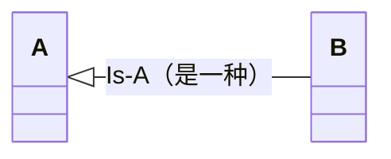
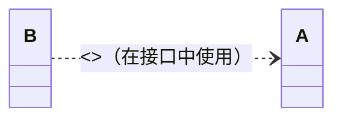
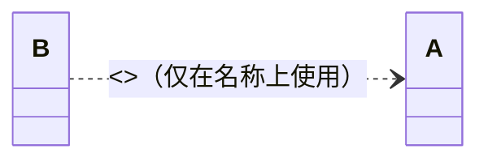
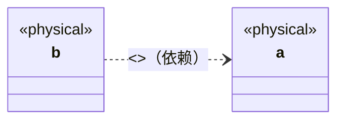

# 大规模C++软件开发 卷1：过程与架构

---
title: 大规模C++软件开发 卷1：过程与架构学习笔记
date: 2026-06-07
tags: [C++, 大规模软件开发, 软件工程]
description: 《大规模C++软件开发 卷1：过程与架构》学习笔记，涵盖开发动机、应用与库软件之辨、编译与连接机制、组件化打包规则、物理设计与分解及层次化复用架构等核心内容。
pinned: true

---

## 第0章 动机

### 0.1 目标：进度更快、产品更好、预算更低

业界评判软件应用开发成功与否的准则一直以来都是以尽可能低的成本、尽可能短的时间交付质量最好的产品。这个目标中实际隐藏着3个维度的要求。

1. **==进度(更快)==**:软件交付的眼前利害。
2. **==产品(更好)==**:增强的软件功能、质量。
3. **==预算(更低)==**:软件开发的经济性。

### 0.2 应用软件与库软件

两类截然不同的软件:**==应用软件(application software)==**和**==库软件(library software)==**。


应用是满足特定业务需要的程序，或紧密结合的程序套件。由于需求不断变化，应用的源代码生来就是不稳定的，且可能变而不告。以我们的观点来看，明确局部于某个应用的代码必须将其使用限制于该应用内(见2.13节)。

库(library)不是一个程序，而是一个存储库(repository)。在C++中，它是头文件和目标文件组成的集合，其设计目的在于便利共享类和函数。

一般来说，库是稳定的，进而潜在地可复用。软件主体是特定应用所特有的还是对整个领域更通用，将决定其在组织内得到复用的限度和有效性，甚至可能不止于此。应用和库在特定性和稳定性上展现出的这些差异表明，二者应采取不一样的开发策略和措施。特别是，库的开发人员(数量很少)须遵守相对严格的规则来创建可复用软件，而应用开发人员(数量多得多)则在组织规则方面有更大的自由。考虑到应用开发人员数量相对更多，他们(理想情况下)都会依赖库软件，因而，库的接口须经过深思熟虑，否则后续的改动成本可能高到难以扭转。

**==库软件==**：

1. **库软件须与那些将会用到它的人有所关联**。库的开发者只需将目光放到己有的应用中。和应用开发者紧密合作，解决他们工作中的经常性需要，库的开发者就能聚焦于真正重要的事情上：提高应用开发人员的开发效率!
2. **库的开发者有责任审慎地处理特性请求，婉转地拒绝不合适的、可能有损于开发社区整体成功的请求**。
3. **即使是有效的请求，有时其提议的解决方案也并不理想。库的开发人员不能盲目照原样满足请求(见3.12.1节)，他们有责任弄清楚实质需要**，考虑所有可能出现的软件问题，并提供满足需要(即使不是所有客户想要的)的切实解决方案，既要满足这一客户，又不止于满足这一个客户。

应用和库的设计范式迥然不同。应用的设计通常是自顶向下的，而由通用软件构成的库则往往是自底向上开发的。

库代码对清晰、简明且完整的注释的绝对需要也显现出它与应用的巨大差异。由于库的存在不依赖于某一特定的上下文，因此客户更加需要全面、详细的概述注释(见卷2的6.15节)以及精心打磨的用例(见卷2的6.16节)以方便理解和使用。另外，与应用不同的是，对于可复用库软件的性能要求并不限于任一用途，且往往必须超过当前可证明的需要。

### 0.3 协作式软件与可复用软件

可复用软件必须 **==易于组合，无须修改==** (见0.5节)就能轻松地拿来解决新的、从未见过的问题。一套值得信赖的预制组件对开发效率大有裨益。

### 0.4 层次化可复用软件


**==细致分级(finely-graduated)==**：表示从某一可访问抽象层级到下一抽象层级所需添加的功能相对较少。
**==颗粒化(granular)==**：表示任一原子物理单元中实现的逻辑功能的广度都很小。

对一个定义明确、反复出现的问题，用户可以轻松访问这样打包整理好的解决方案，并且这一解决方案物理上独立于其他不需要的软件。但我们还是要小心:如果打包得太多，最终导致用于实现颗粒化功能的子功能被嵌套进去(从而导致其呈现变成不可访问的)，则纵向上不再细致分级，并且离层次化复用也会越来越远。

### 0.5 易延展软件与稳定软件

大体上，好的软件可以宽泛地划分为两大类：

1. 一类是 **==易延展的(malleable)==**。
2. 另一类则是 **==稳定的(stable)==**。

易延展软件是指在需求变更时其行为可以轻松、安全地变化的软件，而稳定软件具有定义明确的行为，特意使其行为不会因客户需求变更而发生不兼容的改变。稳定软件的行为也可以轻松地发生改变。健全的软件工程实践有助于提升软件的易延展能力，如给各种符号常量做好完善的注释(魔数就是反面例子)，这当然也适用于稳定代码。两者的关键区别在于，**==易延展软件的行为为变化而设计，而稳定软件则不然。两种类型的软件在不同场合各有需求==**，但既不易延展也不稳定的软件是不可取的。最重要的是，切勿将易延展性与可复用性混淆，只有稳定软件才能复用。与库软件不相同的是，应用代码的行为一般要能够针对快速变化的用户需求做出响应。于是设计优良的应用是易延展的。仅仅因为某些事情在未来某个时候可能会发生些改变，并不意味着我们在编写代码之前不扩展重要的前期思考。遗

**==开闭(open-closed)原则==**:
> **软件既要对扩展开放(open)，又要对修改封闭(closed)。即不谋求在一个组件中为所有可能的行为做好准备，我们提供扩展行为所必要的钩子(hook)，而并不一定要改动组件的源代码。**

### 0.6 物理设计的关键作用

大规模软件开发的成功需要开发人员对 **==逻辑设计(logical design)==** 和 **==物理设计(physical design)==** 两方而细细斟酌，两者有所区别但息息相关。逻辑设计就如字面意思一样，它涉及软件的功能方面，如功能规约决定了应用、子系统或个体组件的整体逻辑设计。决定将特定类特化还是为所需功能提供抽象接口是一个相当高层级的逻辑设计选择。使用带线程的还是不带线程的、阻塞式还是非阻塞式传输(进程间通信)，这些都属于逻辑设计的范畴

物理设计的定义：

1. **==名词==**，表示源代码在文件中的排布以及文件在库中的排布。
2. **==及物动词==**，表示在文件中分隔源代码以及在库中分隔文件。

物理设计决定了(物理上)编码功能相对于整个企业中的其他功能所属的位置。

现如今，软件开发业界已经达成共识，应尽力避免(物理)模块之间的循环依赖。

将深思熟虑的逻辑设计与细致的物理打包相结合，使得软件开发人员能够在细致分级的集成层级上“混搭”现有的解决方案、子解决方案等(见0.3节)。这两相结合所得的灵活性以及逻辑和物理互操作性，有助于通过层次化复用使规模经济最大化成为可能(见0.4节)。

### 0.7 物理形式统一的软件：组件


软件的物理形式在很大程度上影响我们对软件的管理能力。除健全的物理结构之外，我们的专有软件还需要 **==物理形式统一(physically uniform)==** 的组织，这会极大地增强开发者对专有软件的理解、使用和维护能力。而且，物理上的统一会鼓励创建直接在软件上(作为数据)操作的高效的开发工具(如编码规范检查器、依赖分析器、注释提取器)。

组件是物理设计的原子单元。在C++中，它的形式是一对.h/.cpp文件(见16节)。每个组件均应关联一个独立测试驱动程序(见卷3的7.5节)，其要能够检验此组件中所有实现了的功能。

### 0.8 对层次化复用的量化：一个类比

### 0.9 软件资本

**==软件资本的内在特性==**：

1. **易于理解 (easy to understand)**
   - 最小的表面积
   - 规范简洁的呈现
   - 清晰且完整的参考注释
   - 有关的用况
2. **易于使用 (easy to use)**
   - 有效的使用模型
   - 直观的接口
   - 合适的安全等级
   - 最小的物理依赖
3. **高性能 (high performing)**
   - 执行（即真实和CPU）运行时间
   - 进程（即内核内存）大小
   - 编译时间（或者编译时耦合的程度
   - 连接时间（或者连接时依赖的程度
   - 可执行（即硬盘上）代码的大小
4. **可移植的 (portable)**
   - 在所有支持的平台上均可构建
   - 在所有支持的平台上均可运行
   - 在所有支持的平台上均可产生同样的结果
   - 在所有支持的平台上均可达到“合理的”性能
5. **可靠的 (reliable)**
   - 没有核心转储
   - 没有内存泄漏
   - 没有错误的结果
   - 没有bug
   - 没有，我们没在开玩笑！

### 0.10 增大投入

### 0.11 保持警觉

### 0.12 小结

有效的大规模软件开发绝非易事，并不是无意之间就能成功的，组织、计划、经验和技艺缺一不可。要在企业规模上达到我们所追求的长期成功，需要对原本创建库和应用的基础常规实践做一些重大调整。本章介绍了大规模开发解决方案所需考虑的高层级目标、思考过程和设计权衡。经典与现代手段融合成一种内聚的方法论，我们认为这是长期开发高质量应用的最有效方法。

#### 0.1 节小结

软件开发的工作目标涉及 3 个维度，分别是进度、产品和成本。如今，工业软件开发带来了许多难题，包括开发的不可预测性、复用的危险、频繁的构建次数、可执行程序的巨大体积，以及人们对已有产品进行细微改进时所感受的胆战心惊。最根本的是，进度、产品和成本之间的平衡并不令人满意。

为了实现这 3 个维度的增益，需要将设计空间向外推。为此，开发过程的一些输出（如软件产出的一部分）必须以某种形式反馈到此过程中。只有这样，开发过程的效率才能无止境地提高。挑战在于找到一种组织和过程能够使得这样的反馈在实际的软件复用中成为可能。我们给出的解决方案是一个既能解决软件组织问题又能解决软件开发人员组织问题的过程。

一开始先别太过具体，我们先假定这样的过程是存在的，并且已经良好运转一些年份了。几乎每一个我们可能需要的组件或者子系统都已经准备好了并且等着被复用（例如图 0-67）。到这时，这个“假想的”开发过程已经演变到了这样一种状况，实现一个应用只需要找到并组装所需要的部件多一点。我们主张，这一过程不仅是可能的，而且从长远看是最优的。我们有时借用长期贪婪（long-term greedy）这一词来形容我们的方法。当进行大规模的软件开发工作时，经验告诉我们长期贪婪是上上之策。

#### 0.2 节小结

我们观察到应用和库的开发有着本质的不同，两者有着不同的目标和压力。应用开发多数是自顶向下的，而库开发则多数自底向上。应用开发需要解决特定的问题，将工作尽快完成，并且可能在随后需要时更改代码。在库开发中，目标则是尽可能将工作做好，更一般化地解决问题，并且避免随后的改动。开发这两类软件的人们一般在目标、脾气和技能等方面均有差异。

应用开发者尽可能快速有效地完成工作，以此获得酬劳。由此不难理解为什么应用的源代码永远不如库的代码稳定。应用开发的焦点在于快速地解决特定问题，这样的软件常常需要随着时间更迭。随着每次迭代，源代码甚至功能模块都可能发生改变。最好的应用代码需要具备延展性。

而优秀的库开发者的思考模式则截然不同。因为库开发一旦高收入流没那么近，相比于应用开发人员，他们有相当程度的自由，因此，库软件的延续时间往往比更长。按定义来说，库跨越了所有应用，它之于应用的生命周期。在编写库组件时，称职的库开发人员不会选择简单的实现，这会导致难以修改的接口或给客户带来不便。正相反，好的库开发人员会为了易于复用而放弃易于实现的解决方案。

#### 0.3 节小结

大型软件问题通常被切分成子问题，各自独立解决后重新组合在一起以解决原问题。然而，这样一种最小化的分解，常常会导致软件的脆弱性，其特点是过度的不规则性存在于紧接互相依赖的接口边界（“碎盘子”）。修改的余地很小。对整块的应用级功能（“烤面包机-牙刷”）的修改可能会导致我们需要重新检查这些接口的实现，增加成本和威胁到软件的可靠性（见图 0-9）。

协作式的接口往往有较大的表面积-体积比，这使得对单个子系统的理解不必要地困难，更不用说复用了。紧密的语法耦合使得对某个模块的改动必然会在另一模块上有所反映。分发设计决策时跨过模块边界，让模块化不清晰。反之，如果我们强调将系统划分为更自然的界限，我们就会发现更多的规整软件。这些更简单、更易于上手的子系统更易于解释和理解，而且更有可能“按原样”复用，因为更高层级的需求不可避免地会发生。

经典的复用会探讨对特定类型、容器、子系统等的复用，而不考虑用于实现它们的任何部件。碎盘子或烤面包机-牙刷的可复用性着实不高。带挂钩的烤面包机和带孔的牙刷的构造是协作式（同等级组件互知）的简单例子。可复用片段越能被简单地描述出来（如半圆形、矩形、正方形、三角形），它们越有机会被无修改地使用。不过，这种程度的复用仍然不够。

#### 0.4 节小结

为了实现最大化的复用，开发人员在逻辑和物理两方面都必须坚持最大程度的分解。一个烤面包机-牙刷可以被分解为烤面包机、牙刷和给烤面包机连上牙刷的适配器。添加一些胶水后，我们将得到想要的定制零件（见图 0-12）。然而，第一层级的分解实现的只是传统意义下的复用。为了实现最大化复用，我们必须积极地将烤面包机、适配器和牙刷分解到它们各自的组成零件（外壳和底盘、杆和接头，以及刷柄和刷毛）。只有这样才能认识到用一个烤面包机、适配器、刷柄、刷毛和胶水来创建一个烤面包机-牙刷的好处（见图 0-20b）。

#### 0.5 节小结

一款软件要称得上优秀，若不是胜在易延展（行为容易改变），就得稳定（行为不改变）。小物理模块（我们称为组件）的层次化组合是稳定性的关键方面。要一致地实现此类小型模块，就需要积极的分解。举例来说，如果我们创建一个具有 6 个参数的函数，则很有可能遗漏了一个参数。为了之后增加参数，我们还得被迫修改现有函数，从而可能违背开闭原则（见 0.5 节），或者从头创建一个全新的函数（有着大段的不必要重复的代码）。如果我们创建 6 个单参数函数，并对它们进行组合，那么我们随后可以很容易地添加第七个函数，而不影响其他 6 个函数的客户。

我们必须承认，只有稳定的软件才能被复用。稳定性是确保在较高层级上所作的假设不会因原组件并行运行（临时或永久）而不兼容地改变可复用组件的行为的作用。另外，可变软件（最好设计为易延展的）最适合放在最高层，并且不能被共享，否则问题会受到过度约束（例如带旗子的、压扁的、绿色烤面包机-牙刷，见图 0-31）。注意，既不稳定又不易延展的软件通常不是我们期望的。

#### 0.6 节小结

细粒度分解需要的不仅仅是稳定性和可测试性。为了实现层次化复用，我们必须确保如何打包我们的每一个独立的解在分割的物理模块中。回忆一下，Dijkstra 主张粒度的层次化分解，Parnas 主张将单个设计决策封装到设计良好的接口后面，这些接口仅通过简单（如参数）数据类型传递信息，Myers 则主张确保这些接口有良好的注释以帮助理解。只有将功能性内容限制到小型（细致分级、颗粒化且注释完善的）物理模块上，才能让我们仅所需要的的东西付出连接时间和磁盘空间。此外，只有通过这种积极的分解，我们才能在每个抽象层次上都达成复用，即除了那些广泛传播的公共使用。

逻辑设计和物理设计是两个截然不同但是信息相关的设计门类。逻辑设计解决开发软件的功能方面。物理设计解决我们如何将我们的源代码打包到各种文件和库中（示例见图 0-15）。物理设计在考虑任何大型软件时都起着关键作用。特别的，欠缺考虑的物理设计会很快使得软件中的物理模块间产生循环依赖，并且对大规模开发而言，相互循环依赖的模块几乎就是不可维护的了。可能出乎一些读者意料的是，物理设计实际是逻辑设计的前提，并且必须从一开始问题被分解就着手考虑，这会使得独立的解决方案之间可以结合起来解决原来的问题（也可以解决更多其他问题）。在大型开发工作中，再怎么强调健全的物理设计的重要性也不过分。

#### 0.7 节小结

按本书的方法论来说，健全的物理设计的基础是将逻辑内容组织到连贯的物理模块中，称之为组件。这些模块在结构上是一致的，而且相对较小。另外，我们希望这些模块既细致分级又颗粒化。我们用细致分级指不同抽象层级之间的（纵向）“距离”小。颗粒化是指该领域功能的（横展）“面积”较小。这种细粒度的物理分解降低了任何特定模块因需求变化而需要更改的可能性。而且，细粒度的模块化使我们能够重新组合现有的片段，这是一种高效的扩展方法（从头创建整个子功能相比）。此外，当软件是分解妥当的并且被打包在各个组件中时，彻底的测试就简单多了。

按本书的定义，组件是逻辑设计和物理设计中基础的原子单元。在 C++ 中，组件由头（.h）文件和实现（.cpp）文件组成，并且应该始终有一个关联的测试驱动（t.cpp）文件。我们要求组件相对较小，逻辑内容的大小在可处理的范围内，可以由单独的测试驱动程序彻底地测试。组件有着定义明确的接口，接口最好要设计优良（易于理解和使用）。此外，设计优良的组件还应设计成可测试的。

从许多方面看，组件就如同搭建房子的砖块一般，两者大同小异。尽管从微观角度看，每块砖在逻辑上都是独一无二的，但所有砖都有相同的宏观物理形式。在某种程度上，区分一块砖和另一块砖的唯一特征的是它在物理层级中的相对位置。在更高层次的砖可以做更多的事情，并不是因为它们更大或者包含了其他的砖，而是因为它们依赖于其他的砖的承诺。因此，更高物理层级的砖，就如同公司经理一样，比其下的个体贡献者有着更大的作用。

多样性可能是生活的调味剂，但不应该用在软件呈现上。存放逻辑内容的物理形式之规整至关重要。逻辑内容的物理打包的统一性能够极大简化人的认知、促进了有效的开发和支持工具创建、增强了企业中专有子系统的互操作性，并增强了开发者可流转性。

#### 0.8 节小结

有一个恰到好处的类比，我们将软件开发应用比作在固定宽度的页面上排版文字的优化问题。一种简单粗暴的方法当然是递归地解决每个左右文本划分的子问题（类似于软件中纯粹的、自顶向下的设计），这会需要指数级的时间。然而，我们注意到不是十分显然的一点，即要解决的唯一的（有用的）子问题的数目不是指数级的。类似地，我们认为不同的部分子解决方案是相当的少（相对而言）。

我们还观察到对这个优化问题的一些其他改进也与本书的软件开发方法类似。第一个改进阐述的是解决方案稳定性的重要性，解决方案可以被原封不动地使用而无须复制（复制粘贴型的复用）。第二个改进强调查找速度的重要性。正如在成熟的软件环境中，应用开发的很多工作其实都是查找合适的预制解决方案来使用。

为了使这一类比成立，我们观察到，应用分解后的许多不同部件里遇到的软件子问题要么是相似到其解决方案可以“原样”（as-is）复用的程度，实现这一目标至少需要细致粒度分解、统一的物理呈现和规范的接口。此外，为复用准备的软件，除了满足其他更客观的质量指标，还必须“足够吸引人”（如有着惊艳的注释，足够赏心悦目）。要不然开发人员就不会使用。还有一点，为复用而做的设计的目标应该是一个由一套离散的、不同的组件覆盖预期的领域，而不是用组件之间共享的细微区别——尤其是在词汇类型（见卷 2 的 4.4 节）方面——的连续体来覆盖。最大限度地提高复用的可能性将在卷 2 的 5.7 节中论述。

#### 0.9 节小结

从企业的视角来看，我们希望让尽可能多的应用代码收纳到稳定的库中，让它们在其中被分解、精细化、变得更稳健，且独立地供以后的应用复用。尽管并不能保证从一开始就可有复用软件可用，但目标是做到预期地将潜在可复用软件重构并降级（见 3.5.3 节）到物理层次结构中的较低层级，使之可以被更广泛地共享。在软件开发中，这种持续重构方法被许多人认为是现今最好的方法。鉴于我们的目标是复用，我们以义务为中心，并且看着这种强调会将我们引向何方。

通过将通用知识隔离到易于访问的软件存储库中，我们使得现在、将来、乃至过去的项目都可以利用我们的知识库并以远远快于其他的方式速度交付新的功能。这一专有软件存储库变成重要的公司资本，它会随着时间会给出越来越多的回报。一系列的具有良好工程实践的专有软件，能促进一个或多个应用领域或产品线中的开发工作，这就是我们所谓的软件资本。积极创建软件资本的首要驱动力是为了缩短未来应用和产品推向市场的时间（见图 0-54）。提升质量的同时减少开发和维护的成本，都是软件资本附带的好处。

#### 0.10 节小结

发展软件资本的隐含目标是获得一套对所有重要且相关的子解决方案的切实可行、细致分级、颗粒化的划分。我们要一致地分解应用以期精确地得到相同的子解决方案，日积月累之下，软件运行的速度和可靠性会远远超过其他方法。易于理解、易于使用、高性能、易于移植且可靠（见图 0-55）的相关预制组件是软件资本的特点。定期的同行评审和测试能够同时提升质量的 3 个维度。只有一小部分专有软件属于这一企业范围的基础设施，但要是不这一小部分软件，我们就得用庞大得多的、迥然不同的、重复且不兼容的解决方案，这些解决方案性能更差、可靠性较差，而且维护成本过高。

事实上，软件资本能够轻松地同时改善设计空间的 3 个维度——进度、产品、预算。此外，由于从软件资本继承到相当的好处，更快、更好、成本更低，无论 3 个维度的重要性权重如何，从软件资本组装的应用在所有这 3 个维度都将获得非凡的好处。

早先开发的一些应用相对而言可能从软件资本中获得的好处相对较少。反复出现的业务需求会引导这一资本的发展方向。随着时间的推移，越来越多的开发工作会聚焦在应用级功能上。我们注意到，在一个设计优良且成熟的软件开发企业中，对正在实现中的应用而言，几乎所有开发的代码都是应该被用所独有的，只有相对较少的一部分持续再投资放在软件资本这一重要的全公司资产的扩展上。

#### 0.11 节小结

开发人员往往有正当理由质疑非业务需求的开发。为了使复用足够高效，要被复用的软件必须被公司内所有开发人员都公认为“离谱”。最糟糕的事情无非就是碰不上听话、心怀不满的开发人员，但面对这么好的软件资本，他也只能低头承认“这实在太了”，“不值得花时间重写”。毕竟它已经摆在那了，他当然只好接着用；我们知道我们已经让代码质量达到了成功复用所要求的等级。

然而要是没有切实可用的软件资本，为了替代缺失的可复用软件而爆炸性增长的重复代码可能会主导、甚至占据所有的开发工作（示例见图 0-68）。库软件的制造成本感觉起来会相当高，但鉴于开发库软件的成本会被分摊到使用它的诸多应用及其版本（见图 0-69），这是可以理解的。而事实也证明，不采用软件资本的实际成本比这高得多，这甚至还没算软件资本的主要收益，也就是缩短未来应用和产品推向市场的时间（见图 0-54）。

在本章中，我们介绍了一些根本性的业务和经济现实，它们促使我们发展出一套在公司规模上开发高质量软件的方法并使用之，这一方法可以称得上是目前最有效、切实可行、快速经济的方法。本书的其余部分会详细描述如何获得这一成功。这 3 卷书中介绍的所有设计、实现和测试技术都适用于大规模系统。即使在规模不大的系统中，遵循本书提倡的做法也能带来巨大的好处，对软件的可靠性、可维护性和性能大有好处。

总而言之，本书讲述了在生产环境中，如何在应用开发上做到增量式的成功。接下来的几章会谈及一个成熟且已践行过的 C++ 软件开发过程的准则，这一过程之应用不局限于 C++ 的某个特定标准化版本，亦不必囿于 C++ 这门语言。任何编程语言（特别是那些会把独立编译单元组装起来的）均可从这些基本软件工程原理中受益。

## 第1章 编译器、连接器和组件

### 1.1 知识就是力量：细节决定成败

#### 1.1.1 "Hello World!"

#### 1.1.2 创建C++程序

#### 1.1.3 头文件的作用

### 1.2 C++程序的编译和连接

构建C++程序的过程可以自然地分为两个主要阶段。第一阶段被称为 **==编译阶段==**，它分为两步，先是**将每个源(.cpp)文件及其包含的所有头(.h)文件预处理成一个中间表示**；然后**将该中间表示翻译为可重定位的机器码，然后将其放置在目标(.o)文件中**。在第二(主要)阶段中，**将合并这些目标文件以形成一个内聚的程序**。

#### 1.2.1 构建流程：编译器和连接器的使用

#### 1.2.2 目标文件（.o）的经典原子性

**==目标文件历来便是原子的==**。换言之，若是要将一个目标文件纳入可执行文件中，则只能一整个加进去。该 .o 目标文件中定义的所有外部可访问符号现在都可用于解析其他 .o 文件中未定义符号。同理，该 .o 文件中任何未解析的符号(无论是否会被使用)最终都必须被解析，否则连接阶段会失败。由于C++初始版本便需要包含一些较高级的(相比于C语言)语言构件(如隐式模板实例化、不内联的内联函数)，所有现代平台现在都支持在单个 .o 目标文件中包含多个段(section)，这样，每个段都可以独立于其余段纳入(或不纳入)，我们稍后会就此问题进行详细讨论。外部符号定义是否驻留在 .o 文件的不同段中以及驻留的程度有多大都取决于平台和构建配置，并且肯定不应在开发过程中影响我们(见2.15节)。为了确保对物理依赖的可移植、细粒度的控制，我们做设计时还是把 .o 文件以及组件(0.7节)当作原子的。

#### 1.2.3 .o文件中的节和弱符号

前文已详细地考虑了几年来实现常用语言构件所需的基本编译器/连接器功能，例如C语言所需的功能。而随着C++语言的引入，编译器已经普遍可以将某些特定类型的函数定义放到多个 .o 文件中，然后依靠连接器仅将众多(完全一样的)副本中的一个纳入最终的可执行文件。要使这种方法起作用，编译器必须能够将每个此类符号定义放置在其自己分离的节(section)中，而段可以独立于.文件中任何其他目标代码地被纳入(或不纳入)。然后，连接器从它遇到的各个 .o 文件中散布的也许很多的(完全一样的)定义中选择其一，而不会报告此类孤立符号的多个定义，而且只有在它们满足某个未定义引用才拖入，这就确保了不依赖连接顺序。

**将每个符号定义放置在其自己分离的物理节可能会导致额外的构建时开销**。在不分离定义的条件下实现相同效果的一种方法，是将内联函数和函数模板产生的定义符号标记为弱的，这意味着该符号可以用于满足未定义符号的引用，但如果将该符号定义纳入已使用了相同未定义符号的另一弱定义的程序中，不会导致出现多重定义符号错误。

除了构建时性能，还有许多原因(如在某些平台上处理异常的方式)可能导致各节之间的相互依赖，从而迫使混合解决方案，既有独个的物理节又将符号标记为弱的。注意，如果典型的连接器试图将同一名称的一个弱符号定义和(正常的)一个强符号定义(顺序任意)纳入程序中，就会导致多重定义符号错误。遵循广为接受的软件设计实践(见本书第2章)有助于我们满足基础性的语言需求，如单一定义规则(ODR)，从而避免此类令人不安的问题。

记住，这所有关于物理节和弱符号定义与强符号定义的讨论都远远超出了C++标准的规定，此处提供是作为理解如何使用低层级工具来实现它的基础。在所有平台上避免将目标代码纳入最终可执行程序中的唯一可靠方法是使其远离连接命令行。本书对软件模块化的细粒度方法(0.4节)反映了这一思想。

#### 1.2.4 静态库

即使是相对较小的程序，在连接时列出每个 .o 文件也是烦琐且不切实际的。各编译系统都有工具可将多个目标(.o)文件组合起来，放到一个被称为库(library)或归档文件(archive，通常也称为静态库)的物理实体中。妥当地将互相关联的目标文件整合成库可以便利构建和分发软件的过程。

#### 1.2.5 "单例"注册表的例子

#### 1.2.6 库间依赖

**更一般地，任何实体之间的相互依赖都要尽量避免，逻辑依赖和物理依赖皆是如此**。如果相互依赖被认为是必要的(无论原因为何)，不管这些相互依赖的实体是函数、类还是(此处讨论的罕见案例中)翻译单元，我们都建议将它们打包到一起，而不是分离打包。

#### 1.2.7 连接顺序和构建时行为

**C++标准不处理如何打包库中.o文件的（平台特定的）细节**，但若是不了解库在实践中的一般行为方式，可能会导致开发和部署过程中出现重大问题。库中的.o文件一旦被纳入程序中，就会像直接在命令行上提供一样被对待。整个.o文件会被纳入程序中，任何不能由先前输入的目标文件解析的未定义符号都需要其他.o文件的纳入，否则连接阶段将失败。

直接连接器提供有重复符号定义的.o文件是致命性的错误，但提供的一个或多个库中确实无意中包含多个定义了相同符号的分离的.o文件。在连接阶段过两遍的平台上，所需符号的第一次（或最后一次）出现通常指示了哪个.o文件被纳入。在Unix平台上常见的方法是，依次扫描每个库，在扫描下一个库之前，把所有解析当前未定义符号的.o文件纳入。不管在哪种情况下，都没有切实可行的办法来控制使用的是多个定义中的哪一个。

**即使两个符号定义相同，这些符号定义所在的相应.o文件也可能不同**。受所选.o影响，其他定义可能会被拖入其中，而这些定义可能与其他定义冲突，导致多重定义符号错误。因由定义并置产生的额外的未定义符号可能无法被解析。即使连接成功，磁盘上生成的可执行文件的大小和构成也可能因连接顺序而异。应确保每个连接器符号只有一个定义，从而避免此类连接顺序特性影响构建过程的稳定（可重复性和可靠性）。

#### 1.2.8 连接顺序和运行时行为

**甚至还有更微妙的方法可以让.o文件的处理顺序影响生成的可执行文件的运行时行为**。特别是，文件作用域静态对象（如1.2.5节的图1-11中用于自动初始化注册表的对象）的构建顺序取决于实现顺序和连接顺序。C++中根本没有可靠的方法来确保一个翻译单元中的文件作用域静态对象的初始化先于或晚于另一个翻译单元中的文件作用域静态对象。C++给跨翻译单元提供的唯一保证是，文件作用域静态对象将在首次使用之前、在进入main之前被初始化。

**==依靠于跨翻译单元运行时静态初始化的相对顺序可能导致意外且通常是灾难性的行为==**。

#### 1.2.9 共享（动态连接）库

我们应当注意，使用“共享对象”（Unix 平台上的术语）或“动态连接库”（Windows 平台上的术语）只会增加观察物理依赖并正确打包逻辑内容的需要的。这些类型的库的行为更像整块式的。与动态库的文件而不是静态库，对它们的处理是原子化的，即要么全并进去，要么一点都不用。与动态库的集和连接依赖总是特定于平台的，在这里不再赘述。但是，静态连接的库将成为进一步分析和讨论的良好思维模型。

### 1.3 声明、定义和连结

构建程序时的许多事情，都涉及编译器（有时是连接器）将具名实体（如模板、类型、函数和变量）的使用与其相应的定义关联起来。在程序中，将具名实体的使用解析到唯一定义是通过声明间接完成的。也就是说，编译器基于显式声明启用名称的使用，而语言规则决定了如何将每个声明与其相应（唯一）定义关联。名称在多大程度上可以指代不同作用域或跨翻译单元的实体受连结（linkage）的约束。

#### 1.3.1 声明与定义

由于一个程序可以由多个翻译单元组成，并且这些翻译单元往往是分离编译的，因此 C++ 语言精心地规定了每个 C++ 实体的连结规则，以便与当前典型构建工具（特别是连接器）的能力。

> **定义**：**==声明(declaration)是将名称引入作用域的一种语言构件==**。

**声明将一个名称引入作用域。该名称随后可在声明可见的任何地方使用，以指向相应的实体**。

> **定义**：**==定义(deinition)是一种语言构件，它唯一地刻画了程序中的一个实体，并在适当时为其保留存储空间==**。

**定义描述了实体的特征，并在合适时保留存储**。

大多数定义也是其自身的声明，如上述每一项定义一样。遗憾的是，定义的自声明可能会导致一些微妙的问题。

事实上，**C++语言要求程序中使用的每个不同实体刚好只有一个定义**。**==这一规则称为单一定义规则（one-definition rule，ODR）==**，根据所涉实体的类型，它以不同的方式解释和实现（见下文）。为了帮助指定不同作用域和翻译单元中实体的逻辑“相同性”，C++标准定义了连结的概念。

连结（Linkage）
当某一名称的声明可与另一作用域中的声明表示相同的对象、引用、函数、类型、模板、命名空间或值时，我们称该名称的声明具有（逻辑）连结。

- **==外连结型==**：**这一名称的声明表示的实体可以在另一翻译单元、另一作用域或另一翻译单元的另一作用域中被定义**。
- **==内连结型==**：**这一名称的声明表示的实体可以在另一作用域中被定义，但不能在另一翻译单元中被定义**。
- **==无连结型==**：**这一名称的声明表示的实体既不能在另一翻译单元中被定义，也不能在另一作用域中被定义**。

**C++连结规则允许我们确定在不同作用域或翻译单元中声明的两个名称在逻辑上是否表示相同的实体**。例如，在文件作用域（或任何其他命名空间作用域内）声明的类型或非静态函数的名称为外连结型，这意味着该名称将与在不同翻译单元中相同作用域内出现的类似声明中的名称所表示的实体相同。

#### 1.3.2 （逻辑的）连结与（物理的）连接

从历史上看，编译器技术和连接器技术（尤其是连接器技术）对 C 的连结规则和语义产生了强烈的影响，进而影响 C++。尽管如此，（逻辑的）连结和（物理的）连接是两个不同的概念，不应混淆。连接是指将名称的使用与其定义（或含义）绑定的物理行为，而连结则用于确定给定的声明和定义是否指同一逻辑实体。

#### 1.3.3 需要了解连接工具

为了从任何特定的实现选择中抽象出语言规约，连结完全是从逻辑效果而不是任何物理表现的角度来定义的。但是，了解“连接”的底层细节——如编译器、连接器或两者最终是否可用于将已声明名称的特定使用与其相应定义（或含义）相关联，对以下两方面至关重要：一是深入了解 C++标准选择“工具无关的”（逻辑）连结规则的动机；二是作为了解 C++标准的单一定义规则（ODR）是否以及何时可在实践中被良性地违反的基础。

#### 1.3.4 物理"连结"的另一种定义：绑结

值得注意的是，连结一词有时也被用来指直接通常用于在典型平台上连接给定 C++ 构件的物理设备类型，尽管其形式不太正式。当然，C++标准的（逻辑）连结定义必须优先，但我们仍然认为这种替代的物理含义在概念上有用——特别是在口头交流中。今后，我们将始终把“连结”（物理的）称为“绑结”。

事实上，C++的（物理）绑结有 3 种不同的（不相交）类型：**==内绑结型、外绑结型和双绑结型==**。

> **定义**：**==如果在典型平台上，对一种 C++ 构件的已声明名称的使用及其对应定义（或含义）总是在编译时有效地绑定，则此 C++ 构件是内绑结型（internal bindage）==**。

内绑结型语言构件要求其定义（或关联的含义）和使用在同一翻译单元内对编译器可见，因不会向 .o 文件中引入用于绑定的制品。在典型平台上，始终在编译时解析声明名称及其相关含义。

> **定义**：**==如果在典型平台上，一个 C++ 构件的对应定义不能出现在一个程序的多个翻译单元中（如为了避免连接时出现多重定义符号错误），则此 C++ 构件是外绑结型（external bindage）==**。

外绑结型语言构件不要求使用该构件与定义该构件的翻译单元相同，因此，在典型平台上，编译器将在 .o 文件中引入制品，以便连接器随后使用该文件来完成将名称的使用与其（全局唯一的）定义的绑定。（注意，当任何构件的使用发生在其与定义相同的翻译单元内时，编译器可以在编译时执行完全绑定，包括尚未声明为内联的函数。）在典型平台上，通常在连接时绑定的语言构件例子包括非静态的文件作用域（或命名空间作用域）数据和函数、静态的类成员函数以及类数据，以及静态的类数据成员。

> **定义**：**==如果在典型平台上，一个 C++ 构件的对应定义能安全地出现在同一程序的多个翻译单元中，并且这种构件的已声明名称的使用及其相应定义可以在连接时绑定，则此 C++ 构件是双绑结型（dual bindage）==**。

#### 1.3.5 连接器运作的更多细节

#### 1.3.6 对一些需要全程序范围内地址唯一的实体的介绍

#### 1.3.7 客户编译器需要看到定义的源代码的构件

#### 1.3.8 声明并不一定要带上定义才能起作用

**要使用某一实体的名字，其声明必须是可见的**。但有些声明本身是有用的。例如，typedef 声明是一个结构别名，它在编译或连接时都不需要相应的定义便完全可用。声明的使用方式会影响实体的定义是否也需要可见。

#### 1.3.9 客户编译器通常需要看到类定义

然而，单一条类声明提供的信息太少，以至于无法创建该用户定义类型的对象、调用该类型的方法、继承该类型、将该类型的对象嵌套在另一个用户定义类型中，甚至都不知道该类型（对象）的 sizeof。类定义中通常包含其他声明和定义。特别是类成员函数和静态类数据成员本身是外连结型实体的声明——其任何使用都必须在连接时解析。当需要的不仅仅是用户定义类型的名称时，客户的编译器必须已经看到该类型的相应定义。

#### 1.3.10 客户编译器必须看到定义的源代码的其他实体

#### 1.3.11 枚举具有外连结，但又会怎样

#### 1.3.12 内联函数略有特殊

内联函数略有特殊，因为它的定义必须在调用它的任一翻译单元中可用，并且它的定义可以在源代码和目标代码级别的代码中跨翻译单元重复。由于调用方的编译器必须能够访问定义源，所以此类函数可能由编译器或连接器“连接”，具体取决于编译器是否决定“在调用点替换函数体”。如果不替换，编译器将需要在当前翻译单元中存放函数的离线版本，以确保连接器至少可找到一个定义。因此，被声明为 inline 的函数是双绑结型。

#### 1.3.13 函数模板和类模板

模板是 C++ 语言的一大复杂功能，其逻辑特性和物理特性需要大量篇幅讨论。模板与类和函数一样，在文件作用域是外绑结型。即在同一（具名）命名空间内不同的翻译单元中声明的两个类模板或函数模板指向同一实体。但不同于类和函数的是，模板无法被直接使用，而要先实例化成类和函数。

#### 1.3.14 函数模板和显式特化

#### 1.3.15 类模板及其偏特化

#### 1.3.16 extern模板

#### 1.3.17 用工具来理解单一定义规则和绑结

#### 1.3.18 命名空间

#### 1.3.19 对const实体默认连结的阐释

还需注意的是，默认情况下，文件作用域（或命名空间作用域）中的变量是外连结型，而声明为 const 的变量是内连结型（与 C 语言不同）。

#### 1.3.20 本节小结

正如前面详细讨论所表明的，抽象地理解如何区分纯声明、充当声明的定义以及不充当声明的定义，不是一件容易的事。图1-27给出了相当全面的声明与定义的示例列表，包括其（逻辑）连结型及其（物理）绑结型。

| 构件 | 声明/定义 | (逻辑) 连结型 | (物理) 绑结型 |
| --- | --- | --- | --- |
| `int i;` | 定义 | 外 | 外 |
| `const int M = 5;` | 定义 | 内 | 内 |
| `extern int j;` | 声明 | 外 | 外 |
| `static int k;` | 定义 | 内 | 内* |
| `void f();` | 声明 | 外 | 外 |
| `static void f();` | 声明 | 内 | 内* |
| `inline void f() { }` | 定义 | 外 | 双 |
| `static inline void f() { }` | 定义 | 内 | 内* |
| `typedef int Int;` | 声明 | 无 | 内 |
| `enum A { };` | 定义 | 外 | 内 |
| `enum { X };` | 定义 | 外 | 内 |
| `enum { } e;` | 定义 | 外 | 外 |
| `class U;` | 声明 | 外 | 内 |
| `class V { };` | 定义 | 外 | 内 |
| `struct W { };` | 定义 | 外 | 内 |
| `class MyClass { ... } x;` | 定义（类整体） | 外 | 内 |
| 成员 `int d_a;` | 定义 | 外 | 内 |
| 成员 `const int d_b;` | 定义 | 外 | 内 |
| 成员 `static int s_c;` | 声明 | 外 | 外 |
| 成员 `static const int s_d;` | 声明 | 外 | 外 |
| 成员 `typedef double Float64;` | 声明 | 无 | 内 |
| 成员 `enum Status { GOOD, BAD };` | 定义 | 外 | 内 |
| 成员 `void f() const;` | 声明 | 外 | 外 |
| 成员 `static void g();` | 声明 | 外 | 外 |
| 成员 `inline void h();` | 声明 | 外 | 双 |
| 成员 `static inline void i();` | 声明 | 外 | 双 |
| 对象 `x` | 定义 | 外 | 外 |
| `int MyClass::s_c;` | 仅定义 | 外 | 外 |
| `const int MyClass::s_d = 0;` | 仅定义 | 外 | 外 |
| `void MyClass::f() const { }` | 仅定义 | 外 | 外 |
| `void MyClass::g() { }` | 仅定义 | 外 | 外 |
| `inline void MyClass::h() { }` | 仅定义 | 外 | 双 |
| `inline void MyClass::i() { }` | 仅定义 | 外 | 双 |
| `namespace { void f() { } }` | 定义 | 内 | 外* |
| `namespace Foo { int i; }` | 定义（命名空间） | 外 | 内 |
| 命名空间成员 `int i;` | 定义 | 外 | 内 |
| `template<class T> class Stack;` | 声明 | 外 | 内 |
| `template<class T> class Stack { };` | 定义 | 外 | 内 |
| `template<class T> T max(T x, T y);` | 声明 | 外 | 内 |
| `template<> int min<int>(int x, int y);` | 声明 | 外 | 外 |
| `template <class T> class vector { ... };` | 定义（类模板） | 外 | 内 |
| 类模板成员 `void push_back(const T&);` | 声明 | 外 | 外 |
| `void vector<int>::push_back() {...}` | 仅定义 | 外 | 外 |
| `template <class T> struct X { ... };` | 定义（结构体模板） | 外 | 内 |
| 结构体模板友元 `void f(const X&);` | 声明 | 外 | 外 |

**注释**：

- **带 \* 的条目**（如 `static int k;`、`namespace { void f() { } }`）：从 C++11 开始，`static` 函数/数据的语义及底层机制趋同于无名命名空间中对应声明。
- **复合构件**（如 `class MyClass`、`template <class T> class vector`）需拆分"整体"与"成员"分别分析声明/定义、连结型、绑结型。

### 1.4 头文件

### 1.5 包含指令和包含保护符

#### 1.5.1 包含指令

#### 1.5.2 内置的包含保护符

#### 1.5.3 外置的包含保护符（已废弃）

### 1.6 从.h/.cpp文件对到组件

正如我们在1.4节中看到的，物理设计的演变(以1.4节的图1-31而告终)导致了将一个或多个密切相关的类(见3.3.1节)及其相关的自由运算符并置在单个.h和相应的.cpp文件中的做法。这些.h/.cpp文件对又称作组件[见0.7节，将会被形式化定义(见2.6节)]，它们构成物理设计的原子单元。

目前，我们假设我们所指的任何.h/.cpp文件对都是一个组件，至少要满足以下特性。

1. **cpp文件的实质性第一行代码将对应的.h文件纳入。**
2. **在.cpp文件中定义的外连结型逻辑构件(除非在效果上呈现为外部不可见的)在对应的.h文件中声明。**
3. **在组件的头文件中声明的外绑结型或双绑结型逻辑构件，如果有定义，则其定义仅在该组件之内。**

#### 1.6.1 组件特性1

> **==.cpp 文件的实质性第一行代码将对应的 .h 文件纳入。==**

特性1有助于确保.h文件中的任何声明至少与.cpp文件中的定义一致，如1.4节所述。

确保每个头文件都可以不依靠之前包含的任何声明或定义而通过编译是非常可取的，特别是在诊断这些问题并不容易的情况下。只要有一个翻译单元保证在任何其他声明或定义之前解析一个头文件，就不会让它们掩盖此类缺陷，从而可以强制头文件在编译方面自给自足。通过简单地要求每个组件都包含自己的头文件作为第一行实质性代码，我们确保其头文件可孤立编译，因此客户以任何顺序将其包含都是安全的。

#### 1.6.2 组件特性2

> **==在.cpp文件中定义的外连结型逻辑构件(除非在效果上呈现为外部不可见的)在对应的.h文件中声明。==**

特性2通过在组件物理接口的源代码中显示任何全局名称，来防止无意中违反单一定义规则(ODR)。

#### 1.6.3 组件特性3

> **==在组件的头文件中声明的外绑结型或双绑结型逻辑构件，如果有定义，则其定义仅在该组件之内。==**

从模块化的角度来看，这一特性也许是3个特性中最显而易见的，但在技术上是最微妙的。简单地说，任何宣传(通过头文件中的声明)是唯一的外绑结型或双绑结型逻辑构件，它的定义不会驻留在此.h/.cpp对之外的任何地方。

在本节中讨论的3个基本特性十分重要，它们将我们称之为组件的原子设计单元区别于随意的.h/.cpp文件对:

1. .cpp文件必须在实质性第一行代码处包含对应的头文件;
2. 任何外连结型定义都必须在其头文件中声明;
3. 在组件的头文件中声明的任何外绑结型或双绑结型实体都不得在这一组件之外定义。组件的第四个基本特性对于可视化和可维护性特别有用，对它的讨论放在1.11节。

### 1.7 符号和术语

#### 1.7.1 概要


*图1-47 我们的基本逻辑/物理设计符号摘要*


*第 129 页*


*第 130 页*

| Lakos 原书 | UML 2.5 等价符号 | Mermaid 语法 | |
| --- | --- | --- | --- |
| 逻辑实体（椭圆） | 类（矩形） | `class X` | |
| 物理实体（矩形） | 带 `«physical»` 的类 | `class x <<physical>>` | |
| Is-A（是一种） | 泛化（Generalization） | \`A < | -- B\` |
| Uses-In-The-Interface（在接口中使用） | 依赖（Dependency）+ `«uses-in-interface»` | `B ..> A` | |
| Uses-In-The-Implementation（在实现中使用） | 组合（Composition）+ `«uses-in-impl»` | `B *-- A` | |
| Uses-In-Name-Only（仅在名称上使用） | 依赖（Dependency）+ `«uses-in-name-only»` | `B ..> A` | |
| Depends-On（依赖） | 依赖（Dependency）+ `«depends-on»` | `b ..> a` | |









#### 1.7.2 Is-A逻辑关系


#### 1.7.3 Uses-In-The-Interface逻辑关系


> **定义** **==如果某一类型出现在某函数的签名或返回类型中，则称该函数在接口中使用该类型。==**

每当函数声明在其参数列表中提名一个类型或将其提名为返回值类型的一部分时，就称该函数在其接口中使用该类型。例如，自由函数(非成员函数)。

```cpp
    bool operator== (const Date&, const Date&);
```

显然在其接口中使用类Date。此函数恰好返回bool，因此bool类型也将被视为此函数接口的一部分。但这种基本类型到处都是，不用担心它们会引起物理依赖，因此我们不会进一步考虑这
些类型。

**定义** **==如果某一类型被用于某个类的任一(公共)成员函数的接口中，则称该类在(公共)接口中使用该类型.==**

如果某一类型被用于一个类的某一成员函数(不考虑友元)中，则称该类在其接口中依赖该类型。例如，Calendar 的addHoliday方法。

```cpp
    void Calendar::addHoliday(const Date& holiday);
```

在其接口中使用类Date，因此，Calendar在其接口中使用Date。

#### 1.7.4 Uses-In-The-Implementation逻辑关系


**定义** **==如果某一类型被用在一个函数的实现中，但不出现在它的公共(或受保护)接口中，则可以说该函数在实现中使用该类型.==**

如果函数在其实现中提名一种类型，但不在其参数列表中或作为其返回类型的一部分，则称该函数在其实现中使用该类型。

分层(layering，见3.7.2节)是在较小的、较简单的或较初等的类型的基础之上形成较大的、结构较复杂的或程度较高的类型的过程。分层通常是通过组合来实现的，如在一个较简单类型的实例嵌入另一个类型实例的足迹(Has-A)，或者通过嵌入的指针(Holds-A)管理较简单类型的动态分配的实例。但任何形式的实质性使用，只要会引起编译时依赖或连接时依赖，都将被视为分层。

类对各种类型的特定使用方式不仅会影响到其对这些类型的依赖方式，还会影响该类的客户在多大程度上会被裹挟着依赖这些类型(见3.10.1节)。在这里，我们只列举类在其实现中使用类型的不同方式。

**定义** **==如果某一类型不被用于一个类的公共(或受保护)接口中，而是用于该类的成员函数，或者在该类的一个数据成员的声明中被指向，又或者(少数情况)私有派生出该类(是该类的私有基类型)，则可以说该类型被用于此类的实现中。==**

| | |
| --- | --- |
| **Uses(例如，Date“使用” DateImpUtil)** | 此类有一个成员函数在其实现中提名该类型。 |
| **Has-A(例如Calendar “拥有一个”BitArray)** | 此类中嵌入有此类型的对象(实例)。 |
| **Holds-A(例如BitArray“持有一个”int和一个Allocatorr)** | 此类中嵌入有指向该类型对象(或连续对象序列的开头)的指针(或引用)。该类可能拥有也可能不拥有(即控制生命周期)其持有的对象。 |
| **Was-A(曾是一种)** | 此类私有继承自该类型。实践中，我们很少在设计良好的代码中碰到要使用私有继承的合法需求，更倾向于使用Has-A(“拥有一个”)和Holds-A(“持有一个”)关系。注意，我们从不用Is-A箭头标志来刻画私有继承，而更倾向于使用Uses-In-The-Implementation标志，因为后者更能精确地反映其目的。 |

#### 1.7.5 Uses-In-Name-Only逻辑关系和协议类


有时，类会通过局部声明(协作式地)在其接口中提名某种类型，但不会在其实现中实质性使用该类型，实质性使用就要看到该类型的定义才能编译、连接甚至彻底测试该类。对于具体类这种限制性(仅名称上的)使用是人为的，只能通过故意设计实现，例如不透明指针(见35.4节)，但对于抽象类，这种限制性使用会自然发生，特别是那些充当纯接口的类，如上面例子中的Shape。我们通常将这种纯抽象接口类称为协议。

> **定义** **==协议类(protocolclass)是这样一种类，它满足以下要求。==**
>
> 1. **==除了非内联虚析构函数(在.cpp文件中定义)，其成员函数中只有纯虚函数。==**
> 2. **==没有数据成员。==**
> 3. **==不从非协议类(直接或间接)派生。==**

协议类是在其接口中仅在名称上使用类型的典型例子。定义协议类的组件只需前置声明(或者，如有必要，就#include其声明)每种相关接口类型，但不需要在其.h或.cpp文件中#include它们的定义。注意，我们有时会给协议类的名称(如上文的shape类)加下划线，以将其纯抽象本性(如1.7.7节的图0-51)与其他类别(见卷2的4.2节)区分开来。

#### 1.7.6 In-Structure-Only (ISO) 协作式逻辑关系

除了仅在名称上使用，还有另一类纯协作式的逻辑关系，即不隐含任何物理依赖的关系。它与涉及(纯)接口继承的逻辑关系高度相似但又有所不同(见卷2的4.7节)。

这一分离的纯协作逻辑关系类别-我们在此处称为“仅在结构上"(In-Structure-Only，ISO)——在C98中标准化的最初的模板设施上成为可能，这一类别的关系构成了泛型编程和标准模板库(STL)的基础。

在我们的传统符号中(见图1-47)，没有用于表示仅在结构上(ISO)关系的标准符号。因此，我们在必要时使用特殊标记的箭头，或者在类示意图中完全忽略了这种关系。随着这种关系的出现慢慢不仅限于C标准中确定的少数几种关系，我们发现，越来越需要用一致的符号以图解形式捕捉这些关系。图1-50描述了几个附加符号，这些符号是通过对原符号的各个部分进行层次化复用(0.4节)而有意构建的。


我们将沿用椭圆形气泡标识逻辑实体以与长期既定的含义保持一致，但用虚边线而不用实边线表明这一逻辑实体是对类型的规约(specificatoin)，而不是类型本身:


在C++中，这样的类型规约(对类型的一系列需求)被称为设想。我们还将继续用矩形表示物理实体，用虚边线代替实边线表示这一物理实体(目前)尚未存在:


对这3种仅在结构上(1SO)的逻辑关系，我们用图例展示标记它们的符号，这些符号应该可处理几乎所有相关情况:


#### 1.7.7 受约束模板和接口继承的相似之处

#### 1.7.8 受约束模板和接口继承的不同之处

#### 1.7.9 3种"继承型"关系各有所长

#### 1.7.10 给模板的类型约束编写注释

#### 1.7.11 本节小结

如果函数或(类)方法在其签名或返回类型中提名了一种类型，则称它在其接口中使用那个类型。如果用户定义类型的一个(或多个)成员函数在接口中使用(Uses-In-The-Interface)另一个类型，则称此用户定义类型在接口中使用(Uses-In-The-Interface)那个类型。如果类实质性使用一个类型，但在其接口中没有(编程式地)公开该使用，则称此类在其实现中使用(Uses-In-The-Implementation)那个类型。如果类型(正确地)公共继承自其他类型(见卷2的4.6节)，则称此类型是另一种一类型的一种(Is-A)。如果编译、连接或测试一个类，需要一个类的名称，但不需要定义，则称此类(几乎总是协议)仅在名称上使用(Uses-In-Name-Only)那一个类。可以看到，模板的类似(和其他)使用产生了一些额外的、纯协作式的仅在结构上(ISO)的逻辑关系:仅在结构上使用(Uses-In-Structure-Only)、仅在结构上模型化(Models-In-Structure-Only)和仅在结构上精细化(Refines-In-Structure-Only)。我们希望这些涉及设想的关系均隐含着物理依赖，因此，只有一个新符号(表示设想本身的虚边线椭圆)不会随时间过时。

### 1.8 Depends-On关系

构成软件的组件之间交织的物理依赖会深刻地影响开发、测试、部署、维护和(层次化)复用(0.4节)。1.7节主要关注(逻辑实体之间)逻辑关系。本节中会重点介绍依赖本身的(物理实体之间)不同方面和属性。正如我们将在1.9节中看到的那样，逻辑实体[如类和自由(运算符)函数]之间的逻辑关系，隐含着这些逻辑实体所在的物理实体(如组件)之间的可预测物理依赖。

> **定义** **==如果在编译或连接组件y时需要组件x，则称组件y依赖(Depends-On)组件x。==**

这种依赖关系与我们过去讨论的其他关系截然不同。Is-A和Uses是逻辑关系，因为它们适用于逻辑实体，而非这些逻辑实体所处的物理组件。Depends-On是物理关系，因为它适用于本身就是物理实体的组件，视其为一整体。


用于表示某一物理单元对另一物理单元的依赖的符号是(粗)箭头。

回顾1.7.1节，与逻辑实体(如类和函数，分别使用大驼峰式和小驼峰式表示)不同，我们始终使用全小写字母命名物理实体(如文件、组件和库)(见2.4.6节)。

按照本书的约定(1.7.1节)，我们用椭圆表示逻辑实体，用矩形表示物理实体。注意，用于指示物理依赖的箭头是在组件(矩形)之间绘制的，而不是在各个类(椭圆)之间绘制。用于表示物理依赖的(粗)箭头不应与用于表示逻辑关系(如公共继承)的箭头混淆。描绘Is-A逻辑关系的继承箭头始终在(椭圆)逻辑实体(如类或结构)之间穿行;Depends-On的箭头则总是连接(矩形)物理实体，如文件、组件和库(以及分别在2.7节和2.8节中描述的包和包组)。

现在来考虑图1-54中所示的简单多边形组件polygon的骨架头文件。我们能够看到Polygon类具有一个PointList类型的数据成员。如果一个类的数据成员中有一个用户定义类型的实例，那么即使只是编译该类的定义，也需要知道这一数据成员的大小(和布局)。

> **定义** **==如果y.cpp的编译需要x.h,则称组件y对组件x具有编译时依赖(compile-time dependency)。==**

换言之，如果组件y需要某一符号的定义，而只有组件x的目标文件可以提供该定义，则y就会在连接时依赖x。注意，双绑结型符号，比如那些为内联函数(见1.3.12节)和隐式实例化函数模板(见1.3.14节)生成的符号，(通常)不构成连接时依赖，因为它们(常常)在多个目标文件中重复一-其中任何一个(特别是使用它的文件)都同样能够解析未定义符号。

> **定义** **==如果(编译y.cpp而产生的)目标文件y.0中有需要连接x.0才能解析的未定义符号则称组件y对组件x具有连接时依赖(link-time dependency)。==**

**==观察==** **编译时依赖常会导致连接时依赖。**

如果组件x必须包含另一个组件的头文件y.h才能编译，那么可以合理地预期，使用其中的声明可能会在目标代码层级(在x.o中)生成未定义符号，然后需要在连接时(由y.o)解析这些符号。使用以下声明时，通常会产生连接时依赖(1.3节):非内联、非模板化函数:在分离的翻译单元中唯一定义的显式函数模板特化;或具有静态存储持续时间的外部(包括类)数据。就算某些编译时依赖不会在连接时引入实际依赖，我们也不敢依赖这样的细节，因为这样的细节可以变而不告。

**==观察==** **组件之间的依赖具有传递性。**

如果组件x依赖组件y，而y又依赖组件z，那实际上x也依赖z。这种组件间依赖的传递性不提一个组件中的哪个文件依赖另一个组件中的哪个文件。任何这样的文件级依赖都足以产生组件级物理依赖。

### 1.9 隐含依赖

逻辑实体之间的抽象逻辑关系会在其所在组件之间产生一定的物理含义。

> 在设计阶段(而不仅仅是在实现过程中)，使用类来表示设想会直接引出考虑继承和使用关系的需要。它还意味着组件(23.4.3节和24.4节)是设计的单位，而不是单个类。

特别是，跨组件边界的实质性逻辑关系(如Is-A和Uses)必然隐含着物理依赖。

> **==是一种(Is-A)引起直接的编译时依赖==，在本书的方法论中，这依赖要求在定义派生类的.h文件(1.7.2节)中#include定义基类的(不同的).h文件。**
>
> **==在接口中使用(Uses-In-The-Interface)隐含了(可能是间接的)依赖==，这种依赖(可以想象)可能不要求在使用一个类型的组件的.h或.cpp文件中#include所用类型的定义，但根据物理依赖的传递性，它还是隐含了一条真的物理依赖(1.7.3节)。**
>
> **==在实现中使用(Uses-In-The-Implementation)则总是引起直接的编译时(可能还有连接时)依赖==，这种依赖要求在使用一个类型的组件的.h或.Cpp(视情况而定)中#inClude定义所用类型的.h文件(1.7.4节)。**
>
> **==仅在名称上使用(Uses-In-Name-Only)表示逻辑协作==，但与 Uses-In-The-Interface 不同，它并不隐含任何物理依赖(1.7.5节)，其他纯协作式的仅在结构上的(IS0)逻辑关系(1.7.6节)也类似。这些纯协作关系的相似之处(1.7.7节)和不同之处(1.7.8节)在1.7节末尾给出。**

如果在设计时便能考虑到隐含的依赖，开发人员就可以在编写任何代码之前很长时间内随时评估并确保软件架构的物理质量。

### 1.10 层级编号

本节会介绍如何根据组件的物理依赖将其划分为同级类，称为层级。每个层级都与一非负整数索引相关联，称为层级编号(level number)。如果软件子系统中的组件依赖(示例见2.8节中的包)恰好形成了有向无环图(directed acyclic graph，DAG)，我们可以将该子系统中的每个组件的层级定义为该组件和局部叶端组件之间最长物理依赖路径上的组件个数。

> **定义** **==无环物理依赖可以有(非负)层级编号的规范赋值。==**
>
> 1. **==层级0:非局部组件==**
> 2. **==层级1:不依赖任何其他局部组件的局部组件(也称为叶端组件)。==**
> 3. **==层级N:物理上至少依赖一个N-1(N≥2)级局部组件，但不依赖N级或更高层级局部组件的局部组件。==**

在这一定义中，我们假定当前项目目录(或包)之外的组件(如iostream)已经过测试，且已知可以正常工作。这些组件被视为已给定的，并赋层级为0。在物理上不依赖任何其他局部组件的局部组件称为叶端组件，并定义层级为1。否则，每个局部组件都定义为具有比该组件所依赖的组件的最大层级多一个层级的层级编号。

**定义** **==由可赋层级编号的组件呈现的软件子系统被认为是可划分层级的(1evelizable)。==**

根据我们的定义，每个基于组件的、物理依赖形成有向无环图的子系统的每个节点都恰有一个可能的层级编号，参与循环的节点则不然。也就是说，作为循环依赖子系统一部分的节点的层级概念没有类似的自然、明显和直观的含义。

### 组件特性 4

尽管可以分析整个 C++程序或库的源代码以确定组件依赖图，但这样做既困难又相对缓慢--事实上，它实在太慢以至于被认为是不可规模化的。但是，我们可以直接从组件的源文件(.h和.cpp)中提取组件依赖图，只需对其C+预处理器#include指令进行解析即可。这样处理速度相对较快(且可扩展)，通常由多种标准的、公共领域的依赖分析工具完成。

但是，为了使这一依赖分析策略发挥作用，我们需要在1.6节中讨论的符合规范的组件所具有的3个组件特性之外添加.h/.cpp对的第四个特性。
**==不局部“前置”声明由另一组件(唯一地)定义的外绑结型或双绑结型逻辑构件。要获得所需的声明，就要包含该组件的.h文件。==**

前3个特性(1.6.1节至1.6.3节)确保了非内绑结型的每个逻辑实体都在组件的.h文件中声明，并且编译器能够验证该实体的定义是否与其声明一致。这第四个特性确保组件的客户使用己验证过的声明，而不是创建自己的(也许是错误的)声明版本。

每当一个组件使用在另一个组件中定义的外绑结或双绑结型逻辑构件时，组件特性4就会适当地强制明显的编译时依赖。除了前面讨论的工程理由，组件特性4还使开发人员可以一目了然地推断组件的所有直接依赖，只需在两个文件的顶部检查#include 指令即可。满足恰当组件所要求的.h/.cpp对的4个特性中的任何一个在模块化和可维护性方面都有明显的好处，但它们在一起引出一条意义深远的观察。

**==观察==** **只要系统能通过编译，C++的预处理器指令#include就足以推断该系统内组件间的所有实际物理依赖。**

组件特性4要求，要实质性使用组件y中的任何逻辑实体，组件x必须在x.h或x.cpp 中包含y.h。因此，一个组件对另一个组件的直接实质性使用总是隐含了编译时依赖。逆否命题(如果x不包含y.h，则x不会实质性使用y)在给定组件特性4的情况下肯定是正确的，前提是x可以编译。

反过来说，组件x包含y.h的唯一合法理由是组件x实际上直接实质性使用组件y。否则，包含本身将是多余的，并引入不必要的编译时耦合。逆否命题(如果x没有实质性使用组件y，那么x不包含y.h)也应该是正确的，尽管偶尔由于人的疏忽，情况并非如此。

> **定义** **==如果y.h的内容在编译时最终被纳入与x.cpp对应的翻译单元(只需要一个这样的受支持的构建目标)，则称组件x包含(Includes)组件y。==**

源代码中嵌入的#include 指令非常准确地指出了恰当组件之间的连接时依赖和编译时依赖。如果知道组件的任何实质性使用都被头文件包含标记出来了，就可确保Includes关系的传递闭包指示组件之间的所有可能的物理依赖。以这种方式抽取的依赖图可能指示不必要的#include指令(应该删除)带来的额外的虚假依赖。但是，鉴于.h/.cpp对的4个基本组件特性，包含关系将永远不会忽略任何实际的组件依赖。

快速准确地从潜在的大量组件中抽取实际物理依赖的能力使我们能够在整个开发过程中验证这些依赖是否与总体架构计划一致。@这类工具多年来在大型系统的开发和维护方面持续被证明是宝贵的。

### 1.11 抽取实际的依赖

### 1.12 小结

#### 1.1 节小结

可能有很多人告诉你，选取什么编程语言进行表达并不会影响设计；用什么工具构建、呈现也不会对设计造成影响。本书反对这一观点。语言支持什么、能够表达什么的细节会精妙且潜移默化地塑造开发人员谈论甚至思考设计的方式。如果不清楚我们在编辑器里写的源代码是如何被翻译、汇编成可运行的程序，就会缺乏创建可规模化的大型系统所必需的物理基础。事实上，如果对源代码之下发生的事情的认识不够扎实，即使是小型程序也可能会出现不小的正确性和维护方面的问题。

#### 1.2 节小结

C++程序的构建分编译和连接两个主要阶段。在编译阶段(compile phase)(见1.2.1节的图1-2)，对每个实现(.cpp)文件进行预处理，将#include指令所指示的头(.h)文件均纳入被称为翻译单元的单个中间表示中，不管这些头文件是直接出现在.cpp文件中的，还是递归地出现在相应的.h文件中的；然后将此源代码层级的表示翻译(编译)为二进制(机器可读)表示，并存储在一个目标(.o)文件中。

在连接阶段(linkphase)(见1.2.1节的图1-3)，要纳入程序的每个目标文件会被依次检查。以确定哪些未定义符号是必须通过其他目标文件中提供的定义而外部解析的。每个外部符号引用必须被唯一解析，否则连接将失败。如果成功，则含有众所周知的入口点main的结果程序将存储成可执行文件（例如 a.out）。

工具的常见功能，特别是连接器的功能，是一个人为限制因素，它限制了在C++等语言中可以实现的事情。历史上，目标文件总是必然原子地被纳入程序中。此外，每个这样的.o 文件中的所有未定义符号都必须被解析，无论它们是否被使用。因此，即使是逻辑上相关的函数有时也被放置在分离的翻译单元中，因为并置可能导致依赖其他不需要的.o文件，从而导致程序大得不必要。

要支持更高级的语言特性(如隐式实例化以及内联函数)，所有现代平台现在都支持编译器在多个.o文件中生成完全一样的函数定义，然后依靠连接器将多个(完全相同的)副本中的一个纳入最终可执行文件中。但是，为了使这种方法发挥作用，编译器/连接器技术必须确保每个这样的定义都仿佛在.o文件中自成一段(segment)，这样它就可以独立于该.o文件中的任何其他代码(或不)纳入，即使用该定义不会拖入其他任何代码。尽管如此，由于任何这样的细节在很大程度上依赖于平台(和部署)(见2.15节)，因此我们在设计上仍将.o文件视为始终按原子方式纳入。

静态库让软件构建更容易，并便于分发。我们可能会选择使用归档器(例如Unix平台上的ar)将一组合适的文件放置到一个库(如.a)文件中(见图1-8)，而不是连接一个个.o文件。与直接提供的.o文件不同，通过库提供给连接器的.o文件只有在需要解析之前未定义的符号时才会被纳入。不过，一旦.o被纳入，随后对它的处理就和直接提供的没有区别了。注意，必须小心不要像“单例”注册表示例(见图1-11)那样，允许这种差异改变库软件的预期行为(如通过运行时初始化的文件作用域静态变量)。

各平台上对静态库的处理方式并不完全一致。例如，在Unix平台上，几个库被按顺序扫描；每个库依次被用于解析任何符号引用，然后再转到下一个。在静态库中随意地并置目标文件，会导致库之间的相互依赖，这使得这些文件更难以理解和维护。静态库之间的相互依赖的许多不良后果中的一种是，(在某些平台上)可能需要在连接命令上重复一个或多个库——即使只是对这些库作小的增强，这些库的顺序和出现次数也可能会发生变化。

#### 1.3 节小结

声明(通常)会将名称引入作用域，并且大部分可以在翻译单元中重复。另外，受单一定义规则的约束，一个程序中的任何对象、函数或类型最多只能有一个定义。在C++中，有纯声明(如前置声明)、可以充当声明的定义(自声明)和不能充当声明的定义。区分这些不同种类的构件并不容易，也许最好用示例来介绍(见图1-27)。

纯声明的通常是用作函数参数或返回类型的类型。在几乎所有情况下，使用这样的前置声明的编译器最终都会看到相应的定义(当需要实质性使用时)。在极少数(而且几乎总是人为设计的)情况下，当程序中的任何位置都没有相应的定义时，可以使用类声明(见1.7.5节的“仅在名称上使用”关系)；纯抽象接口——我们称之为协议——是这种关系在实践中的唯一自然方式。通过在头文件中适时使用前置类声明而不是#include指令(1.6节和1.11节)，我们常常可以大量减少不必要的编译时耦合(见卷2的6.6节)。

对于那些可能由连接器解析其使用的具名实体，该声明用于向编译器描述完全使用该实体所需要知道的一切——除了它在最终可执行程序的内存中的地址。如果对这样的实体的任实质性使用是通过其声明来做到的，并且假定在此翻译单元局部看不到相应的定义，则在该翻译单元的结果.文件中会放置一个指向该实体关联的符号的引用。然后由连接器查找此实体的(唯一)定义，并在连接时填写缺失的地址信息。

单一定义规则既适用于单个翻译单元，也适用于整个解决方案。在给定的翻译单元中，“一个(one)表示单个源代码定义实例：

**任何翻译单元都不能包含任何变量、函数、类类型、枚举类型或模板的多个定义。**

当我们谈论一个程序时，什么被认为是多个定义，什么不是，取决于被定义实体的本性，并且与该实体的物理绑结密切相关。例如，外连结(且外绑结)型的文件或命名空间作用域的变量和非内联函数定义必须在一个程序内的所有翻译单元中全局唯一。另一方面，外连结型且内或双绑结型的逻辑实体的定义则允许在分离翻译单元中重复，只要每一个这样的定义使用相同记号序列来呈现，并且本质上意味着相同的事情。

作为层次化可复用软件的设计者，我们理应对自己写下的声明和定义的含义充分了解。根据C++标准，如果一个名称可以表示在另一个作用域内声明的实体，则该名称被称为连结型。如果个名称可以表示在另一个**翻译单元**中定义的实体，则该名称被称为外连结型;相比之下，只能表示同一翻译单元内的实体的名称被称为内连结型，如图1-75所示。

***表/图1-75 3类(逻辑)连结***

| | |
| --- | --- |
| 无连结型 | 该逻辑实体不能从定义它的局部作用域外被引用 |
| 内连结型 | 可以跨作用域引用该逻辑实体，但要在同一个翻译单元中 |
| 外连结型 | 可以跨翻译单元引用该逻辑实体 |

对名称的任何使用，编译器必须能够确定名称所指的实体。为此，编译器在翻译单元中使用名称时必须能够看到该名称的声明。连结允许不同上下文中的单独声明引用同一实体。在翻译单元中，连结使得编译器最终会看到定义的类型可以被前置声明。外连结使得编译器看不到定义的函数或对象可以被声明，完全使用它必须由连接器将其声明与定义绑定

在将类型、数据和函数的使用与其相应定义联系起来的典型平台上的物理机制有时也被称为(物理)连结。但我们将始终将此类典型的物理关联机制称为绑结，如图1-76所示。

***图1-76 3类(物理)绑结***

| | |
| --- | --- |
| 内绑结型 | 该实体的定义可以重复于任一翻译单元中；由编译器解析该实体的使用，连接器不参与解析（如类、结构体、typedef和预处理器宏） |
| 双绑结型 | 该实体的定义可以重复于任一翻译单元中；可以由编译器（若它可以看见定义源并选择这么做）解析该实体的使用，也可以由连接器解析（如内联函数或函数模板的显式特化的隐式实例化） |
| 外绑结型 | 该实体的定义不能出现在一个程序的多个翻译单元中，必须由连接器解析其使用 |

注意，与内绑结型构件的定义不同，客户编译器不需要看到外绑结或双绑结型的构件，就能使用它们。即连接器完全可以解决其使用。因此，特别是非内绑结型实体的局部声明尤其成问题:错误的局部声明不会是编译时错误，最好的情况是连接时错误，也有可能是运行时错误。、

在同一命名空间中使用相同名称的声明(即使是跨翻译单元的)，在逻辑上指向程序中的同一实体。单一定义规则要求每一个这类实体的定义都是唯一的。因此，例如，在文件作用域内的不同翻译单元中创建两个名称相同但定义不同的枚举违反了单一定义规则。但是，枚举（内绑结型）等类型根本无法从其他翻译单元直接访问，因此，在典型平台上，尽管C++标准将这些类型定义为外连结型，但它们实际上是其翻译单元的私有类型。

例如，如果外绑结型函数没有在接口中使用这种类型(从而允许定义脱离其翻译单元).么在大多数平台上，这种单一定义规则的违反很可能无法被检测。但是，同时知道多个翻译单元的编译器完全有权拒绝任何他们可以确定不符合C+标准的此类代码。一般来说，我们最好遵免这种所谓良性的单一定义规则违反，除非有令人信服的工程理由(见卷2的6.8节)。

在典型的平台上，当翻译单元的编译器无法访问定义的源代码时，连接器将被要求解析该函数应使用何种定义:如果是这样，编译器可以选择将名称的使用与其定义本身联系起来，而无论该函数是否被声明为内联的。了解典型平台上底层工具的功能和限制(如在绑结方面)，使我们能够更好地对C++语言的复杂性(如关于连结)进行建模，从而理解和推理。

#### 1.4 节小结

尽管在C语言和C++语言中，头文件并非不可或缺，但它们便利了翻译单元之间共有源代码的共享。C语言作为一种过程式语言，它可以启用抽象数据类型(abstract datatype，ADT)，但缺乏有效支持。因此，C语言中的模块化编程演变成相对较大且有些不规整的物理单元。随着私有数据和内联函数被引入C++，抽象数据类型的高效对象可以作为自动变量(直接在程序栈上)创建。这些较小的(原子)设计单元的实现在.h文件和.cpp文件之间分布得更均匀，变得独立有用，导致软件的不成文组织，常被称为.h/.cpp对。

注意，struct或namespace均可用于限定自由(非成员)函数或全局变量的作用域。如果将namespace用于此目的，则限定定义必须小心地实现在namespace之外(使用struct就会迫使我们必须这么做)。这样，函数签名的声明和定义之间或全局变量的名称之间的不一致性将自动在编译时被库开发人员检测(而不是在连接时被其客户检测到)。出于此，再加上其他工程原因(见图2-23)，对仅限于单个物理模块(组件)的作用域我们更偏好使用struct，而对跨物理模块的作用域则使用namespace。

本书将头文件作为模块化机制，用于共享内绑结或双绑结型的定义，例如类、内联函数和模板的定义，以及结构别名(如typedef和预处理器宏)。我们还使用头文件来分配具有静态存储持续时间的函数(或变量)等共享的外绑结型构件的一致声明。

#### 1.5 节小结

头文件需要包含保护符，以确保单个编译单元多次#include一个头文件后，此头文件中的任何定义都只被编译器解析一次。内置的包含保护符可实现这一目标，但代价是在某些行业标准平台上的编译过程中(许多年来仍然)会花费过多的时间。

> 头文件中的外置(冗余)包含保护符现在已被弃用，曾经用于让编译器(特别是较早的编译器)连打开头文件都别超过一次，从而改善了构建时性能。但是，最近，它们在更现代平台上的残余优势(如果算的话)是，冗余的保护符真的丑陋到提醒我们应该仅仅在要确保头文件在编译方面是自给自足的时，才在头文件中包含.h文件，再没有其他原因。

### 1.6 节小结

本书中的软件开发方法基于原子构建基石，我们称之为组件，由.h/.cpp对组成，每个组件都具有某些基本物理特性(1.6节和1.11节),如图1-77所示。

组件特性1使编译器能够(在编译时)帮助确保物理接口和实现之间的一致性。使组件包含其自身的头文件有效且永久地消除了与包含顺序相关的缺陷。组件特性2确保所有导出的符号都在源代码层级有被表示，并且可以通过包含头文件来访问(避免创建任何局部extern声明)。如果没有组件特性3，则.h和具有相同根名称的.cpp文件之间的关联所隐含的任何模块化都将是空洞的。组件特性4(在1.11节单独讨论)不仅确保客户在编译时(而不是在连接时，也不是在更糟糕的运行时)检测到库代码中对函数名、签名和返回类型的更改，也使我们能够以比其他方法更快的速度(如通过解析C++源代码)通过简单(如Perl)脚本抽取物理依赖顺序，该脚本只需检查结合起来的.h文件和.cpp文件中的#include指令。

#### 1.7 节小结

在本书中，我们使用尽可能少的符号(见1.7.1节的图1-47)。逻辑实体(如类和函数)分别由胶囊状的气泡和椭圆状的气泡表示;物理实体(如文件)由矩形表示。

#### 1.8 节小结

除了上述逻辑关系，本节还定义了依赖(Depends-On)这一物理关系，这种关系必然存在，我们仅描述在物理实体之间的依赖。

#### 1.9 节小结

跨物理边界的实质性逻辑关系(如公共继承、在接口中使用或在实现中使用)隐含物理依赖。在设计时便考虑隐含依赖的物理结果使我们可以预先避免错误。如果不预先检测到这些错误，可能会在以后迫使我们大量改写代码。在整个开发过程中，我们会利用组件特性4以自动验证组件之间的依赖假设。

#### 1.10 节小结

层级编号主要是为了帮助我们及早检测到循环并消除之。组件的层级划分涉及给子系统中的组件赋确定性的层级编号，这基于组件在局部(无环)物理层次中所处的位置。不物理依赖其他局部组件1.10节小结的组件被称为叶端组件，自然处于层级1。其他任何局部组件c的层级编号比它所依赖的局部组件的最大层级编号多一级。按照这一定义，当且仅当软件子系统中没有循环物理依赖时，给其中的组件赋层级编号才是可能的。避免此类物理设计循环会显著提升我们理解、测试和维护软件的能力。

#### 1.11 节小结

在本章中，我们描述了如何面对高度复杂编译型语言的底层机制，如C++。这种思维模式让我们对下面两件事准备得更加充分，一是对C++标准的解释，二是对关键设计决策的推理，且不遗漏会对这些决策产生巨大影响的实现细节。此处所述的4个组件基本特性(1.6节和1.11节)刻画我们的逻辑设计和物理设计的基础原子单元的特征。组件特性4，即永远不局部重新声明外绑结型或双绑结型构件，取而代之的是，总是包含定义它的组件的(唯一的)头文件，这会带来实践上的好处，即单从#include指令中就可以抽取出(物理)组件依赖的包络，而无须解析C源代码本身。遵循这些特性的.h/.cpp文件对能确保是在逻辑上和物理上均连贯的设计原子单元，并可以被打包成适合独立发布的更大的连贯实体。第2章会详细介绍组件(以及不遵循这些特性的软件)的打包和部署方式。

## 第2章 打包和设计规则

不同的人对软件工程有着不同的看法。一些聪明能干、充满激情的开发人员认为创造软件是艺术的一种形式，强加任何约束都会扼杀人的创造力，即使它对整体是有益的。这种态度催生了无端的不规整，而这会损害软件开发过程的总体效率。我们认为，一个组织要达到最高水平的软件生产率，就必须遵守某些基础规则(甚至一些武断的约定)。本章中的内容正是基于这一看法。

C++在逻辑和物理上均提供了极大的自由度。如果不加以限制，随着系统规模的增加，人们会越来越难以理解任意且多样的物理结构。而编译器和连接器既不知道也不关心我们的源代码做的是什么，只要源代码符合它们的组织规则。这些工具其实看到的都是我们代码的物理结构。自然，我们可以用一种无关乎源代码中所含领域功能的方式来组织源代码。我们希望在这里提供一些通用结构来构建我们可能会开发出的许许多多软件。这一组织结构被有意设计成统一的物理形式，且无关乎代码所执行的任务。简而言之，本章定义了“游戏规则”。

我们将会给出一小组架构设计规则及其理由，这些规则塑造出这样一个已历经验证的物理框架，可以把基于组件的软件(连同不基于组件的遗留软件、开源软件和第三方软件)组织起来，在企业规模上有效地进行设计、开发、测试和部署。但与典型命名约定或单纯的编码标准不同的是，这些架构规则不受限于语言特性，切中肯綮，特别强调开发的可伸缩性和有效复用。当然，我们在这里建议的这种软件组织不是唯一可行的，但我们己成功将之付诸实践许多年，并且经受住了时间的考验。


### 2.1 观全貌

大型系统中的最高层级集成单元可以不正式地算作一个“库”，其接口通常由单个目录(例如/usr/include)中的头文件集合和依赖目标平台的单个库(如libc.a或libc.so)组成。尽管这一特定架构型实体的内部结构(逻辑内容是如何被分割在.o文件之间的)完全是组织型的(不是其规约或合约的一部分，见卷2的5.2节)，且可能因供应商平台而异，但我们还是可能用“C库”(The C Library)唯一地指代这整个实体。

与遗留库、开源库和第三方库的集成是重要的，

### 2.2 物理聚合

在第1章中，我们讨论了物理设计的原子单元(我们称之为组件)，以及由其(无环的)物理依赖创建的物理层次。可扩展性要求层次，而由物理依赖强加的层次虽然至关重要，但只是大规模物理设计的一个架构方面。另外，我们还必须考虑如何将相关组件打包到更大的内聚物理单元中。我们将基于组件的设计的这一其他层次维度称为物理聚合(physical aggregation)。

#### 2.2.1 物理聚合的一般定义

> **定义** **==聚合(aggregate)是内聚的物理设计单元，由逻辑内容构成。==**

聚合的目的是将逻辑内容(以C++源代码的形式)整合为一个可在架构上作为原子单元处理的内聚物理实体。物理聚合谱(physical-aggregation specrum)的一端是组件。每个单独的组件聚合逻辑内容。

#### 2.2.2 物理聚合谱的小端

> **定义** **==组件是物理聚合最里面的层级。==**

在设计中，每个组件都包含有限数量的代码--通常只有几百行到一千行源代码(不包括注释和其相关测试驱动程序)。因此，单个组件的粒度太细(0.4 节)，无法完全表示大多数不平凡的架构子系统和模式(pattem)。例如，给定一个协议(1.7.5节)，如一个(抽象)内存分配器(见卷2的4.10节)，我们可能希望提供几个不同的组件来定义各种具体实现，每个组件都是为满足不同的特定行为和性能需求而定制的。当这些组件被视作一个整体时，自然地代表着个更大的内聚架构实体，如图2-5所示。为了在逻辑上相关的组件中捕捉这些组件和其他内聚关系(假设它们没有迴然不同的物理依赖)，我们可能会将它们并置在更大的物理单元中(见2.8节、2.9节和3.3节)。这样能方便库软件的搜寻和管理。

#### 2.2.3 物理聚合谱的大端

> **定义** **==发布单元(unitofrelease，UOR)是物理聚合最外面的层级。==**

物理聚合谱的另一端是发布单元，它代表了一个物理上(通常也代表了一个逻辑上)内聚的软件集合(也就是源代码的集合)，它被设计成一个整体以部署和使用。每个发布单元通常由多个较小的物理聚合组成，比任何单一组件中的代码要多得多。但就算如此，随着时间的推移，读者也可以预料到库软件会不断膨胀到单一发布单元无法容纳的程度。因此，读者如果从企业级的规划视角来看，就必须准备好在库软件的源代码库的最高层级容纳可能出现的许多发布单元。

#### 2.2.4 聚合的概念原子性

> **==指导原则==** **==设计上，每个物理聚合都应视作原子的。==**

尽管发布单元可能会聚合物理上独立的实体，但它在设计上总是应该被视作原子的。依赖发布单元(所有物理聚合都类似，如组件)的程序纳入其中内容的粒度依赖组织上的、平台特定的、部署细节，而这些细节在设计时是不可靠的。因此，我们必须得假定，只要有一处用到这一发布单元，它和它所依赖的一切都会被纳入最终的可执行程序中。这一个原因就足以说明把软件
聚合成不同发布单元的手法是至关重要。

#### 2.2.5 聚合依赖的广义定义

> **定义** **==如果对聚合y的编译、连接或彻底测试需要聚合x中的任何一个文件，则称聚合y依赖(Depends-On)聚合x。==**

我们有意放宽以上对聚合的物理依赖的定义，以扩大它的适用范围，使之可以应用于那些不太遵循本书方法论的聚合。对于完全由第1章中的4个组件特性定义的组件构成的聚合，y对x的直接依赖的定义可简化为y中是否有任何文件包含来自x的头文件。

**==观察==** **聚合之间的依赖关系具有传递性。**

物理聚合由于设计目的而必须被视为原子，那么如果聚合z(直接地或以其他方式)依赖y，而y又依赖x，那么至少从架构角度而言，必须假定z依赖x。

#### 2.2.6 架构显著性

> **定义** **==如果一逻辑或物理实体的名称(或符号)有意被设为对(定义该实体的)发布单元外部是可见的，则称该实体是架构显著的(architecturally significant)。==**

架构显著的实体是指外部客户直接看到(并可能使用)的发布单元的部分。这些实体共同有效地构成了发布单元的公共接口(public interface)，任何变更都可能对其客户的稳定性产生不利影响。架构显著性(architectural significance)的定义强调的是有意为之，而不仅是实际的物理表现，因为架构必然要反映的正是这种意图。

欠佳的实现可能会无意中暴露出从不打算用在发布单元之外的符号(在.o层级)。这种无意的可见性如果出现在完全由组件构成的发布单元内，则可能是由对组件特性2(1.6.2节)的意外违反而导致的，并不是故意(且被误导着)试图留个秘密的“后门”访问点。修复此类缺陷不会构成架构上的改动，尤其是在这种情况下，因为对这种符号的使用又会违反组件特性4(1.11节).

#### 2.2.7 一般发布单元的架构显著性

按照本书基于组件的方法论，除实现main()函数的文件之外的所有软件都是以组件形式实现的。遗憾的是，那些我们想要或需要(或被迫要)使用的发布单元并不一定都(按照我们的设计方式)基于组件。我们先从一般发布单元中那些不管是不是完全由组件构成都具有架构显著性的部分开始讲起，之后再针对那些完全由组件构成的发布单元进行讨论。

#### 2.2.8 发布单元中具有架构显著性的部分

简而言之，任何可外部访问的.h文件、这些.h文件中声明的非私有逻辑构件以及发布单元自身均具有架构显著性。在定义逻辑实体的发布单元之外使用它们，需要它们(有包限定)的名称(见2.4.6节)。此外，实质性使用.h文件中声明实体的客户必须(或至少应该)通过名称直接(见2.6节)包含这些头文件(1.11节)。如果要引用某一发布单元对应的.o文件构成的特定库(也许出于连接目的)，亦必须用名称标识该库。

#### 2.2.9 发布单元的什么部分不是架构显著的

.h文件自然是架构显著的，而.cpp文件及其相应的.o文件却不然。如果我们要改动头文件的名称或重新分发其中声明的逻辑构件，就会对客户的稳定性产生不利影响;而.cpp或.0文件则不然。假设某一发布单元已由其名称整体标识，则该发布单元的.o文件(对应其.cpp文件)构成的静态库的内部组织如何绝对不会影响到客户源代码。此外，对这种被隔离细节(见3.11.1节)的改动甚至不需要重新编译客户代码。

#### 2.2.10 组件"自然地"具有架构显著性

对于那些由组件构成的发布单元，如果其组件确实按照第1章的定义由.h/.cpp对构成，那么其.h和.cpp文件都会以组件名作为前缀(见2.4.6节)，这使得组件也是架构显著的。为了让层次化复用最大化(0.4节)，发布单元中的所有组件及这些组件中定义的所有非私有构件一般都是架构显著的。但偶尔也会有合理的工程原因抑制组件的架构显著性。在2.7节中，我们会介绍如何通过命名上的约定来有效地限制非私有逻辑实体在定义它的组件之外的可见性以及组件作为一个整体的可见性。

#### 2.2.11 组件必须是一对.h/.cpp文件吗

归根结底，刻画一个组件的架构特征的是它的.h文件。在第1章中，我们将组件定义为满足4个基本特性的.h/.cpp对。这种说法在绝大部分场合都能够当作C++中组件的定义。但为了完整起见，我们指出，虽然这一定义在实践中很有用，但它充分而不严格必要。存在满足这4个基本特性的单个.h文件和一个(至少)或多个(见下文).cpp文件才是C++中对组件的真正基本需求。

#### 2.2.12 何时不宜写成一对.h/.cpp文件

在一些极其少见的情况下，可能确实有充分的理由用多个.cpp文件来表示单个组件。与头文件不同，组件中的.cpp文件和静态连接库(.a)中的.o文件并不被视作架构显著(后者尤其如此)。举个例子，myuti1组件定义有3个逻辑相关但物理独立的函数，可以将其实现为单个头文件myutil.h和多个实现文件，如myutil.1.cpp、myutil.2.cpp 和myutil.3.cpp,它们的名称都是唯一的，但都以组件名为前缀。因此，在某些部署策略(见2.15节)下，只调用3个函数之一的程序可能只会纳入与所需函数对应的那个.。文件。一般的开发不会在意这种细微之处，关心这一点的通常是嵌入式系统子领域。

#### 2.2.13 对.cpp文件的划分仅是组织上的改变

必须认识到，上述积极的物理划分是允许的，因为它是组织上的(organizational)，而非架构上的(architectural)。这就是我们对组件的看法和使用，其逻辑设计及其物理依赖不受这种架构不显著的(insignificant)优化的影响。引入(或移除)此类优化不会影响面向客户的接口(包括任何重新编译的需要)或逻辑行为，只会影响程序大小。相比之下，为单个组件引入多个.h文件将代表明显影响使用的架构更改;因此，无论如何一个组件必须只有一个头文件，其根名称唯-地标识了该组件(见2.2.23节)。

#### 2.2.14 实体清单和可容许依赖的谱系

> **定义** **==清单(manifest)是对其所属的物理聚合的意想之中的物理实体集合的规约，通常用外部元数据(见2.16节)表示。==**
>
> **定义** **==可容许依赖(allowed dependency)是被允许存在于其所属的物理层次中的物理依赖:通常用外部元数据(见2.16节)表示>。==**

**==观察==** **任何物理聚合的定义均须包含它所聚合的实体的规约和它被容许直接依赖的外部实体的规约。**

为了切实有用，每个聚合(从组件到发布单元)至少必须容许我们在某种程度上以合约方式指定它所聚合的实体，以及容许(明确容许)这些实体可直接依赖的其他实体。本书的设计方法论大多基于软件内离散的逻辑和物理上内聚的实体之间的物理依赖(见2.3节)。给定一个依赖图，在不知道这个有向图的节点或(容许)边的特定(对外可见)实体的情况下，根本没有好的方法来解释它。

对于任何给定组件，如图2-6a所示，聚合实体的清单由在其头文件中声明的可访问逻辑实体隐含。容许的直接依赖由嵌入该组件.h和.cpp文件中的组合#include指令(1.11节)隐含。对于物理聚合的第二级和后续层级，成员聚合的清单和可容许依赖列表是架构规约的重要组成部分，必须以某种方式明确说明(图2-6b)。


#### 2.2.15 对可容许依赖的包络的表达需求

显式表示组件聚合的可容许依赖的包络乍看似乎十分多余。如1.11节所述，有许多依赖分析工具可用于从聚合组件中提取实际依赖，并自动生成物理聚合中这些依赖的包络，但这样做会忽略以下要点:说明可容许依赖的目的是预先考虑，而不是被动。描述一组提议的聚合，然后提供这些聚合之间可容许依赖的包络，使我们能够在编写任何代码之前表达我们的物理设计(意图)。随着新功能的增加，可以检测到意外的物理依赖并将其标记为实现错误。如果不预先指定可容许依赖，就没有要实现的物理设计，更不用说验证了。因此，在每个物理聚合层级上都必须明确指定并验证可容许依赖。

#### 2.2.16 物理层次需平衡得当

**==观察==** **为了尽可能方便人的认知，物理聚合中同级实体的物理复杂度应相当(如具有相同的物理聚合层级)。**

在组件和发布单元之间，我们可以想象(理论上)任意数量的中间层级物理聚合，有些层级可能有架构显著性，而另一些则没有。物理聚合的层次有优有劣。特别是，不平衡的层次(如图2-8示意的层次)是欠佳的。

#### 2.2.17 不仅要层次化，而且要讲究平衡

大型系统的有效定期分解不仅需要层次，还需要平衡。我们选择相应地为我们的软件开发建模。虽然严格来说不必要，但我们希望每个聚合都包含物理复杂性相似的实体。特别是，我们故意避免将组件放在发布单元中较大的聚合体旁边。我们发现，在每个聚合深度具有可比复杂性的实体可以提高理解能力并方便复用。

在物理聚合的每个不断增长的层级上，我们都努力将大量但不是压倒性的信息和工程整合到一个统一的抽象层次上，以便能有效地理解和使用这些信息和工程。通常，我们希望相关的示意图细节与图2-9中各个图的复杂性相对应，可以合理地放在一张216mmX279mm的纸上。这一平衡与本书的章节划分非常相似，通过实现平衡我们提供了相当统一的分块内容，这使得分析和讨论更加方便。

#### 2.2.18 物理聚合超过3级即算过多

**==观察==** **通常来说，物理聚合若是平衡妥当，超过3个层级几乎总是不必要的，并且可能引起麻烦。**

一方面，组件很小(是故意细粒度的)，小到不合适单独发布或部署。另一方面，平衡物理聚合的层级超过3个(如图2-10中的示意图所示)便裨益甚少，而且涉及的代码量过于庞大，可能不切实际。可以妥当地放入单个物理库中的内容量是有极限的，开发和构建工具也会有其容纳、处理的上限。还有一些设计和部署方面的问题会阻碍物理聚合如此庞杂的架构实体。

#### 2.2.19 即使是大型系统，3级也已足够

根据我们的经验，平衡妥当的3级架构显著物理聚合足以表达相当大规模的库。当发布单元中存在3个架构显著的层级时，我们总是称其中第二层级的实体为包(见2.8节)，称这一发布单元为包组(见2.9节)。

例如，即使像图2-11对组件、包和包组作保守的大小估计，每个发布单元平均可支持20万行非注释源代码，这还不包括其相应的组件级测试驱动程序(见卷3的7.5节)。据此估算，就算1000万行源代码规模的企业范围的库软件也只需要50个这种大小的发布单元，更大的代码库只需要按比例增加发布单元的数量即可。


#### 2.2.20 发布单元总共有2级或3级的物理聚合

按照本书中的方法论，库软件中平衡妥当的、架构显著的物理聚合的层级数将总是至少为2(组件和它们构成的发布单元)，但绝不超过3。

在极少数情况下，可能有合理的理由(例如容纳大型整块式且由外部设计的接口)，纯粹出于组织目的，引入额外的、交织的物理聚合。任何像这样对架构显著的聚合的实现进行的基于组织的划分(就像对组件的划分一样)，自然不应再具有架构显著性(见2.11节)。

#### 2.2.21 平衡得当的3级聚合就已足够

上文中建议的对物理聚合的“人为”限制绝不会束缚个体开发人员的创造力:相反，这种结构规整的物理聚合模型有助于将创造力集中在最有效的地方，也就是功能上，而不是集中到打包上，从而使软件开发团队更加成功。事实证明，一个规整、平衡和相当浅的架构结构也有利于在我们的专有库软件中识别每个架构显著的逻辑和物理实体(见2.4节)。

#### 2.2.22 发布单元应该是最为架构显著的

我们有意避免创建比单个(物理)发布单元更大的具有架构显著性的东西。如图2-12a所示，将如此庞大的逻辑单元按原子方式处理会扩大可容许依赖包络，而不会给内聚的物理实体中的逻辑功能带来任何具体的封装(见2.3节)。取而代之的是，我们会将这种粗糙的架构方针更明确地建模为发布单元之间的单独可容许物理依赖(图2-12b)。在单个(架构显著的)物理聚合中，能够封装出的逻辑子系统越多，我们越能从这些实体之间的逻辑关系中推断出有用的物理依赖(1.9节)

#### 2.2.23 架构显著的名称必须唯一

> **==设计规则==** **==在整个企业中，每个架构显著的实体的名称都必须是唯一的。==**

C++语言要求，如果某一逻辑实体的名称在定义它的翻译单元之外是可见的，这一名称就必须在程序中是唯一的(1.3.1节)。我们的要求比这更强。我们要求我们的库中所有外部可访问逻辑实体的名称能够唯一地标识其实体，因为有了复用之后，这些逻辑实体可能有一天会纠缠在一个程序中(见3.9.4节)。出于同样的原因，所有发布单元(包组和包)的名称和组件的名称(都对外部客户可见)也必须是全局唯一的。

即使没有我们的衔接命名策略(见2.4节)，确保组件文件名本身在整个企业中全局唯一(无论目录结构如何)仍有令人信服的优势(见2.4.6节和2.15.2节)。

> 唯一文件名带来的好处是独一无二的。在系统中任何位置(无论是在日志消息、断言、电子邮件还是文本编辑器的选项卡里)看到一个文件名(如xyza_Context.h)时，我们都能唯一地知道它所指的组件。唯一的文件名还使源代码中的包含指令的呈现正交于与头文件在文件系统中的物理位置。文件名不唯一并不会破坏任何事情，但由于文件名不再是唯一的标识符，要将许多任务集合在一起会变得更加困难。在一个有着成千上万组件的大规模组织中(肯定会有许多组件的基名是“context”)，让文件名作为标识符保持唯一会是个非常宝贵的特性，现在如此，将来也是如此!

#### 2.2.24 不要出现循环物理依赖

> **==设计要务==** **==物理聚合之间可容许的(已明确表示的)依赖必须是无环的。==**

无论物理聚合的层级如何，任何物理实体之间的循环物理依赖都不可扩展，并且总是不受欢迎。这种相互之间循环依赖的架构不仅难以构建，而且相较于无环架构更难以理解、测试及维护。事实上，为了帮助改善人类认知，我们几乎总是对源代码进行结构化，以避免对逻辑实体的引用，即使在同一个组件中也是如此。每当设计的物理规约容许是架构显著的物理聚合之间循环依赖时，我们都断言设计存在不可接受的缺陷。即使出于某些不寻常的(组织)原因，我们选择将一个对外可见聚合划分为架构不显著的子聚合(见2.11节)，我们仍然坚持这些子聚合之间可容许依赖也是无环的(另见2.15.10节的图2-89)。

#### 2.2.25 本节小结

总之，物理聚合是逻辑内容的物理内聚单元，是任何开发过程中都必要的抽象。物理聚合的组织细节可能会因平台，编译器/连接器技术和部署策略的不同而有所差异;因此，每个物理聚合至少在架构上被视为原子。我们的逻辑设计也必须始终受为聚合指定的架构可容许的(而不是实际)物理依赖的约束。在每个连续的聚合层级上平衡复杂性有助于人们的认知和潜在的复用。使用3个平衡层级的架构显著的物理聚合已被证明足以(实际上是最佳的)描述甚至是最大的系统。但是，我们确实希望避免跨发布单元的架构显著的逻辑实体(企业范围命名空间除外)。

### 2.3 逻辑连贯和物理连贯

在开发大规模软件时，逻辑设计和物理设计必须在每个打包层级以几种相当具体的方式协调一致。打包良好的软件的最基本特性可能是在物理模块或聚合的集合接口内公布所有直接在该模块内实现的逻辑构件[如组件、包、发布单元(2.2节)]。若是用有向图描绘软件结构，以节点表示内聚的**逻辑**内容，有向边表示对其他物理模块的(无环)依赖，则有向图足以描述具备上述特性的软件，而不具备该特性的软件一般难以用这种有向图描述。本书将此类不受欢迎的软件称为**逻辑和物理上不连贯的软件**。

例如，组件特性3(1.6.3节)指出，如果一个外绑结型逻辑构件声明在一个组件的头文件中，则该组件是唯一允许定义该构件的组件。回顾1.9节，如果知道具有组件特性3的分离组件中含有的类之间的逻辑关系，我们就可以可靠地推断这些组件之间的物理依赖。不能完全封装其逻辑构件定义的任意.h/.cpp对会使设计(和组织)依赖的推理变得不必要地复杂(如图1-46中类Date的输出运算符定义错误)。因此，我们要求，组件公布的任何逻辑构件都必须完全在该组件中定义，而不是在其他组件中定义。

> **==指导原则==** **==架构内聚的逻辑实体应紧密封装在物理实体中。==**

我们从单个组件中获得的逻辑/物理连贯性的相同优势也适用于较高层级聚合的库软件。例如，假设我们有两个相当大的逻辑子系统，我们称之为buyside(买方)和sellside(卖方)。每个子系统由多个类组成。在本次讨论中，让我们假设每个类都是在其各自分离的组件中定义的，并且非捆绑组件的依赖图是无环的。图2-13显示了当从逻辑角度构想的子系统成为现实时经常发生的情况。尽管这些系统的逻辑和物理方面是一致的，但聚合设计的循环物理性质并不能扩展，因此是不可接受的(2.2.24节)。

避免跨聚合边界的循环物理依赖不仅有利于构建工具，还有利于开发人员的认知和推理。如果所需要的只是两个库，其中聚合之间的组件依赖的包络是无环的，那么对这些组件机械地重新划分就足够了，如图2-14所示。但是，除了要在物理上无环，还要让软件打包方便人的认知，设计的逻辑和物理方面就必须保持**连贯**。

将软件的逻辑特性和物理特性结合在一起是使大规模系统的有效开发成为可能的原因。实现逻辑子系统的有效模块化并非总是容易的，可能需要对子系统的逻辑设计进行重大调整(见第3章)。如图2-15所示，重新设计甚至可能产生某种不同的逻辑模型。在开发周期的早期阶段实现逻辑/物理连贯物理依赖无环的设计需要深思熟虑，但要比在编码完成后调整设计容易得多。然而，一旦向客户发布，重新构建子系统这一已经十分艰巨的任务将变得更加棘手，而且往往是难以克服的。

在整个代码库中实现逻辑和物理连贯性以及物理依赖无环是绝对必要的。但是，除了确保这些重要特性，我们还需要一种策略，不仅保证每个架构显著的逻辑实体和物理实体的名称在整个企业中都是唯一的，而且还可以从其使用点进行识别(并定位其定义)，而不必使用工具(如IDE)。2.4节将讨论我们如何在实践中实现这些附加目标。

### 2.4 逻辑名称衔接和物理名称衔接

能够直接从使用点识别每个逻辑构件定义的物理位置，这是设计的一个重要方面，它将我们的方法与软件行业中使用的其他方法区分开来。然而，这一设计方面的实际优势很多，本节将对此进行探讨。

#### 2.4.1 过去对命名空间污染的应对措施

全局命名空间污染是一个由来已久的问题，具体而言，是指局部构件篡夺了短的公共名称。众所周知，在文件作用域内(甚至在.cpp文件中)将一个类命名为Link或将一个函数命名为max是自找麻烦。如果不受管理，名称冲突的概率会随着程序大小的增加而增加。开发人员通常会根据有希望唯一的前缀(如1s_Link、myMax、sizet)命名逻辑构件的特殊约定来解决此问题。当逻辑构件的使用仅限于单个.cpp文件时，我们始终可以使单个函数保持静态，并在无名命名空间中嵌套局部类。然而，名称冲突的问题也扩展到头文件。

#### 2.4.2 名称务必唯一，衔接的命名有益于人

回顾2.2.6节，如果有意使逻辑实体或物理实体的名称(或符号)从定义它的发布单元外部可见，则该实体是**架构显著的**。要明确地引用每个架构显著的实体，我们要求每个此类实体的名称是全局唯一的。我们如何实现这一唯一性在某种程度上是一个实现细节(至少从编译器的角度来看)。然而，正如我们将在本节中阐明的，对人而言，衔接的命名已经被证实提供了有力的认知强化。

#### 2.4.3 既不衔接又无助于记忆的命名荒谬至极

除了全局企业范围命名空间(见下文)，在本书的方法论中用到的每个命名空间都将对应于一个连贯的、**架构显著的**、逻辑和物理上内聚的聚合。

#### 2.4.4 需要相互衔接的名称

对于每个架构显著的逻辑实体，至少有3个相关的架构名称:

1. 逻辑实体本身的名称(或符号)
2. 声明该逻辑实体的组件(或头文件)的名称;
3. 实现该逻辑实体的发布单元的名称。

确保这些名称有意地衔接将对开发和维护产生重大影响。因此，我们如何以及在何种物理层级实现名称衔接是我们方法论中的一个独特且非常重要的设计考虑因素。

#### 2.4.5 过去/现在对包的定义

**定义** **==在大于组件的实体中，包(package)是具有架构显著性的最小物理聚合。==**

**推论** **==包的名称必须在整个企业中唯一。==**

包(见2.8节)是一个架构显著的(全局可见的)逻辑和物理设计单元，它用于聚合组件，但必须遵守明确规定的可容许依赖准则(2.2.14节)。包也是使相关组件物理和名称上衔接的一种手段，稍后我们即将看到这一点。通过这些方式，包使设计人员能够在源代码中捕获和反映单凭组件不容易表达的重要架构信息。

历史上，包被定义为一个组织成(逻辑和)物理内聚的单元的组件集合(见2.8.1节)。尽管按本书方法写出的包均是用组件来实现的，但其他包含多个头文件、理由充分且架构显著的物理实体，虽不聚合组件，当然也是可能的。

使用上述定义，包可以作为一个统一的术语来描述任何比组件更大但不一定是基于组件的、架构显著的代码主体。但是，我们总是将不完全符合我们设计规则(特别是与2.4节剩余部分中描述的衔接命名约定相关的规则)的组件组成的包定性为**不规整的**(见2.12节)。

#### 2.4.6 使用点就应足够锁定位置

> **==指导原则==** **==在包级命名空间作用域中声明的任何逻辑实体，对它们的使用应足以指示定义该实体的组件、包和发布单元。==**

当开发者看到代码中使用的逻辑构件时，他们会希望能够看一眼就知道它隶属于哪个组件、包和发布单元。如果没有明确的策略，类的名称、声明该类的头文件以及实现该类的发布单元的名称之间可能会互不相关，如图2-17所示。看到BondPrice的客户仅从使用中无法揣测出定义BondPrice的头文件是哪个，也不知道哪个库实现了它;因此，在后续的所有客户代码维护过程中，都需要全局搜索工具。

同样，为实现此逻辑子系统而打包在一起的其他组件可能具有彼此无关的名称，从而掩盖了此子系统的衔接物理模块。尽管源代码中的明确的“视觉”关联并非严格必要，但经验表明，它有助于人的认知。这种名称上的衔接反过来又强化了对逻辑/物理的连贯(2.3节)的更关键的需求。因此，相关的架构显著实体之间的逻辑名称和物理名称衔接是我们打包方法论的明确设计目标。

> **==设计规则==** **==组件文件(.h/.cpp)的根名称必须与组件本身的根名称相同(仅在后缀上有所不同)。==**

作为.h/.cpp对实现的组件本性上便已经自然地表现出某种程度的物理名称衔接。注意，在我的第一本书出版时(1996年)，情况并非如此。由于早期对文件名长度的不合理限制，要区分静态库(.a)文件中包含的.文件，.0文件名往往不得不缩短;因此，需要维持外部交叉引用，以便重新确立各组件的内聚本性。

**==推论==** **任何库组件的文件名在整个企业中都必须唯一**

回顾2.2.23节，每个全局可见的物理实体都必须具有唯一的名称。由于库组件头文件至少有可能(见3.9.7节)在其各自发布单元之外是清晰可见的，并且其相应的.cpp文件派生自相同的根名称，但它们之间又有区别，因此它们也必须是全局唯一的。注意，与库组件不同，应用包中的组件名称(见2.13节)不必与其他应用包中的组件名称不同，只要它们的逻辑名称和物理名称与库中的名称不冲突，就像本书的方法论中所说的那样。同一程序中永远不会有两个这样的应用包。

> **==设计规则==** **==任何组件都必须处于一个包内。==**

组件用于达成非常专注的目的，并为层次化复用而特别定制(0.4节)，它们往往过于细粒度，很难单独发布(2.2.20节)。因此按本书的方法论，每个组件都必须嵌套在一个更高层级的架构显著的聚合中，这一聚合(根据定义)是一个包。虽然仅在0.7节中概述的物理形式统一的好处(增强了可理解性和自动化工具的便利化)是有说服力的，但如果不严格遵守这一规则，将远远达不到它所寻求的潜在好处。这里的目的不仅是提供软件的统一和平衡的物理表示，而且是为了构建一个层次化存储库，其中包含的元素从逻辑和物理角度来看都是内聚的和协同的(见2.8.3节)。此外，我们还希望确保我们编写的每个库组件在我们公司范围内的存储库的物理层次中都有一个自然而明显的位置(见3.1.4节和3.12节)。

> **==设计规则==** **==每个组件的(全小写)名称必须以其所属包的(全小写)名称开头，后跟下划线(_)。==**

确保架构显著的名称之间明显可见的衔接性的第一步是确保组件名称反映其所在的包的名称，如图2-18所示。只要看一下bts_cost组件的名称，我们就知道存在两个名为bts_cost.h和bts_cost.cpp的组件文件，它们位于bts包中。

本书倾向于不在物理实体(如文件、包和库)的名称中加入任何大写字母(1.7.1节)，这是由于一些常用的文件系统(特别是Microsof的NTFS)不区分大小写。理论上，只要所有文件名小
写后还仍然唯一就不会产生冲突。但实际上，在物理打包中拥有不必要的额外自由度会使开发/部署工具复杂化，还有碍于人的理解，这使得给C++源代码的文件名混用大小写的做法欠佳。

另外，也许最重要的是，我们发现，具有始终以大小写混用的形式呈现的类的名称(1.7.1节)——与全小写呈现的物理名称不同一在符号表示上是方便的，并且在视觉上加强了个不同设计维度之间的区别，如在组件/类图(图2-18)中所示。不应低估源代码和外部注释(如本书)中这种视觉区分所带来的效用。

虽然namespace构件对逻辑名称可以奏效且效果显著，但对应的物理名称(也就是组件的文件名)却不好用命名空间解决。也就是说，即使使用命名空间，使用简单名称(如date.h)的头文件仍然在问题。我们可以像许多人一样强制客户在源代码中嵌入指向相应头文件的部分(相对)路径(#include<bts/date.h>);但是，确保文件名在企业范围内的唯一性(如#include<bts_date.h>)在部署方面提供了卓越的灵活性。换句话说，通过使所有组件文件名本身在设计上都是唯一的(无论相对目录路径如何)，我们在部署过程中对重新打包提供了更好的稳健性和灵活性(见2.15.2节)。

从软件厂商的角度来看，我们的打包方法论的早期明确需求是能够从庞大的存储库中选择一个组件或任意一组特定组件，并将它们与这些组件所依赖的组件(直接或间接)一起提取(副本),并将这些组件作为具有单个(“平的”)包含目录和单个的库提供给客户归档。如果我们允许开发目录结构掺杂源文件，我们就会被迫在客户的系统上复制一个可能非常大且稀疏填充的目录结构。同样，非唯一的.cpp文件名将使多个包中的.o文件重新归档到单个库中变得困难起来。

这种不必要的稀疏目录结构将因第三级物理聚合而加剧。例如，在开发过程中位于包级#include目录中的同一个头可以与在同一个发布单元中组合在一起的其他包的头共存(在单个组级#include目录中)，对外部客户使用来说，这种方法更方便(也更有效)。在部署方面拥有这种卓越的灵活性胜过基于美学或“常见实践”的任何论据，库软件尤其如此。

确保全局唯一的文件名还有其他附带好处。使文件名包含其唯一的包前缀也简化了对包含保护符名称的预测。如1.5.2节的图1-40所示，保护符名称只是前缀INCLUDED 后跟大写的根文件名(如文件 bts_bondprice.h的保护符名称就是 INCLUDED_BTS_BONDPRICE)。编译器通常使用实现文件名作为在程序中生成唯一符号的基础(如用于虚表或无名命名空间中的构件)。对文件名中的唯一包前缀进行硬编码还意味着其全局唯一标识将保留在创建它的目录结构之外(如在~/tmp中、作为电子邮件附件或在打印机托盘中)。正如我们所做的(见2.5节)，在每个组件文件的第一行上始终重复文件名作为注释，这进一步增强了其身份。仅仅通过查看文件的名称来了解文件的上下文是一个很快就会想到并依赖的有用的特性。

> **==设计规则==** **==在组件中声明的每个逻辑实体都必须嵌套在与此实体所在包同名的命名空间中。==**

现行各大C++编译器早已支持namespace构件，随后人们开始倾向于简洁纯粹的逻辑名称。我们大约从2005年开始将逻辑实体都嵌套在命名空间中，这一命名空间的名称与定义该构件的组件所在的包的名称相同，如图2-20所示。逻辑型包级命名空间的使用和原来逻辑型包前缀的用法是同构的，因此改用逻辑型包级命名空间后，和组件文件名沿用的物理型包前缀的用法是一致
的，逻辑名称和物理名称还是衔接的。

#### 2.4.7 专有软件须有企业级命名空间

读者大概从图2-20己预料到，我们还会建议添上一个非常重要的企业级命名空间，以便我价够消除与可能遵循我们(或类似)命名方法论的其他软件的冲突(尽管这在实践中罕见)。

**==设计规则==** **==每个包级命名空间都必须被嵌套于唯一的企业级命名空间内。==**

通过将我们所有的专有代码(main应用函数除外，见2.13节)屏蔽在一个企业范围的名称(们的公司全名)后面(如图2-20所示)，我们几乎消除了任何意外外部冲突的可能性。而且，由于我的所有组件都位于同一个企业级命名空间内，因此无须使用using声明或指令。在极不可能发生的s外部软件冲突的情况下(即使有using指令)，消除冲突仅仅需要在前面加上公司范围的符号或第三方产品的符号，如果第三方代码没有其自己的命名空间，就在前面加上::。

相反，拥有由最高层级命名空间代表的每个单独包将导致(至少在概念上)大量的短全局符号，从而增加与采用类似策略的供应商发生冲突的可能性(见卷3的8.3节中的生日问题)。不管怎样，为我们自己的代码使用一个(某种程度上是唯一的)企业范围的“保护伞”命名空间有助于降低风险，因此是可取的。

实现逻辑和物理名称衔接的下一步是正式确定在组件中定义的逻辑实体的命名方式，以便仅使用它们就可以标识定义它们的组件。为了简化描述，我们提供了组件基名的以下定义。

**注意** **==组件的基名(base name)是指这一组件头文件的根名称，不算包前缀和紧跟其后的下划线。==**

在图2-20中所示的组件的**基名**是cost。但是，该名称没能衔接上该组件定义的类BondPrice的名称。

#### 2.4.8 逻辑构件署名应锚定于其组件

**注意** **==切面函数(aspect function)是签名的语义普遍统一的(如begin或swap)具名(成员或自由)函数；当它是自由函数时，其行为类似于运算符[如对参数依赖查找argument-dependent lookup, ADL） 而 1 ]。==**

> **==设计规则==** **==在包级命名空间作用域中声明的每个逻辑构件的名称[自由运算符和切面函数(如operator==和swap)除外]必须以实现它的组件的基名作为前级;宏名称(ALL UPPERCASE)词法上不被限定在包级命名空间内，它们必须将组件的大写名称(包括包前缀)整个作为其前缀。==**

**==推论==** **在架构显著的组件头文件中声明的任何逻辑实体的完全限定名称(如果这一实体是函数或运算符，即是指其签名)必须在整个企业中是唯一的。**

但要注意，在本书的方法论中，除非有4个具体的补偿理由之一，否则我们倾向于每个组件都有单一的一个(主体)类(见3.3.1节)。只要在单个组件中的包级命名空间作用域定义了多个类，每个这样的类名都将纳入该组件的基名(尽管是大驼峰)作为前缀。

#### 2.4.9 在包级命名空间的作用域中只有类、结构体和自由运算符

> **==设计规则==** **==在组件的.h文件内的包级命名空间作用域中声明的只允许有类、结构体和自由运算符函数(以及类似于运算符的切面函数，如swap)。==**

为了尽可能地减少混乱，要始终避免在组件头文件的命名空间作用域声明单个函数以及枚举、变量、常量等，而是倾向于始终将这些逻辑构件嵌套在适当的class或struct的作用域内。这样做时，我们将这些不太实质性的构件固定在一个更大的、架构显著的逻辑实体中，该逻辑实体与命名空间不同(1.3.18节)，必须完全包含在一个组件中(0.7节)。我们理解，这条规则与前一条规则类似，在存在有效的补偿业务原因[如外部指定的(“面向客户的”)接口]时，可能不适用。


> **==设计规则==** **==对于自由(非成员)运算符或(在包级命名空间作用域内的)切面函数，组件头文件只有在其一个或多个参数将同一组件中定义的类型纳入时才被允许含有其声明。==**

如果一个自由运算符指向在两个分离的组件(其中一个依赖另一个)中实现的两种类型，则运算符自然应定义在较高层级的组件中。但要是组件相互独立(如图2-27a所示)，则有两种选择

1. (次优)任意选择一个组件使之层级较高，并将自由运算符放置在其中(如图2-27b所示)(从而给其中一个组件引入了额外的物理依赖)。
2. (首选)在一个分离的组件中创建类实用结构体(如图2-27c所示)，并在此结构体中嵌套定义一个或多个非运算符函数(见3.2.7节)。注意，将相互依赖的自由运算符升级(见3.5.2节)到一个分离的组件**绝对**是不合适的。

除了最基本、最明显且最直观的那些操作(见卷2的6.11节)，使用运算符几乎总是一个坏主意，通常应避免;对于本来独立的用户定义类型之间的运算符，几乎不存在任何有效、实际的需求。

#### 2.4.10 包的前缀命名不仅仅是编程风格

毫无疑问的是，包的命名方式绝不仅仅是一种编程风格；包的名称具有深刻的架构显著性。

**==推论==** **==包之间的容许(明确说明的)依赖必须是无环的。==**

像任何其他聚合一样，若是容许包之间的循环依赖，软件的复杂程度就会剧增。到最后，**所有**涉及循环的包都将不得不作为一个单元处理。

#### 2.4.11 包前缀即其所在包组名

#### 2.4.12 using指令和声明往往是坏主意

> **==设计规则==** **==不允许using指令或using声明出现在组件的函数作用域之外。==**

无论如何，我们都必须禁止using指令或声明出现在头文件函数作用域之外的地方。

#### 2.4.13 本节小结

总之，我们在命名包、组件、类和自由(运算符)函数时，为保持名称上的衔接而采用严格的方法，不仅可以避免冲突，还在源代码中给出宝贵的视觉线索，可用于找出所有架构显著的实体的物理位置。经验表明，这种视觉关联方便了人的认知。反过来，名称上的衔接又增强了逻辑/物理连贯性(2.3节)更关键的需求。于是，相关架构显著的实体之间逻辑名称和物理名称的衔接便化为我们基于组件的打包方法论的一个组成部分。

### 2.5 组件源代码的组织

### 2.6 组件设计规则

### 2.7 组件私有类和附属组件

#### 2.7.1 组件私有类

#### 2.7.2 有几种实现方案可待选择

#### 2.7.3 下划线的约定用法

#### 2.7.4 使用组件私有类的经典案例

#### 2.7.5 附属组件

#### 2.7.6 本节小结

### 2.8 包

#### 2.8.1 用包来分解子系统

#### 2.8.2 包间循环是不好的

#### 2.8.3 布置、作用域和规模是首要考量

#### 2.8.4 包前缀的唯一性对沟通大有裨益

#### 2.8.5 本节小结

### 2.9 包组

#### 2.9.1 物理聚合的第三层级

#### 2.9.2 在部署时对包组的组织

#### 2.9.3 在实践中如何使用包组

#### 2.9.4 去中心化的（自治的）包的创建

#### 2.9.5 本节小结

### 2.10 包和包组的命名

#### 2.10.1 平铺直叙的包名不一定好

#### 2.10.2 包组的名称

#### 2.10.3 包的名称

#### 2.10.4 本节小结

### 2.11 子包

### 2.12 遗留软件、开源软件和第三方软件

### 2.13 应用

### 2.14 层次化可测试性的需求

#### 2.14.1 将本书的方法论适用于细粒度的单元测试中

#### 2.14.2 本节安排（还有卷2及特别是卷3的引子）

#### 2.14.3 测试要能层次化地推进

#### 2.14.4 测试时的局部组件依赖的相对导入

#### 2.14.5 可容许的跨包的测试驱动程序依赖

#### 2.14.6 尽量减少测试驱动程序对外部环境的依赖

#### 2.14.7 坚持统一（独立）的测试驱动程序调用接口

#### 2.14.8 本节小结

### 2.15 从开发到部署

#### 2.15.1 不应在软件的灵活部署方面让步

#### 2.15.2 .h和.o文件名的唯一性非常关键

#### 2.15.3 在开发过程中软件组织会有所变化

#### 2.15.4 在全公司范围内让名称保持唯一有助于重构

#### 2.15.5 在构建过程中软件组织都可能有所变化

#### 2.15.6 即使在正常情况下部署中仍需要灵活性

#### 2.15.7 让定制化部署成为可能是灵活性之价值的重要体现

#### 2.15.8 头文件中风格化呈现的灵活性

#### 2.15.9 库的部署方式不应架构显著

#### 2.15.10 出于工程原因对已部署的软件进行划分

#### 2.15.11 出于业务原因对已部署的软件进行划分

#### 2.15.12 本节小结

### 2.16 元数据

#### 2.16.1 元数据即"法令"

#### 2.16.2 元数据的类型

#### 2.16.3 元数据的呈现

#### 2.16.4 本节小结

### 2.17 小结

## 第3章 物理设计和分解

### 3.1 从物理的角度思考

#### 3.1.1 纯经典的（逻辑的）软件设计是幼雅的

#### 3.1.2 组件充当细粒度的模块

#### 3.1.3 软件的设计空间是有方向性的

#### 3.1.4 软件有其绝对位置

#### 3.1.5 并置与否的准则应该看本质，不应流于表面

#### 3.1.6 不规整的非初等功能搜寻十分麻烦

#### 3.1.7 包的作用域是一项重要的设计考量

#### 3.1.8 禁止循环物理依赖带来的一些限制

#### 3.1.9 对友元的约束有意排除了某些逻辑设计

#### 3.1.10 一个有正当理由要求包装的案例

#### 3.1.11 本节小结

### 3.2 避免糟糕的物理模块化

#### 3.2.1 有很多糟糕的模块化准则，语法是其中之一

#### 3.2.2 将用途广泛的软件分解并加入库中非常重要

#### 3.2.3 迫于压力未能维持应用/库的模块化

#### 3.2.4 可复用组件的持续降级至关重要

#### 3.2.5 对应用开发者而言，物理依赖不是实现细节

#### 3.2.6 迭代器有助于减少初等功能的开发量

#### 3.2.7 既要最小也要初等：实用结构体

#### 3.2.8 总结性示例：封装多边形类接口

#### 3.2.9 语义与语法作为模块化准则

#### 3.2.10 本节小结

### 3.3 逻辑相近的事物在物理上应分组在一起

#### 3.3.1 类并置的4个明确准则

#### 3.3.2 组件之上的并置

#### 3.3.3 何时让辅助类供其组件私用

#### 3.3.4 模板特化的并置

#### 3.3.5 附属组件的使用

#### 3.3.6 将紧密的相互协作并置于单个发布单元中

#### 3.3.7 计算天数的示例

#### 3.3.8 最后的示例：单线程引用计数型函子

#### 3.3.9 本节小结

### 3.4 避免循环的连接时依赖

### 3.5 层级划分技术

#### 3.5.1 经典层级划分技术

#### 3.5.2 升级

#### 3.5.3 降级

#### 3.5.4 不透明指针

#### 3.5.5 哑数据

#### 3.5.6 冗余

#### 3.5.7 回调

#### 3.5.8 管理器类

#### 3.5.9 分解

#### 3.5.10 升级封装

#### 3.5.11 本节小结

### 3.6 避免过度的连接时依赖

#### 3.6.1 起初分解妥当的日期类会随时间退化

#### 3.6.2 将工作日功能添加到日期类中（坏主意）

#### 3.6.3 提供一个物理上整块式的平台适配器（坏主意）

#### 3.6.4 本节小结

### 3.7 横展架构与分层架构

#### 3.7.1 另一个与建筑业的类比

#### 3.7.2 （经典的）分层架构

#### 3.7.3 对纯组合式设计加以改进

#### 3.7.4 最小化累积组件依赖度

#### 3.7.5 基于继承的横展架构

#### 3.7.6 横展架构与分层架构的测试

#### 3.7.7 本节小结

### 3.8 避免不当的连接时依赖

#### 3.8.1 不当的物理依赖

#### 3.8.2 在单一技术上"押注"（坏主意）

#### 3.8.3 本节小结

### 3.9 确保物理互操作性

#### 3.9.1 妨碍层次化的复用是坏主意

#### 3.9.2 领域特定的条件编译是坏主意

#### 3.9.3 在库组件中的应用特定的依赖是坏主意

#### 3.9.4 约束并排型复用是坏主意

#### 3.9.5 防止故意的滥用不是目的

#### 3.9.6 让组件侵吞全局资源是坏主意

#### 3.9.7 隐藏头文件来实现逻辑封装是坏主意

#### 3.9.8 可复用库中存在对不可移植软件的依赖是坏主意

#### 3.9.9 将潜在可复用软件隐藏起来是坏主意

#### 3.9.10 本节小结

### 3.10 避免不必要的编译时依赖

#### 3.10.1 封装不能杜绝编译时耦合

#### 3.10.2 共享枚举和编译时耦合

#### 3.10.3 C++中的编译时耦合比C语言中更为普遍

#### 3.10.4 避免不必要的编译时耦合

#### 3.10.5 避免编译时耦合的益处及真实示例

#### 3.10.6 本节小结

### 3.11 架构隔离技术

#### 3.11.1 封装与隔离的形式化定义

#### 3.11.2 用组件的概念阐释封装与隔离

#### 3.11.3 整体隔离与部分隔离

#### 3.11.4 架构显著的整体隔离技术

#### 3.11.5 纯抽象接口（协议）类

#### 3.11.6 完全隔离型具体包装器组件

#### 3.11.7 过程接口

#### 3.11.8 隔离和动态加载库

#### 3.11.9 面向服务的架构

#### 3.11.10 本节小结

### 3.12 用组件进行设计

#### 3.12.1 原先陈述的"需求"

#### 3.12.2 实际（外延）的需求

#### 3.12.3 用C++类型表示日期值

#### 3.12.4 确定今天的日期值

#### 3.12.5 确定给定日期值是否为工作日

#### 3.12.6 解析和格式化功能

#### 3.12.7 值的传输与持久化

#### 3.12.8 债券计息日惯例

#### 3.12.9 日期数学

#### 3.12.10 日期和日历实用件

#### 3.12.11 充实分解透彻的实现

#### 3.12.12 本节小结

### 3.13 小结

## 结论

## 参考文献
